# Final Project: Flappy Bird Game

106033233 資工大四 周聖諺
107091021 電資大三 曾燕茹

---

## Proposal
本期末專題將設計與實現flappy bird遊戲，玩家在進行本遊戲時，需要控制畫面中的bird，使其不要碰到障礙物(圖中綠色水管)，方可累積分數；若碰到障礙物則遊戲結束。

本期末專題利用FPGA板實現遊戲，並用VGA連接螢幕，呈現出bird以及障礙物的畫面；遊戲一開始時，VGA螢幕畫面會呈現開始畫面，等偵測到玩家按下鍵盤後即開始遊戲，進入遊戲畫面。

當遊戲開始時，bird會自動下降其飛行高度，此時玩家需要透過控制鍵盤讓畫面中的 bird (按一下按鍵往上飛一些，若沒有持續按鍵盤，則bird飛行高度會再次下降) 躲避障礙物(圖中綠色水管) 方可進行遊戲。


## Overview

以下是架構圖，``top`` 為本專案的頂層模組，``global`` 為全域變數。

- ``global``
- ``top``
    - ``clock_divisor``
    - ``onepulse``
        - ``debounce``
    - ``KeyboardDecoder``
        - ``KeyboardCtrl_0``
        - ``OnePulseKB``
    - ``game``
        - ``bg_ctrl``
            - ``bg_mem_addr_gen``
            - ``blk_mem_gen_bg_big``
        - ``pipe_ctrl``
            - ``pipe_mem_addr_gen``
            - ``blk_mem_gen_pipe``
        - ``bird_ctrl``
            - ``bird_mem_addr_gen``
            - ``bird_pos_ctrl``
            - ``blk_mem_gen_bird``
        - ``ctrl``
        - ``scence_ctrl``
            - ``score2font``
                - ``dec2font``
            - ``text_ctrl``
                - ``font_ctrl``
                    - ``font_mem_addr_gen``
                    - ``blk_mem_gen_font``
    - ``song_switch``
    - ``audio_ctrl``
        - ``fre_div``
        - ``song_ctrl``
            - ``up_counter``
            - ``song_setting``
            - ``fruit_pudding_mem``
            - ``angry_bird_mem``
            - ``flap_mem``
            - ``bump_mem``
        - ``note_gen``
        - ``speaker_control``
    - ``vga_controller``
    - ``dec_disp``
        - ``segment7``
        - ``display_7seg``
            - ``segment7_frequency_divider``

其中 ``blk_mem_gen_bg_big``、``blk_mem_gen_pipe``、``blk_mem_gen_bird``和``blk_mem_gen_font``三者為 Vivado 內建的 RAM IP，因此在報告中不多加贅述。

## Design Specification

### Ports of Modules

**Module: global**

Global variables

**Module: top**

Inout: 
PS2_DATA, PS2_CLK

Input:
clk, rst, btn_u, btn_m, btn_d, btn_r, btn_l

Output: 
[3:0] vgaRed, 
[3:0] vgaGreen, [3:0] vgaBlue, [15:0] leds,[0:3] d_sel, [7:0] d_out, hsync, vsync, mclk, lrck, sck, sdin

**Module: clock_divisor**

Input:
clk

Output:
clk1, clk21, clk22

**Module: onepulse**

Input:
clk, rst, push

Output:
push_onepulse, push_onepulse_long, push_debounced, push_debounced_long, push_sig, push_sig_long

**Module: debounce**

Input:
rst, clk, push

Outpout:
push_debounced

**Module: KeyboardDecoder**

Inout: 
PS2_DATA, PS2_CLK

Input: 
rst, clk

Output: 
[511:0] key_down, [8:0] last_change, key_valid

**Module: KeyboardCtrl_0**

此為 lab 8 助教提供的 IP。

**Module: OnePulseKB**

Input:
signal, clock

Output: 
signal_single_pulse

**Module: game**

Input: 
clk, clk_bg_scroll, clk_pipe_scroll, clk_flap, clk_move, rst, push_debounced_u, push_onepulse_d, [9:0] h_cnt, [9:0] v_cnt, 

Output:
[11:0] pixel, [13:0] score, is_start, is_game_over, is_dead, is_bump, is_overlap

**Module: bg_ctrl**

Input: 
clk, clk_scroll, rst, is_visible, [9:0] h_cnt, [9:0] v_cnt 

Output:
[11:0] dout, px_valid

**Module: bg_mem_addr_gen**

Input: 
clk, rst, [9:0] h_cnt, [9:0] v_cnt

Output:
[16:0] pixel_addr, valid

**Module: pipe_ctrl**

Input: 
clk, clk_scroll, rst, is_visible, [9:0] h_cnt, [9:0] v_cnt

Output:
[9:0] pos, [11:0] dout, px_valid

**Module: pipe_mem_addr_gen**

Input: 
clk, clk_scroll, rst, [9:0] h_cnt, [9:0] v_cnt, 

Output:
[9:0] pos, [16:0] pixel_addr, valid

**Module: bird_ctrl**

Input:
clk, clk_flap, clk_move, rst, is_visible, is_dead, btn_fly, enable_move, [9:0] h_cnt, [9:0] v_cnt

Output:
[9:0] pos_h_cnt, [9:0] pos_v_cnt, [11:0] dout, px_valid 

**Module: bird_mem_addr_gen**

Input: 
clk, rst, [9:0] h_cnt, [9:0] v_cnt, [9:0] pos_h_cnt, [9:0] pos_v_cnt

Output:
[16:0] pixel_addr, valid 

**Module: bird_pos_ctrl**

Input: 
clk, clk_move, rst, is_dead, btn_fly

Output:
[9:0] pos_h_cnt, [9:0] pos_v_cnt

**Module: ctrl**

Input: 
clk, clk_pipe_scroll, rst, push_debounced_u, push_onepulse_d, [9:0] pos, [9:0]bird_pos_h_cnt, [9:0]bird_pos_v_cnt, bg_px_valid, pipe_px_valid, bird_px_valid, text_px_valid,[11:0] bg_pixel, [11:0]pipe_pixel, [11:0]bird_pixel, [11:0]text_pixel

Output:
[11:0] pixel, [13:0] score, is_game_over, is_dead, is_start, is_bump,
clkis_overlap

**Module: scence_ctrl**

Input: 
clk, rst, is_visible, is_start, is_dead, is_game_over, [9:0] h_cnt, [9:0] v_cnt, [13:0] score 

Output:
[11:0] dout

**Module: score2font**

Input: 
[13:0] score

Output:
[7:0] d0_font, [7:0]d1_font, [7:0]d2_font, [7:0] d3_font

**Module: dec2font**

Input: 
[3:0] dec

Output:
[7:0] font

**Module: text_ctrl**

Input: 
clk, rst, is_visible, [9:0] h_cnt, [9:0] v_cnt,[9:0] pos_h_cnt, [9:0] pos_v_cnt, 
[0:87] alphabets_1d

Output:
[11:0] dout

**Module: font_ctrl**

Input: 
clk, rst, is_visible, [9:0] h_cnt, [9:0] v_cnt, [9:0] pos_h_cnt,[9:0] pos_v_cnt, [7:0] alphabet,

Output:
[11:0] dout, px_valid

**Module: font_mem_addr_gen**

Input: 
clk, rst, [9:0] h_cnt, [9:0] v_cnt, [9:0] pos_h_cnt, [9:0] pos_v_cnt, [7:0] alphabet

Output:
[16:0] pixel_addr, valid

**Module: song_switch**

Input: 
clk, is_start, is_game_over, is_overlap

Output:
[3:0] song_id

**Module: audio_ctrl**

Input:
clk, rst_n, enable, is_repeat,
[3:0] song_id 

Output:
mclk, lrck, sck, sdin

**Module: freq_div**

Input: 
clk, rst_n

Output:
clk_ctl

**Module: song_ctrl**

Input: 
clk, clk_song, rst_n, [3:0] song_id, enable, is_repeat

Output:
[21:0] data

**Module: up_counter**

Input: 
clk, rst_n, is_repeat, [9:0] cnt_limit

Output:
[9:0] cnt

**Module: song_setting**

Input: 
clk, enable, [3:0] song_id, [21:0] fruit_pudding_data, [21:0] angry_bird_data, [21:0] flap_data, [21:0] bump_data

Output:
[9:0] cnt_limit, [21:0] data

**Module: fruit_pudding_mem**

Input: 
rst_n, [9:0] addr

Output:
[21:0] data

**Module: angry_bird_mem**

Input:
clk, rst_n, [9:0] addr

Output:
[21:0]data

**Module: flap_mem**

Input: 
clk, rst_n, [9:0] addr,

Output:
[21:0] data 

**Module: bump_mem**

Input: 
clk, rst_n, [9:0] addr

Output:
[21:0] data

**Module: note_gen**

Input: 
clk, rst_n, [21:0] note_div

Output:
[15:0] left, [15:0] right

**Module: speaker_control**

Input: 
clk, rst_n, [15:0] audio_in_left, [15:0] audio_in_right

Output:
audio_mclk, audio_lrck, audio_sck, audio_sdin

**Module: vga_controller**

Input: 
pclk, reset

Output:
hsync, vsync, valid, [9:0]h_cnt, [9:0]v_cnt

**Module: dec_disp**

Input: 
clk, rst, [13:0] num

Output:
[0:3]d_sel, [7:0]d_out

**Module: segment7**

Input: 
[3:0] i

Output:
[7:0] D

**Module: display_7seg**

Input: 
clk, rst, [7:0] d0, [7:0] d1, [7:0] d2, [7:0] d3

Output: 
[0:3] d_sel, [7:0] d_out

**Module: segment7_frequency_divider**

Input: 
clk, rst

Output:
clk_out

### I/O of The Project

|clk|rst|btn_u|btn_m|btn_d|btn_r|btn_l|
|-|-|-|-|-|-|-|
|W5 |V17 |T18 |U18 |U17 |T17 |W19 |

|vgaRed[0]|vgaRed[1]|vgaRed[2]|vgaRed[3]|vgaGreen[0]|vgaGreen[1]|
|-|-|-|-|-|-|
|G19|H19|J19|N19|J17|H17|

|vgaGreen[2]|vgaGreen[3]|vgaBlue[0]|vgaBlue[1]|vgaBlue[2]|vgaBlue[3]|
|-|-|-|-|-|-|
|G17|D17|N18 |L18|K18|J18|

|leds[0]|leds[1]|leds[2]|leds[3]|leds[4]|leds[5]|leds[6]|leds[7]|
|-|-|-|-|-|-|-|-|
|U16 |E19 |U19 |V19|W18 |U15 |U14 |U14 |

|leds[8]|leds[9]|leds[10]|leds[11]|leds[12]|leds[13]|leds[14]|leds[15]|
|-|-|-|-|-|-|-|-|
|V13|V3|W3 |U3|P3 |N3 |P1 |L1|

|dsel[0]|dsel[1]|dsel[2]|dsel[3]|d_out[0]|d_out[1]|d_out[2]|d_out[3]|d_out[4]|d_out[5]|d_out[6]|d_out[7]|
|-|-|-|-|-|-|-|-|-|-|-|-|
|W4|V4| U4|U2|V7|U7|V5|U5|V8|U8|W6 |W7|

|hsync|vsync|mclk|lrck|sck|sdin|
|-|-|-|-|-|-|
|P19|R19|A14|A16|B15|B16|

## Design Implementation

### Module: global

The global variables are used across the whole project.

### Module: top

此為本遊戲的頂層模組，此模組調用 ``clock_divisor`` 為背景滾動、水管滾動、小鳥移動和拍動翅膀提供 clock 作為 trigger。並將這些 clock 傳進模組``game``，並依據 VGA 座標``(h_cnt, v_cnt)``回傳 pixel 的資料，再傳進模組 ``vga_controller``，並用模組``dec_disp``使分數同步顯示於七段顯示器上。

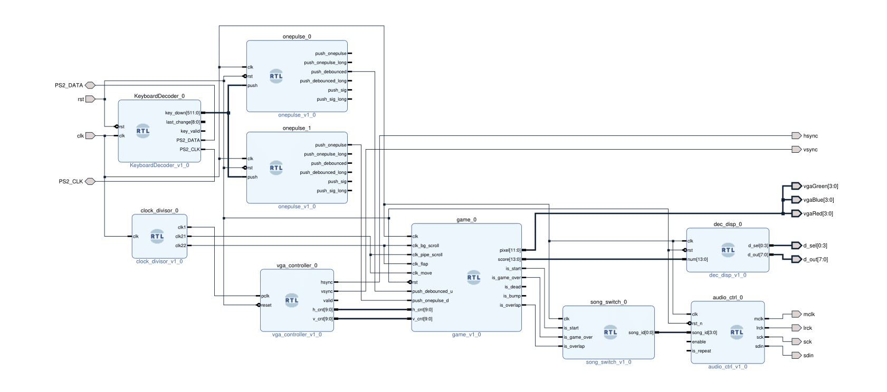

### Module: clock_divisor

為背景滾動、水管滾動、小鳥移動和拍動翅膀提供 clock 作為 trigger。

### Module: onepulse

用一個計數器來計算按鈕按下的 clock cycles，若按鈕按下的時間較長，會觸發``push_onepulse_long``，反之，若按鈕按下的時間較短，則會觸發``push_onepulse``。

#### Module: debounce

在每次按按鈕的時候，此模組會延遲 4 個 clock cycle 並產生一個"debounce pulse"。同時，在模組中，使用 4 個 registers 來達成延遲 4的 clock cycle，並在此 4 個 registers 中的值皆為 1 的時候，輸出一個 pulse。

### Module: KeyboardDecoder

此為 lab 8 助教提供的 keyboard 模組之一。

#### Module: KeyboardCtrl_0

此為 lab 8 助教提供的 IP。

#### Module: OnePulseKB

此為 lab 8 助教提供的 keyboard 模組之一。

### Module: game

此為控制遊戲邏輯的主要模組，主要由五個模組構成，分別是：``bg_ctrl``、``pipe_ctrl``、``bird_ctrl``、``ctrl``、``scence_ctrl``。接下來將於本節詳細描述。

### Module: bg_ctrl

此模組的作用在於控制背景滾動，我們用 ``bg_mem_addr_gen`` 和 ``blk_mem_gen_bg_big`` 來實現此功能。其中 ``bg_mem_addr_gen`` 產生對應該 VGA 座標所需的 pixel 的 address，並放入 ``blk_mem_gen_bg_big`` 將對應 address 的背景圖資料讀出。

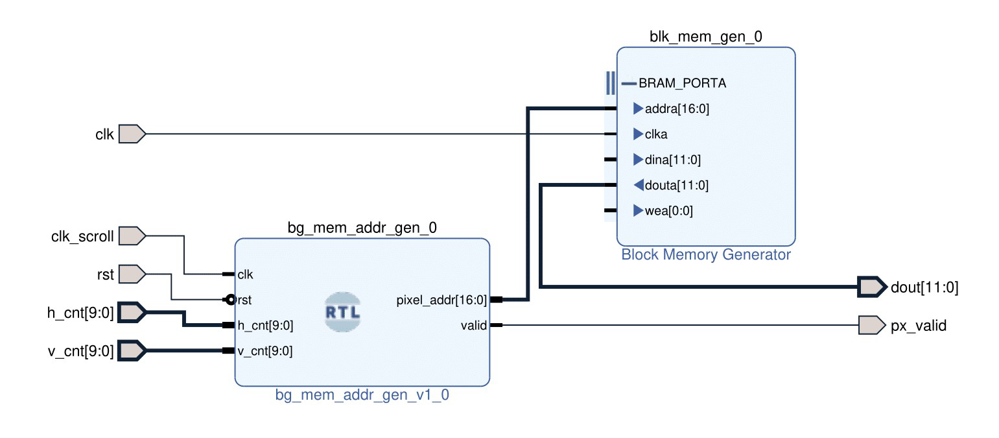

#### Module: bg_mem_addr_gen

``bg_mem_addr_gen`` 依據滾動速率在每單位時間都將背景圖片向左 shift 一個單位，並依據輸入的 VGA 座標輸出相對應的 pixel 的 address。

#### Module: blk_mem_gen_bg_big

此為 Vivado 內建的 RAM IP 模組，我們將背景圖片如下放進 RAM 中儲存並讀取。


### Module: pipe_ctrl

此模組控制畫面中的綠色水管的長度與水管間的間隔，以及在螢幕畫面中移動的方式。 其中，``pipe_mem_addr_gen`` 控制了水管的移動方式、長度及間隔，並依據 VGA 輸入所需要的座標輸出相對應所需的 pixel 資料。而 ``blk_mem_gen_pipe`` 則是依據輸入的記憶體地址輸出相對應的 pixel 資料。兩者組合在一起就可以做出水管移動並且有不同高度與間隔的效果。

另外，``dout``輸出對應 VGA 座標的 pixel 資料，``px_valid`` 則輸出在此 VGA 座標是否需要顯示出此 pixel，會如此設計是因為水管圖片周圍其實會有一層非透明的框，因此我們就直接針對方框的顏色予以剃除，同時必須在不用畫出水管的區域讓水管這一個圖層保持透明，以方便疊圖。

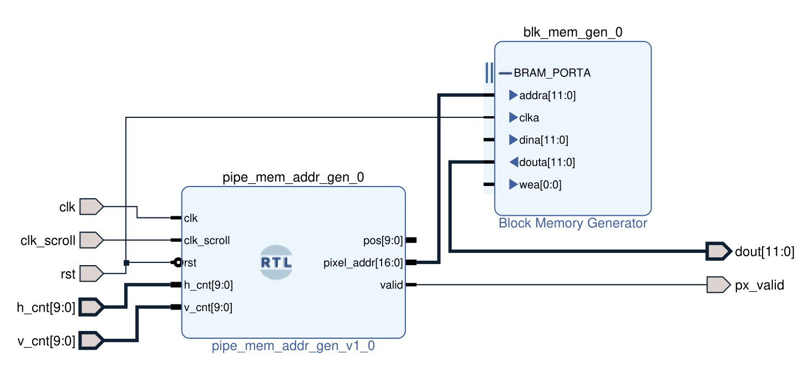

#### Module: pipe_mem_addr_gen

此模組的功能在於控制水管的長度、間隔與移動方式，並對應輸入的 VGA 座標輸出 address。由於在畫面中只會出現三根水管，因此水管每移動 1/3 個螢幕就必須讓下一根水管出現，然而，每根水管必須從右到左將整個螢幕掃過一次才會消失，因此其實我們必須設計一個 shift register 如下，其中 ``pipe_gaps`` 儲存水管間的間隔，而 ``pipe_lens`` 儲存水管的高度，每當水管走過 1/3 個螢幕時，就將下一個水管 shift 進來。

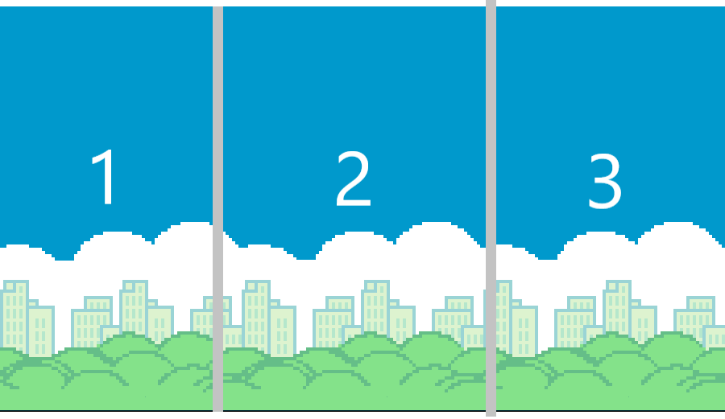

```verilog
reg [CNT_BITS_N-1:0] pipe_gaps [`PIPE_NUM-1:0];
reg [CNT_BITS_N-1:0] pipe_lens [`PIPE_NUM-1:0];

pipe_gaps[14] <= pipe_gaps[0];
pipe_gaps[0] <= pipe_gaps[1];
.
.
.
pipe_gaps[13] <= pipe_gaps[14];

pipe_lens[14] <= pipe_lens[0];
pipe_lens[0] <= pipe_lens[1];
.
.
.
pipe_lens[13] <= pipe_lens[14];
```

而水管的移動速度是依據 input ``clk_scroll``的跳動速率決定，每一個 clock period pipe 皆會向左移動一個單位。同時，因為水管每走 1/3 個螢幕就必須 shift 一個新的水管進來，所以我們將螢幕從左到右切分成三等份，第1等分顯示第 0 個水管，也就是``pipe_gaps[0]``及``pipe_lens[0]``，第二等分顯示第 1 個水管，第三等份顯示第 2 個水管。每個水管在超出該等分所顯示的範圍之後(其實就是水管每走完 1/3 個螢幕時)，就會 shift 到左邊下一個等分繼續顯示，並且 shift register 會 shift 進一個新的水管到第三等份的螢幕中。以下為當水管的位置 ``pos`` 到達第一等分``h_h_cnt < pos + PIPE_WIDTH_CNT``的位置時，若 VGA 的座標分別為``h_h_cnt``與``h_v_cnt``的話，需要水管圖片的``(addr_h_cnt, addr_v_cnt)``座標的 pixel。

```verilog
end else if(h_h_cnt > pos && h_h_cnt < pos + PIPE_WIDTH_CNT) begin
    if(h_v_cnt < pipe_lens[1]) begin
        addr_h_cnt <= h_h_cnt - pos;
        addr_v_cnt <= pipe_lens[1] - h_v_cnt;
        valid <= 1'b1;
    end else if(h_v_cnt > pipe_lens[1] + pipe_gaps[1]) begin
        addr_h_cnt <= h_h_cnt - pos;
        addr_v_cnt <= h_v_cnt - pipe_lens[1] - pipe_gaps[1];
        valid <= 1'b1;
    end else begin
        addr_h_cnt <= 0;
        addr_v_cnt <= 0;
        valid <= 1'b0;
    end
```

值得注意的是，其實做到這樣只能確保水管在進場和滑動的時候沒有問題，但是這個做法卻沒有考慮到水管除如何出場，因此，我們而外在多加了一個第 0 等分，目的在於我們希望當水管在走完第一等分的螢幕畫面必須出場時，會接續由第零等分顯示並出場。

```verilog
if(is_pass_first_pipe && h_h_cnt > 0 && PIPE_WIDTH_CNT > (`PHASE1_CNT - pos) && h_h_cnt < PIPE_WIDTH_CNT - (`PHASE1_CNT - pos)) begin
    if(h_v_cnt < pipe_lens[0]) begin
        addr_h_cnt <= h_h_cnt + (`PHASE1_CNT - pos);
        addr_v_cnt <= pipe_lens[0] - h_v_cnt;
        valid <= 1'b1;
    end else if(h_v_cnt > pipe_lens[0] + pipe_gaps[0]) begin
        addr_h_cnt <= h_h_cnt + (`PHASE1_CNT - pos);
        addr_v_cnt <= h_v_cnt - pipe_lens[0] - pipe_gaps[0];
        valid <= 1'b1;
    end else begin
        addr_h_cnt <= 0;
        addr_v_cnt <= 0;
        valid <= 1'b0;
    end
```

而畫面中的上下兩根水管其實就將水管的 pixel 的垂直座標上下顛倒就行。

#### Module: blk_mem_gen_pipe

此為 Vivado 內建的 RAM IP 模組，我們將水管圖片如下放進 RAM 中儲存並讀取。


### Module: bird_ctrl

此模組依據玩家的輸入，控制小鳥的飛行位置，並同時實現小鳥拍打翅膀的動畫與模仿地心引力的下墜。``dout``輸出對應 VGA 座標的 pixel 資料，``px_valid`` 則輸出在此 VGA 座標是否需要顯示出此 pixel，若``px_valid=0``則此圖層為透明無色，同時，與繪製水管的考量相仿，因為小鳥的圖片周圍也有一層非透明的方框，因此必須檢測該方框顏色並予以剃除。

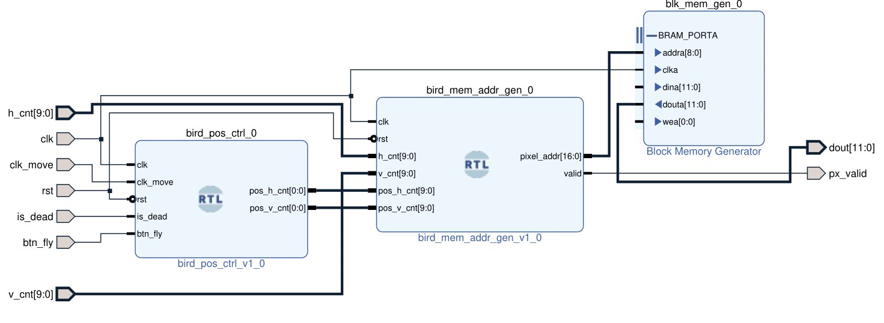

#### Module: bird_mem_addr_gen

此模組會依據目前小鳥的位置``(pos_h_cnt, pos_v_cnt)``產生對應 pixel 的 address，同時會依據``clk``的頻率更新小鳥拍動翅膀的圖片。具體的作法為，由於小鳥拍動翅膀的動畫是由三個 frame 組成，我們會依據``clk``更新小鳥處在不同的 frame 始知看起來像在拍動翅膀。另外，我們依據``(pos_h_cnt, pos_v_cnt)``來判斷小鳥在畫面上所處的位置，若 VGA 的座標位置落在顯示小鳥的區域上的話，則輸出對應的 pixel。而具體做法就是檢查 VGA 座標是否落在以 ``(pos_h_cnt, pos_v_cnt)`` 作為顯示小鳥區域的左上 anchor ，往右及往下小鳥的高度及寬度所框起來的區域，即為``h_h_cnt >= pos_h_cnt && h_h_cnt < pos_h_cnt + BIRD_WIDTH_CNT && h_v_cnt >= pos_v_cnt && h_v_cnt < pos_v_cnt + BIRD_HEIGHT_CNT``。

```verilog
always@(posedge clk) begin
    if(rst) begin
        phase <= 0;
    end else begin
        if(phase == 0) begin
            phase <= 10;
        end else if(phase == 10) begin
            phase <= 20;
        end else if(phase == 20) begin
            phase <= 0;
        end
    end
end

always@(*) begin
    pixel_addr <= addr_h_cnt % BIRD_WIDTH_CNT + phase + BIRD_WIDTH_CNT * 3 * (addr_v_cnt % BIRD_HEIGHT_CNT);
end

always@(*) begin
    if(h_h_cnt >= pos_h_cnt && h_h_cnt < pos_h_cnt + BIRD_WIDTH_CNT &&
        h_v_cnt >= pos_v_cnt && h_v_cnt < pos_v_cnt + BIRD_HEIGHT_CNT) begin
        addr_h_cnt <= h_h_cnt - pos_h_cnt;
        addr_v_cnt <= h_v_cnt - pos_v_cnt;
        valid <= 1'b1;      
    end else begin
        addr_h_cnt <= 0;
        addr_v_cnt <= 0;
        valid <= 1'b0;
    end
end
```

#### Module: bird_pos_ctrl

此模組依據使用者的輸入，控制小鳥的位置。使用者只需要按住空白鍵，小鳥就會一直往上飛直至碰到螢幕的頂部，放開空白鍵的話小鳥就會以自由落體的速度下墜，也就是說會以時間平方成正比的速度下墜。

我們的做法是，若 input ``btn_fly`` 為1，也就是空白鍵被按下時，則每過一個 ``clk_move`` 小鳥的垂直座標``pos_v_cnt``會減一；若否，則小鳥的垂直座標``pos_v_cnt``會以放開空白鍵的 clock 數量的平方增加。code 邏輯如下。

```verilog
if(btn_fly && ~is_dead && pos_v_cnt > 0) begin
    if(pos_v_cnt - 2 <= 1) begin
        pos_v_cnt_next <= 0;
    end else begin
        pos_v_cnt_next <= pos_v_cnt - 2;
    end
    drop_count_next <= 0;
    is_clicked_next <= 1;
end else if((is_dead && pos_v_cnt_next < HEIGHT_CNT) || (~btn_fly && is_clicked && pos_v_cnt < HEIGHT_CNT)) begin
    pos_v_cnt_next <= pos_v_cnt + drop_count * drop_count / 32;
    drop_count_next <= drop_count + 1;
end
```

#### Module: blk_mem_gen_bird

此為 Vivado 內建的 RAM IP 模組，我們將小鳥的圖片如下放進 RAM 中儲存並讀取。

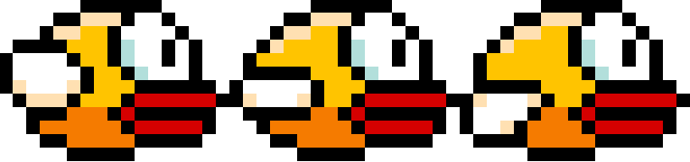

### Module: ctrl

此模組有四大功能

1. 判斷小鳥是否有撞上水管：讀取當前小鳥的位置和在畫面中第一等分水管的位置，並檢查小鳥的 pixel 是否和水管的 pixel 是否同時 ``px_valid=1``，若有，則判斷小鳥已經撞上水管，並將變數 ``is_bump=1``；若否，則將變數 ``is_bump=0``。
2. 融合圖層：本遊戲有四個圖層，顯示的優先順序從高到低分別為文字 -> 小鳥 -> 水管 -> 背景，若叫高優先的圖層的 ``px_valid=1``則會以該圖層蓋掉較低優先順率的圖層。
3. 控制畫面場景：使用 ``push_onepulse_d`` 及 ``is_bump`` 來控制狀態機，狀態機有三個狀態，分別是 a. 開始狀態 b. 遊戲狀態 c. 結束狀態
    a. 開始狀態： ``is_start=0``、``is_dead=0``、``is_game_over=0``，若遇到``push_onepulse_d=1``，也就是 Enter 鍵被按下，則跳到遊戲狀態
    b. 遊戲狀態： ``is_start=1``、``is_dead=0``、``is_game_over=0``，若遇到小鳥撞上水管``is_bump=1``，則跳到結束狀態。
    c. 結束狀態： ``is_start=0``、``is_dead=1``、``is_game_over=1``，若遇到``push_onepulse_d=1``，也就是 Enter 鍵被按下，則跳到開始狀態
5. 計算分數：若水管的位置 ``pos <= 0``(代表水管的左側已經碰到螢幕的左側) 且小鳥沒有死``is_dead=0``，則分數加一，若``(~is_start) && (~is_dead)`` 為真，也就是在開始狀態，分數則歸零。

### Module: scence_ctrl

此模組依據 input ``is_start``、``is_dead`` 判斷狀態機所處的狀態，並顯示相對應的文字，

a. 開始狀態： 當``is_start=0``、``is_dead=0``，在畫面正中央顯示：**FLAPPY BIRD**
b. 遊戲狀態： 當``is_start=1``、``is_dead=0``，在畫面頂部顯示玩家分數：**SCORE: 0001**
c. 結束狀態： ``is_start=0``、``is_dead=1``，，在畫面正中央顯示兩行： 第一行為固定文字： **GAME OVER**，第二行為玩家分數： **SCORE: 0001**

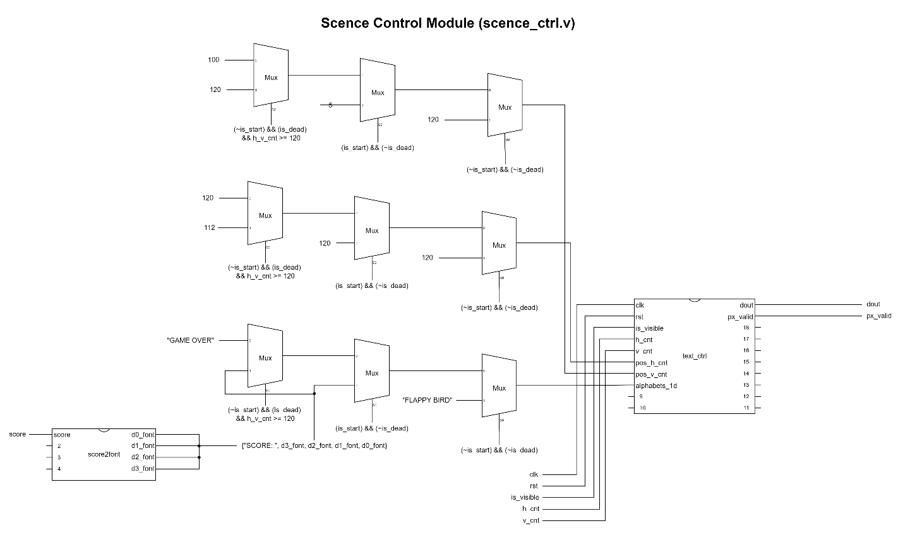

#### Module: score2font

此模組能將 4 位數的十進位數字``score``轉成``font_ctrl``的文字代碼``d0_font``、``d1_font``、``d2_font``和``d3_font``，分別是千位、百位、十位以及個位數。具體作法其實就只是用除法和 mod 就可以達成。

#### Module: dec2font

此模組能將二進位數字``dec``轉成``font_ctrl``模組的文字代碼``font``。

### Module: text_ctrl

此模組擴展 ``font_ctrl`` 的功能，給定一個座標``(pos_h_cnt, pos_v_cnt)``將多個文字``alphabets_1d``於指定座標水平顯示。也就是說，此模組提供類似於文字方塊的功能，將文字內容水平顯示。具體的作法是檢查 VGA 座標 ``(h_cnt, v_cnt)`` 看看座標是落在水平文字的第幾個文字上，若是落在第二個文字上，就將 ``font_ctrl`` 的 input 換成第二個文字的座標``(text_h_cnt, text_v_cnt)``和文字編碼``alphabet``。代碼如下

```verilog
always@(posedge clk) begin
    if(h_h_cnt >= pos_h_cnt && h_v_cnt >= pos_v_cnt) begin
        if((h_h_cnt - pos_h_cnt) < FONT_WIDTH_CNT * ALPHABET_N) begin
            text_h_cnt <= pos_h_cnt + FONT_WIDTH_CNT * alpha_idx;
            text_v_cnt <= pos_v_cnt;
            alphabet <= alphabets[alpha_idx];
        end
    end
end
```

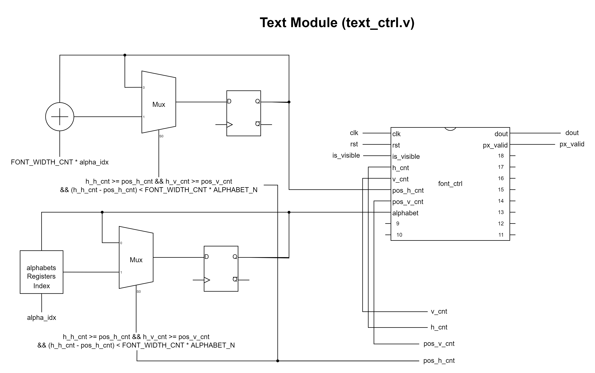

### Module: font_ctrl

此模組可以依據指定位置``(pos_h_cnt, pos_v_cnt)``將單個文字``alphabet``在指定位置畫出，其中``dout``輸出對應該 VGA 座標``(h_cnt, v_cnt)``的 pixel 資料，而``px_valid``輸出該 VGA 座標是否會有文字 pixel，也就是文字圖層在該 VGA 座標是否為透明。

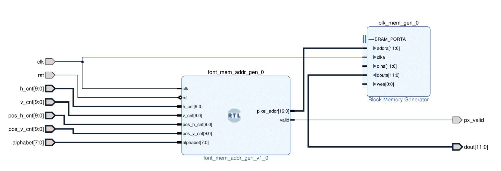

#### Module: font_mem_addr_gen

此模組依據輸入的文字座標位置``(pos_h_cnt, pos_v_cnt)``並將此座標當作文字框的左上錨點輸出 input ``alphabet``對應文字圖片的 address ``pixel_addr``。具體作法是先將文字圖片切成 7 * 8 個方格，其中每個方格為 8 * 8 pixels，並從左上到右下依序從小到大編號，當 VGA 座標若位於 ``([pos_h_cnt, pos_h_cnt+8), [pos_v_cnt, pos_v_cnt+8))`` 區域內，則將 input ``alphabet`` 對應的文字的 address 輸出。

```verilog
always@(*) begin
    blk_h_cnt <= alphabet % FONT_NUM_COL;
    blk_v_cnt <= (alphabet / FONT_NUM_COL) % FONT_NUM_ROW;
end

always@(*) begin
    pixel_addr <= (addr_h_cnt + FONT_WIDTH_CNT * blk_h_cnt) + (FONT_WIDTH_CNT * FONT_NUM_COL * (addr_v_cnt + FONT_HEIGHT_CNT * blk_v_cnt));
    // pixel_addr <= addr_h_cnt + (FONT_WIDTH_CNT * FONT_NUM_COL * addr_v_cnt);
end

always@(*) begin
    if(h_h_cnt >= pos_h_cnt && h_h_cnt < pos_h_cnt + FONT_WIDTH_CNT &&
       h_v_cnt >= pos_v_cnt && h_v_cnt < pos_v_cnt + FONT_HEIGHT_CNT) begin
        addr_h_cnt <= (h_h_cnt - pos_h_cnt) % FONT_WIDTH_CNT;
        addr_v_cnt <= (h_v_cnt - pos_v_cnt) % FONT_HEIGHT_CNT;
        valid <= 1'b1;      
    end else begin
        addr_h_cnt <= 0;
        addr_v_cnt <= 0;
        valid <= 1'b0;
    end
end
```

#### Module: blk_mem_gen_font

此為 Vivado 內建的 RAM IP 模組，我們將文字圖片如下放進 RAM 中儲存並讀取。

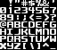

### Module: song_switch

此模組依據``is_start``、``is_game_over``和``is_overlap``三種訊號判斷遊戲目前場景，並回傳對應的歌曲 ID。

```verilog
always@(posedge clk) begin
    if(is_overlap) begin
        song_id <= `BUMP_SONG_ID;
    end else if(~is_start && ~is_game_over) begin
        song_id <= `ANGRY_BIRD_SONG_ID;
    end else if(is_start && ~is_game_over) begin
        song_id <= `FRUIT_PUDDING_SONG_ID;
    end else if(~is_start && is_game_over) begin
        song_id <= `ANGRY_BIRD_SONG_ID;
    end
end
```

### Module: audio_ctrl

在此遊戲中，背景音樂的部分設計為遊戲進行中和遊戲結束分別播放"fruit pudding"和"angry bird"兩首曲子，並在小鳥拍動翅膀以及撞擊到水管時也會有音效(備註：最後此功能因為時間限制所以沒有完全實現)。在曲子循環播放的部分，背景音樂是重複循環播放，並由現在是否在遊戲中決定要播放哪首曲子；而小鳥翅膀拍動的聲音以及撞擊到水管的音效，則是單次播放。此模組主要功能是將所有聲音的模組結合在一起，並經由這個模組，可以選擇要播放哪首曲子，以及該首曲子是否要重複播放。

在此模組中，利用``song_id ``來決定要播放哪首曲子、``enable``來決定被選到的曲子是否要播放、``is_repeat``來決定是否要循環重複播放該首曲子；``mclk``、``lrck``、``sck``和``sdin``則是audio的output訊號。

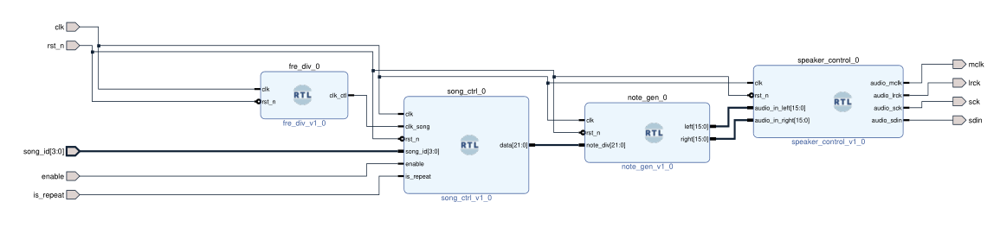

#### Module: fre_div

此模組主要功能是利用除頻器，產生一個音符播放的時間長度，此模組產生的 clock訊號輸出給``up_counter
``，即可控制一個音符的播放時間。

在播放曲子時，每個音符都有自己播放的時間長度，但在一首曲子中，並不會每個音符播放的時間都一樣長(例如: 一首曲子中常常會有十六分音符、八分音符、四分音符、全音符等)，在此為了設計方便，統一所有的音符皆使用十六分音符的時間長度，並透過「多放幾個音符」的方式來呈現持續時間不同的音符(例如: 當播放八分音符時，因為每個音符播放的時間是十六分音符的播放時間，因此就將原本曲子內的八分音符拆成連續兩個十六分音符播放，這樣兩個連續的十六分音符聽起來就會像一個八分音符一樣)

### Module: song_ctrl

此模組主要功能為選擇要播放的曲子，以及控制該曲子是否要重複循環播放。``song_id``決定要播放哪首曲子、``enable``；決定被選種的曲子是否要播放；``is_repeat``決定該首曲子是否要循環播放；``data``則是要播放音符的音階。

此模組還有用到``up_counter``、``fruit_pudding_mem``、``angry_bird_mem``、``flap_mem``、``bump_mem``等模組，在以下詳述。

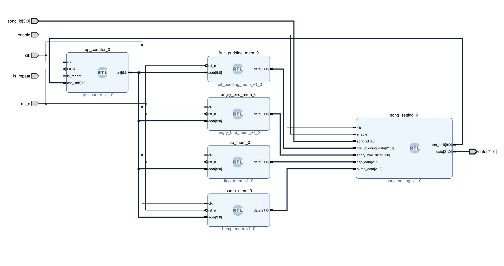

#### Module: up_counter

此模組的主要功能是控制曲子播放到第幾個音符，並在音符結束播放後決定是否要重頭開始循環重複播放。``is_repeat``訊號會輸入此模組，最為該曲子是否要重複播放的判斷。

因為每首曲子的長度並不相同，就代表每首曲子的音符個數不同。因此在此模組中，也會有輸入訊號``cnt_limit``，代表該首曲子的音符個數；``cnt``則是代表counter。

藉由``is_repeat``、``cnt_limit``，和``cnt``這三個訊號，可以控制該首歌曲的播放以及是否重複播放。
```verilog
always@(*)begin
    if (cnt >= cnt_limit) begin    //當播放的音符個數超過曲子長度時
            if(is_repeat) begin
                cnt_tmp = 'd0;    //若is_repeat=1，代表要重複播放，則當曲子播到最後一個音符時，及回到第一個音符繼續重頭播放
            end else begin
                cnt_tmp = cnt_limit;    //若不循環播放，則停在該曲子的最後一個音符，不再從頭播放
            end
        end else begin
            cnt_tmp = cnt + 'd1;    //一個音符一個音符依序播放下去
        end
    end
```
```verilog
    //up counter 
    if (~rst_n) begin
            cnt <= 'd0;
        end else begin
            cnt <= cnt_tmp;
        end
    end
```

#### Module: song_setting

此模組依據輸入的``song_id``和每支不同曲子的音階，包括``fruit_pudding_mem``、``angry_bird_data``、``flap_data``和``bump_data``，輸出對應的曲子的音階。

#### Module: fruit_pudding_mem

此模組主要控制遊戲進行時的背景音樂 -- "fruit pudding"這首曲子的播放，透過輸入不同音符的 address ``[MUSIC_ADDR_BITS_N-1:0] addr``來判斷要播放哪個音符，並用``data``將音符的音階讀出來並播放出來。

```verilog
    //曲子中會用到的音符
    //在曲子中會用到各種不同頻率(音階)的音符
    //因此需要先將曲子中會用到的所有音階都先用"100M除以該音符的頻率"，算出對應的數值
    //藉由這些數值，就可以播放出不同頻率、音階的音符，進而拼湊出完整的曲子
    localparam none = 22'd11;    //播放none會沒有聲音，藉由放none在不同音符間可以讓不同音階的音符聽起來不會黏在一起(none也是佔一個音符的播放長度)
    localparam m_do = 22'd382219;
    localparam m_re_b = 22'd360776;
    localparam m_re = 22'd340529;
```
```verilog
    always@(*)begin
        case (addr)    //藉由音符的address(addr)，可以決定要播放第幾個音符
            'd0: data = h_fa;    //在決定要播放第幾個音符後，就可以輸出該addr所代表的data
            'd1: data = h_fa;    //此處有兩的"h_fa"放在一起，表示此為一個八分音符的高音fa。為了使fre_div模組方便設計，該模組只會輸出十六分音符的播放時間，因此若需播放八分音符，就必須要連續播放兩個相同的音符
            'd2: data = h_re;
        endcase
```

#### Module: angry_bird_mem

此模組主要是負責播放遊戲結束時的背景音樂 -- "angry bird"這首曲子。其運作和前面的``fruit_pudding_mem``模組一樣，都是透過一個音符一個音符，透過不同的頻率產生不同的音階，並利用這些音階拼湊出整首曲子。

#### Module: flap_mem

此模組主要是負責翅膀拍動時的音效，其運作方式也和前面提到的``fruit_pudding_mem``、``angry_bird_mem``模組一樣，都是利用除出不同頻率得到不同音階的音符，再用這些音符將音效做出來。在此模組因為是模仿翅膀拍動的聲音，因此在此模組只有兩個音符。
```verilog
    localparam h_do = 22'd190839;
    localparam h_mi = 22'd151515;
```

#### Module: bump_mem

此模組是在小鳥撞擊到水管時，要發出的音效。其運作原理和前面提到的``fruit_pudding_mem``、``angry_bird_mem``、``flap_mem``模組一樣，都是透過不同頻率產生不同音階，再將這些音階拼湊出想要的撞擊音效。

#### Module: note_gen

此模組主要功能是以"papallel"的方式產生各種不同頻率的左、右聲道訊號，以形成各種不同的音階。在此模組中，有counter``"Note frequency generation"``，其運作原理和 1 Hz 的除頻器一樣，但不同的地方是，在此模組中的counter，有可以改變的``note_div``當作counting limit，透過改變``note_div``，可以產生不同頻率，進而產生不同音階。

```verilog
// Note frequency generation
always @(posedge clk or negedge rst_n)
  if (~rst_n)
  begin
    clk_cnt <= 22'd0;
    b_clk <= 1'b0;
  end
  else
  begin
    clk_cnt <= clk_cnt_next;
    b_clk <= b_clk_next;
  end
	 
always @*
  if (clk_cnt == note_div)
  begin
    clk_cnt_next = 22'd0;
    b_clk_next = ~b_clk;
  end
  else
  begin
    clk_cnt_next = clk_cnt + 1'b1;
    b_clk_next = b_clk;
  end
```

此外，在此模組中還有``b_clk``控制振幅，每當 counter 記數到``note_div``(limit)，``b_clk``就會切換一次。當``b_clk=1``時，``[15:0] left``和``[15:0] right``(各 16-bit 的 parallel data)會是``16'h5FFF``；反之，當``b_clk=0``時，``[15:0] left``和``[15:0] right``則會是``16'hB000``。``[15:0] left``和``[15:0] right``會一直在``16'h5FFF``(波峰)和``16'hB000``(波谷)之間不斷變換其值，這就是振幅。

```verilog
// Assign the amplitude of the note
assign left = (b_clk == 1'b0) ? 16'hB000 : 16'h5FFF;
assign right = (b_clk == 1'b0) ? 16'hB000 : 16'h5FFF;
```

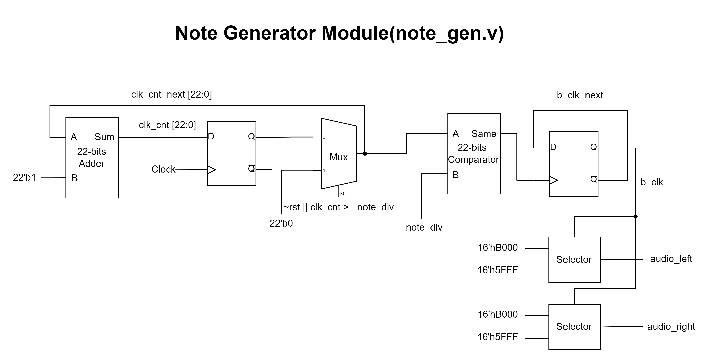

#### Module: speaker_control

speaker在輸出時，是透過左、右聲各 16-bit 以"serial"的訊號輸出。在此模組中，``clk_cnt``會產生三種 clock 需要的頻率，分別是``audio_mclk``、``audio_lrck``、``audio_sck``。

此模組是以左、右聲道各 16-bit (總共 32-bit )，以 "parallel" 的方式輸入，並以 "serial" 的方式輸出。因此在"serial"的 clock (``audio_sck; // serial clock``)需要比 "parallel" 的 clock (``audio_lrck; // left-right clock``)快32倍。且``clk_cnt``每往左 1-bit，即代表除以2，因此將將三種clock設定為: ``audio_mclk = clk_cnt[1]; (master clock)``、``audio_lrck = clk_cnt[8];  (left-right clock)``、``audio_sck = 1'b1; (serial clock)``

```verilog
// Assign divided clock output
assign audio_mclk = clk_cnt[1];    // master clock
assign audio_lrck = clk_cnt[8];    // left-right clock
assign audio_sck = 1'b1;     // serial clock
```

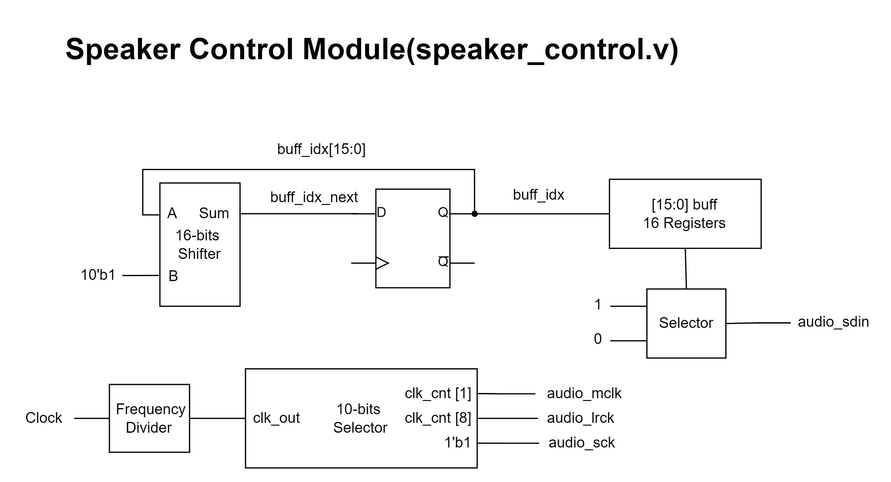

### Module: vga_controller

依據 VGA 的設計，我們需要在 Horizontal Sync Pulse 與 Vertical Sync Pulse 的時間區間內拉回 Scan 到下一行或下一個 frame 的起始位置。因此，在 Horizontal Sync 的時間區間內，必須將 HSYNC 設為低電壓，而在 Vertical Sync 區間內，必須將 VSYNC 設為低電壓。而在其他時間則是在每個 clock 依序掃每個 pixel，如下圖所示。

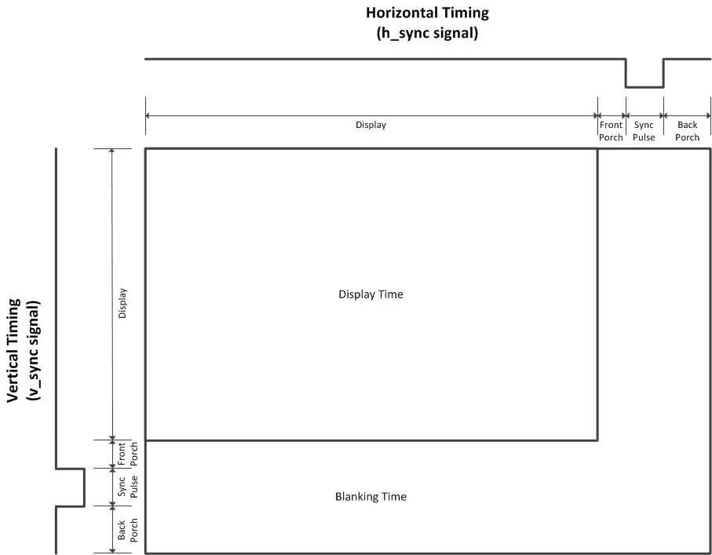

而 pixel clock 的計算方式為 FPS * Width * Height，若為 60 FPS, 640 * 480 的螢幕的話則為 60 * 800 * 525 = 25175000 Hz = 25.175 MHz，詳細參數對應下方表格。

Width = (Horizontal Active Video + Horizontal Front Porch  + Horizontal Back Porch + Horizontal Sync Pulse)

Height = (Vertical Active Video + Vertical Front Porch  + Vertical Back Porch + Vertical Sync Pulse)


其中 a 為 Horizontal Sync Pulse，b 為 Horizontal Back Porch，c 為 Horizontal Active Video，d 為 Horizontal Front Porch；而 f 為 Vertical Sync Pulse，g 為 Vertical Back Porch，h 為 Vertical Active Video，i 為 Vertical Front Porch。

### Module: dec_disp

此模組在七段顯示器上會顯示``d0``, ``d1``, ``d2``, 和 ``d3`` 的二進制數。此模組會將二進制的``d0``, ``d1``, ``d2``, 和 ``d3`` 轉換成七段顯示模式，並將這些訊號傳入``display_7seg``模組，即可將``d0``, ``d1``, ``d2``, 和 ``d3``以七段顯示顯示出來。

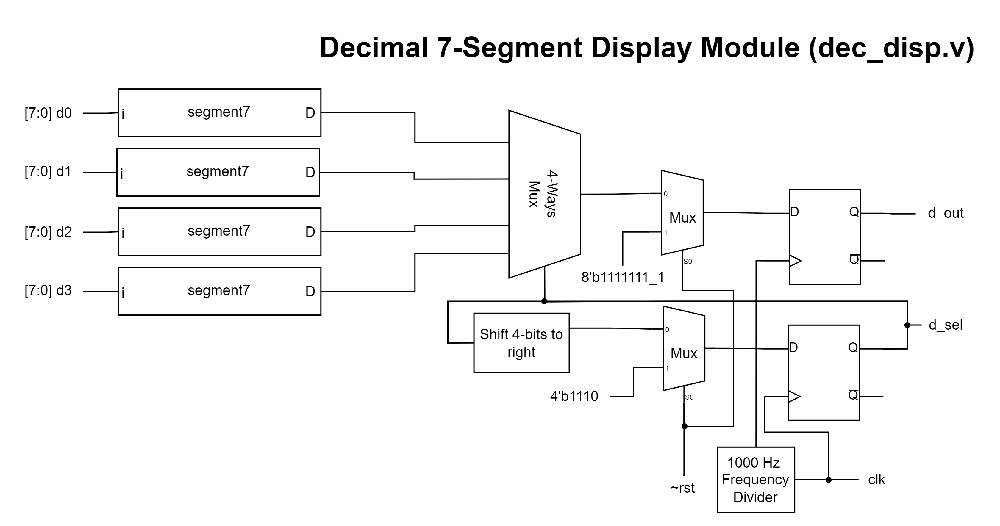

#### Module: segment7

此模組將4-bit二進制數字轉換為七段顯示器

#### Module: display_7seg

當要控制七段顯示器時，由於每次只能控制一個位數，因此將此模組設計為以四位數為輸入，並在每次時鐘訊號上升的時候，即在顯示器上顯示一個位數。每當時鐘電位為高電壓時，此模組會控制``d_sel``切換到不同的位數，並顯示相對應的數字。例如: 當時鐘電位第一次為高電壓時，模組會設定``d_sel = 4'b1110`` 和 ``d_out = d0``；時鐘電位第二次為高電壓時，模組則會設定``d_sel = 4'b1101`` 和 ``d_out = d1`` 等等。

#### Module: segment7_frequency_divider

為了要產生 1000 Hz 的時鐘訊號，在此模組使用了變數``counter_in`` 和 ``counter_out`` ，並使變數從 0 數到 50000。變數``counter_in`` 會儲存下一個時間狀態要用到的值，並在時鐘電位為高電壓時將此值傳給``counter_out``。在每次時鐘電位為高電壓的時候，才會觸發記數，因此在此模組需要從 0 到 50000 的記數，且在每兩次 clock pulses ，記數會多 1。 

## Discussion

### 如何設計水管滾動機制

在設計水管滾動機制時，我們測試了許多種方法，也有考慮過是否能用不用切分螢幕的方式實現，但最後發現這樣就必須要有三個 index 指出目前第一、二、三根水管在 register matrix 內的座標，因此可能不大可行。最後反覆嘗試才使用目前的作法，而設計這種做法作最難就是要計算目前的 pixel 位置，稍一不慎就很容易寫錯，最後使用的寫法則是統一先判斷 VGA 座標是否在任一水管要顯示的範圍內，再將 VGA 座標減去該水管左上角的座標，對齊水管圖片的座標後再轉成水管圖片的地址。

### 如何設計多行文字顯示機制

實現文字顯示功能的模組為``text_ctrl``與``font_ctrl``，前者負責顯示多個文字，後者負責顯示一個文字，而實現的方式也類似於``pipe_ctrl``，就是判斷 VGA 座標是否和顯示文字的區域重疊，若有重疊，則將對應文字的座標和文字代碼傳入``font_ctrl``以顯示文字。這樣做的好處不言而喻，只需要一個模組就可以顯示任意數量的文字。但其實我們原本打算顯示一行文字就用一個新的``font_ctrl``，但這樣因為太消耗記憶體作罷，另一個想法是，傳入一個 matrix 紀錄每個欲顯示文字的座標和文字代碼，並用時間分差的方式顯示，也就是每個 clock 輪流顯示不同文字，但這樣需要考量到 clock 速度和 VGA clock 速度的問題，也怕有同步問題導致顯示效果不佳，因此座後決定採用此種作法。

## Conclusion

透過這次的專題實做，讓我們更加了解想要實現一個遊戲，各個不同的module之間是如何設計的。因為在之前的LAB，基本上都是只有單個主題，透過這次的期末專題，不只讓我們可以將這些不同主題結合起來，也讓我們體會到這些不只可以應用在課堂上的LAB，還可以實現在生活中我們自己設計的東西。

## Reference

- [【接口时序】7、VGA接口原理与Verilog实现](https://www.cnblogs.com/liujinggang/p/9690504.html)
  
    此部落格詳細解說了 VGA 的運作機制和各尺寸螢幕的參數表。
- [Working with block designs in Xilinx Vivado by Vincent Claes](https://www.youtube.com/watch?v=-mXFlp7UZR8&ab_channel=fpgabe)
  
    Vivado block design tutorial.