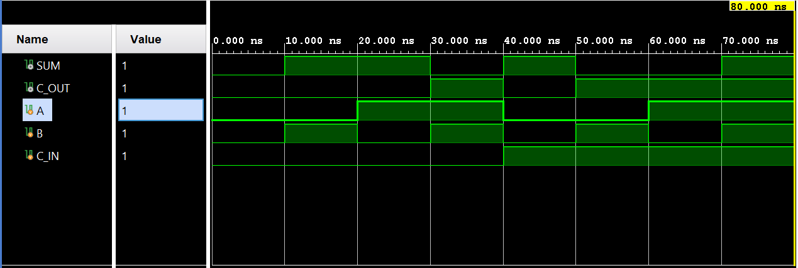
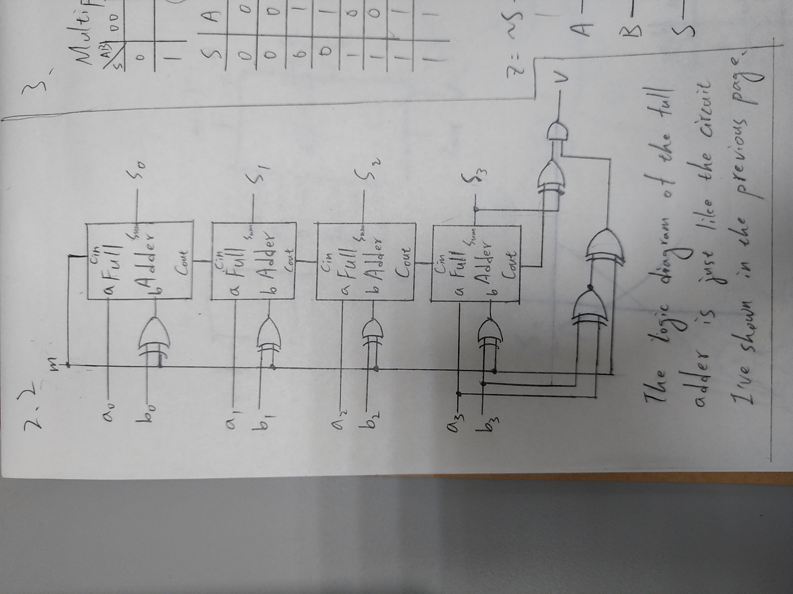

# Lab 1 - Verilog Report

106033233 資工大四 周聖諺

---

## Lab 1 - 1: 4-Bit Binary-To-Gray-Code Converter

### Design Specification

[Source Code](./lab1_1/)

Input: a, b, c, d

Output: w, x, y, z

### Design Implementation

First, we can observe that the MSB of the Gray code and binary code are always the same so it doesn't need any conversion. The Boolean equation is $a = w$

In addition, if you list the table of the conversion from 4-bit Gray-code to binary code, you can observe that $a \oplus b = x$, $b \oplus c = y$ and, $c \oplus d = z$. Thus, we can design the circuit as the following code.

**Boolean Equation:**

$$a = w$$
$$a \oplus b = x$$
$$b \oplus c = y$$
$$c \oplus d = z$$

**BCD to Gray Code Truth Table**

| Decimal | Binary Code (abcd) | Gray Code (wxyz) |
|---|---|---|
| 0 | 0000 | 0000 |
| 1 | 0001 | 0001 |
| 2 | 0010 | 0011 |
| 3 | 0011 | 0010 |
| 4 | 0100 | 0110 |
| 5 | 0101 | 0111 |
| 6 | 0110 | 0101 |
| 7 | 0111 | 0100 |
| 8 | 1000 | 1100 |
| 9 | 1001 | 1100 |
| 10 | 1010 | 1111 |
| 11 | 1011 | 1110 |
| 12 | 1100 | 1010 |
| 13 | 1101 | 1011 |
| 14 | 1110 | 1001 |
| 15 | 1111 | 1000 |

**Verilog Code**

```verilog
assign w = a;
assign x = a ^ b;
assign y = b ^ c;
assign z = c ^ d;
```

**Block Diagram**


**RTL Simulation**


## Lab 1 - 2: 4-Bit Adder-Subtractor

[Source Code](./lab1_2/)

### Design Specification

**Full Adder**

Input: a, b, c_in

Output: sum, c_out

**4-Bit Adder-Subtractor**

Input [3:0]a, [3:0]b, m

Output [3:0]s, v

### Design Implementation

#### Full Adder

For 1-bit addition, it would yield 0 when 1 + 1 or 0 + 0. Otherwise, it would yield 1. As a result, we can use XOR gate to implement the addition operation like the following code.

**Boolean Equation:**

$$sum = a \oplus b \oplus c_{in}$$

where $c_{in}$ is the carry-in bit c_in.

**Verilog Code**

```verilog
assign sum = (a ^ b) ^ c_in;
```

As for the carry bit, we've known that the carry bit would be 1 while two of the input bits: a, b and c_in (the carry bit of the previous one) are 1. Thus, we can express the Boolean equation  as the follow 

**Boolean Equation:**

$$c_{out} = (a \land b) \lor(c_{in} \land (a \oplus b))$$

where $c_{in}$ is the carry-in bit c_in.

**Verilog Code**

```verilog
assign c_out = (a & b) | c_in & (a ^ b);
```

**Logic Diagram**


**RTL Simulation**



#### 4-Bit Adder-Subtractor

As for 4-bit adder, all we need to do is that concatenate the 4 full-adder. Thanks to 2's complement. The full-adder also works when the input number is negative in the form of 2's complement. To adapt the subtraction, we only need to invert the number and set the carry-in as 1.

```verilog
wire C_IN;
wire C_OUT_0, C_OUT_1, c_OUT_2, c_OUT_3;
assign C_IN = m;
full_adder U0(.a(a[0]), .b(b[0] ^ m), .c_in(C_IN), .sum(s[0]), .c_out(C_OUT_0));
full_adder U1(.a(a[1]), .b(b[1] ^ m), .c_in(C_OUT_0), .sum(s[1]), .c_out(C_OUT_1));
full_adder U2(.a(a[2]), .b(b[2] ^ m), .c_in(C_OUT_1), .sum(s[2]), .c_out(C_OUT_2));
full_adder U3(.a(a[3]), .b(b[3] ^ m), .c_in(C_OUT_2), .sum(s[3]), .c_out(c_OUT_3));
```

However, we need to handle the overflow or underflow exceptions. We've known that the overflow might occur in 4 cases: (1) positive + positive, (2) negative + negative, (3) negative - positive, or (4) positive - negative. In this 4 cases, if we detect the last carry-out bit is different from the MSB of the summation, it means there is an overflow.

To detect the 4 possible cases:

$$\lnot (a[3] \oplus b[3]) \oplus m$$

To detect the difference between carry out and the MSB.

$$c_{out} \oplus s[3]$$

where $c_{out}$ is the last carry-out bit.

**Boolean Equation:**

$$v = (c_{out} \oplus s[3]) \land (\lnot (a[3] \oplus b[3]) \oplus m)$$

**Verilog Code**

```verilog
assign v = (c_OUT_3 ^ s[3]) & (~(a[3] ^ b[3]) ^ m);
```

**Logic Diagram**



**RTL Simulation**


## Lab 1 - 3: 3-Bit Signed Binary Max

### Design Specification

[Source Code](./lab1_3/)

**Full Adder**

Input: a, b, c_in

Output: sum, c_out

**3-Bit Adder-Subtractor**

Input [2:0]a, [2:0]b, m

Output [2:0]s, v

**Multiplexer**

Input: a, b, s

Output: z

**3-Bit Signed Binary Max**

Input: [2:0]a, [2:0]b

Output: [2:0]o

### Design Implementation

#### Full Adder

Same as the module in Lab 1-2.

#### 3-Bit Adder-Subtractor

Same as the module in Lab 1-2.

#### Multiplexer(MUX)

In the file *mux.v*, it's just a 1-bit simple multiplexer. If m is 0, it would output the signal of input a, vice versa. Following are the Boolean equation and the code.

**Boolean Equation**

$$z = ((\lnot s) \land a) \lor (a \land b) \lor (s \land (\lnot a) \land b)$$

**Verilog Code**

```verilog
assign z = ((~s) & a) | (a & b) | (s & (~a) & b);
```

**Logic Diagram**


**RTL Simulation**


#### 3-Bit Signed Binary Max

It's easy to know that if the 2 number a and b have different sign, we only need to choose the positive one. Otherwise, we need to use the subtractor and let a minus b to determine which one is larger. If the MSB is 0, number a is larger. If the MSB is 1, number b is larger. We can simply form the Boolean equation of the multiplexer selection as the following.

**Boolean Equation**

$$SEL = (a[2] \land (\lnot b[2])) \lor (a[2] \land S[2]) \lor ((\lnot a[2]) \land (\lnot b[2]) \land S[2])$$

where $S$ is the difference between number a and b and $SEL$ is the selection input of the multiplexer. To output the larger number, we only need to apply the multiplexer and the selection to each bit.

**Verilog Code**

```verilog
wire [2:0]S;
wire M;
wire SEL;

assign M = 1;
bit3_add_sub U0(.a(a), .b(b), .m(M), .s(S));
assign minus = S;
assign SEL = (a[2] & (~b[2])) | (a[2] & S[2]) | ((~a[2]) & (~b[2]) & S[2]);

mux U1(.a(a[0]), .b(b[0]), .s(SEL), .z(o[0]));
mux U2(.a(a[1]), .b(b[1]), .s(SEL), .z(o[1]));
mux U3(.a(a[2]), .b(b[2]), .s(SEL), .z(o[2]));
```

**Logic Diagram**


**RTL Simulation**


## Discussion

In the lab 1-3, I used the star symbol * to express the AND logic and plus symbol + to represent the OR logic. However, the logical operator is totally different from the computational operator and the simulation shown that it was wrong. Finally, I found the misuse and correct the errors.

## Conclusion

In this lab, I've learned that how to design a logical circuit with Verilog and simulate the behavior with RTL simulation. In addition, thanks for this lab, I reviewed the logic design briefly to recap the design of the full adder and Gray code.

## Reference

- [Java T Point - Binary to Gray code conversion](https://www.javatpoint.com/binary-to-gray-code-cconversion-in-digital-electronics)
  
  Provide the design example of the binary-to-Gray-code convertor.

- [GEEKSFORGEEKS - 4-bit binary Adder-Subtractor](https://www.geeksforgeeks.org/4-bit-binary-adder-subtractor/amp/)
  
  Provide the design example of the 4-bit binary Adder-Subtractor.
- [Electronics Tutorials - Binary Adder](https://www.electronics-tutorials.ws/combination/comb_7.html)
  
  Provide the design example of the full adder.
- [Wikipedia - Two's complement](https://en.wikipedia.org/wiki/Two%27s_complement)
 
  Explain how the two's complement works.