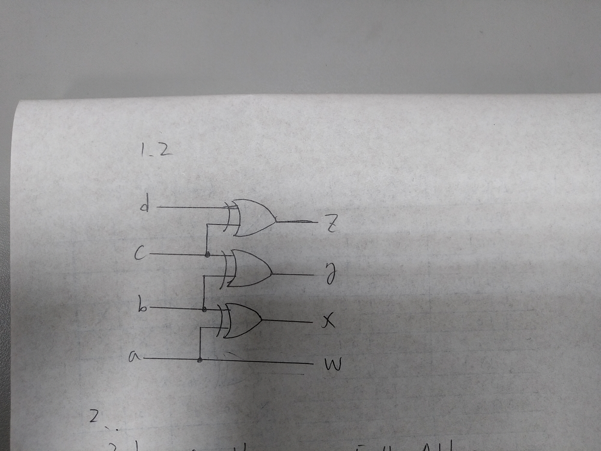

# Lab 2 - FPGA Emulation Report

106033233 資工大四 周聖諺

---

## Lab 2 - 1: 4-Bit Binary-To-Gray-Code Converter

### Design Specification

[Source Code](./lab2_1/)

Input: a, b, c, d

Output: w, x, y, z

### Design Implementation

First, we can observe that the MSB of the Gray code and binary code are always the same so it doesn't need any conversion. The Boolean equation is $a = w$

In addition, if you list the table of the conversion from 4-bit Gray-code to binary code, you can observe that $a \oplus b = x$, $b \oplus c = y$ and, $c \oplus d = z$. Thus, we can design the circuit as the following code.

**Boolean Equation:**

$$a = w$$
$$a \oplus b = x$$
$$b \oplus c = y$$
$$c \oplus d = z$$

**BCD to Gray Code Truth Table**

| Decimal | Binary Code (abcd) | Gray Code (wxyz) |
|---|---|---|
| 0 | 0000 | 0000 |
| 1 | 0001 | 0001 |
| 2 | 0010 | 0011 |
| 3 | 0011 | 0010 |
| 4 | 0100 | 0110 |
| 5 | 0101 | 0111 |
| 6 | 0110 | 0101 |
| 7 | 0111 | 0100 |
| 8 | 1000 | 1100 |
| 9 | 1001 | 1100 |
| 10 | 1010 | 1111 |
| 11 | 1011 | 1110 |
| 12 | 1100 | 1010 |
| 13 | 1101 | 1011 |
| 14 | 1110 | 1001 |
| 15 | 1111 | 1000 |

**Verilog Code**

```verilog
assign w = a;
assign x = a ^ b;
assign y = b ^ c;
assign z = c ^ d;
```

**I/O Pin Assignment**

| I/O | a   | b   | c   | d   | w   | x   | y   | z   |
|-----|-----|-----|-----|-----|-----|-----|-----|-----|
| LOC | W17 | W16 | V16 | V17 | V19 | U19 | E19 | U16 |

**Block Diagram**



**RTL Simulation**


## Lab 2 - 2: Binary to 7-Segment Display Decoder

[Source Code](./lab2_2/)

### Design Specification

**Binary to 7-Segment Display Decoder**

Input [3:0]i

Output [3:0]d, [3:0]P, [7:0]D

### Design Implementation

#### 4-Bits Binary Displayer

It's quite easy to display the 4-bit binary number. All we need to do is to light the LED up while the corresponding bit is 1, vice versa.

**Boolean Equation:**

$$d = i$$

**Verilog Code**

```verilog
assign d = i;
```

#### 7-Segment Display Decoder

We design the logic circuit with K-map to implement the decoder, but in Verilog, to simplify the code, we implement the logic with switch-case.

**Boolean Equation:**

$$
\lnot (i \oplus 0000)
$$

**Verilog Code**

```verilog
assign P = ~4'b0001;
always@(i)
    case(i)
        4'd0: D=8'b0000001_1;
        4'd1: D=8'b1001111_1;
        4'd2: D=8'b0010010_1;
        4'd3: D=8'b0000110_1;
        4'd4: D=8'b1001100_1;
        4'd5: D=8'b0100100_1;
        4'd6: D=8'b0100000_1;
        4'd7: D=8'b0001111_1;
        4'd8: D=8'b0000000_1;
        4'd9: D=8'b0000100_1;
        4'd10: D=8'b0001000_1;
        4'd11: D=8'b1100000_1;
        4'd12: D=8'b0110001_1;
        4'd13: D=8'b1000010_1;
        4'd14: D=8'b0110000_1;
        4'd15: D=8'b0111000_1;
        default: D= 8'b0111000_1;
    endcase
```

**Logic Diagram**


**RTL Simulation**


**I/O Pin Assignment**

| I/O | i[3] | i[2] | i[1] | i[0] | d[3] | d[2] | d[1] | d[0] |
|-----|------|------|------|------|------|------|------|------|
| LOC | W17  | W16  | V16  | V17  | V19  | U19  | E19  | U16  |

| I/O | P[3] | P[2] | P[1] | P[0] | D[7] | D[6] | D[5] | D[4] | D[3] | D[2] | D[1] | D[0] |
|-----|------|------|------|------|------|------|------|------|------|------|------|------|
| LOC | W4   | V4   | U4   | U2   | W7   | W6   | U8   | V8   | U5   | V5   | U7   | V7   |

## Lab 2 - 3: Bull-And-Cow Game

### Design Specification

[Source Code](./lab2_3/)

**Extract**

Input [7:0]x

Output [3:0]d1, [3:0]d2

**Bull-And-Cow Game**

Input [7:0]a, [7:0]b

Output [2:0]bull, [2:0]cow

### Design Implementation

#### Extract

**Boolean Equation**

$$$$

**Verilog Code**

```verilog
wire [7:0]mod;
wire [7:0]div;
assign mod = x % 10;
assign div = x / 10;

assign d1 = mod[3:0];
assign d2 = div[3:0];
```

**Logic Diagram**


**RTL Simulation**


#### Bull-And-Cow Game

In the file *lab2_3.v*, 
Following are the Boolean equation and the code.

**Boolean Equation**

$$$$

**Verilog Code**

```verilog
wire [3:0]A_D1;
wire [3:0]A_D2;
wire [3:0]B_D1;
wire [3:0]B_D2;
reg [2:0]BULL;
reg [2:0]COW;

extract U0 (.x({4'b0000, a[3:0]}), .d1(A_D1));
extract U1 (.x({4'b0000, a[7:4]}), .d1(A_D2));

extract U2 (.x({4'b0000, b[3:0]}), .d1(B_D1));
extract U3 (.x({4'b0000, b[7:4]}), .d1(B_D2));

assign bull[2] = (A_D1 == B_D1) && (A_D2 == B_D2);
assign bull[1] = (A_D1 == B_D1) ^ (A_D2 == B_D2);
assign bull[0] = (~(A_D1 == B_D1) && ~(A_D2 == B_D2));

assign cow[2] = (A_D1 == B_D2) && (A_D2 == B_D1);
assign cow[1] = (A_D1 == B_D2) ^ (A_D2 == B_D1);
assign cow[0] = (!(A_D1 == B_D2) && ~(A_D2 == B_D1));
```

**Logic Diagram**


**RTL Simulation**


**I/O Pin Assignment**

## Discussion

In the lab 1-3, I used the star symbol * to express the AND logic and plus symbol + to represent the OR logic. However, the logical operator is totally different from the computational operator and the simulation shown that it was wrong. Finally, I found the misuse and correct the errors.

## Conclusion

In this lab, I've learned that how to design a logical circuit with Verilog and simulate the behavior with RTL simulation. In addition, thanks for this lab, I reviewed the logic design briefly to recap the design of the full adder and Gray code.

## Reference

- [Java T Point - Binary to Gray code conversion](https://www.javatpoint.com/binary-to-gray-code-cconversion-in-digital-electronics)
  
  Provide the design example of the binary-to-Gray-code convertor.