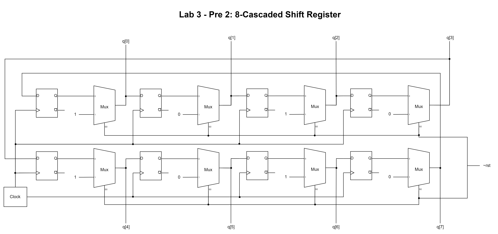
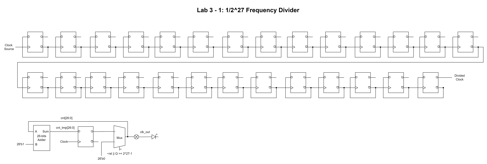

# Lab 3 - Counters and Shifters I Report

106033233 資工大四 周聖諺(Sheng-Yen Chou)

---

## Lab 3 - Pre 1: 4-bit Synchronous Binary Up Counter

### Design Specification

[Source Code](./lab3_pre1/)

**4-bit Synchronous Binary Up Counter**

Input: rst, clk

Output [3:0]q

### Design Implementation

To implement the binary up counter, I use a variable q_in to count from 0 to 15. Whenever the output of the counter q changes, the variable q_in should be changed to q + 1. In addition, when the circuit detects the raise of the clock, the output of the counter will change to the variable q_in. On the other hand, if the reset switch to 0 or the counter hit the upper limit(15), q will be reset to 0.

**Verilog Code**

```verilog
`define BCD_COUNTER_BITS 4

module binary_up_counter(
    q,
    clk,
    rst
    );
    
    output [`BCD_COUNTER_BITS-1:0]q;
    input clk;
    input rst;
    
    reg [`BCD_COUNTER_BITS-1:0]q;
    reg [`BCD_COUNTER_BITS-1:0]q_in;
    
    always@(q)
    begin
        q_in <= q + `BCD_COUNTER_BITS'd1;
    end
    
    always@(posedge clk or negedge rst)
    begin
        if(~rst)
        begin
            q <= `BCD_COUNTER_BITS'd0;
        end
        else
        begin
            q <= q_in;
        end
    end
endmodule
```

**Block Diagram**


**RTL Simulation**


## Lab 3 - Pre 2: 8-Cascaded Shift Registers

### Design Specification

[Source Code](./lab3_pre2/)

**D Flip Flop**

Input d, clk, rst

Output q

**8-Cascaded Shift Registers**

Input: rst, clk

Output [7:0]q

### Design Implementation

**D Flip Flop**

I use a variable d to store the input and q as the output of the flip flop. Whenever the clock is raised, the output variable q will be updated with the input variable d. In addition, when the reset is triggered, the output q will be 0.

**8-Cascaded Shift Registers**

I use a variable q with 8 entries to store the value. Whenever the clock is raised, it will shift the value in the previous register to the next one and the last one will be shift to the first register.

**Verilog Code**

```verilog
`define BIT_WIDTH 8

module shifter(
    q,
    clk,
    rst
    );
    
    output [`BIT_WIDTH-1:0]q;
    input clk;
    input rst;
    
    reg [`BIT_WIDTH-1:0]q;
    
    always@(posedge clk or negedge rst)
    begin
        if(~rst)
        begin
            q <= `BIT_WIDTH'b01010101;
        end
        else
        begin
            q[0] <= q[7];
            q[1] <= q[0];
            q[2] <= q[1];
            q[3] <= q[2];
            q[4] <= q[3];
            q[5] <= q[4];
            q[6] <= q[5];
            q[7] <= q[6];
        end
    end
endmodule
```

**Block Diagram**



**RTL Simulation**


## Lab 3 - 1: $1/2^{27}$ Frequency Divider

### Design Specification

[Source Code](./lab3_1/)

Input: rst, clk

Output: clk_out

### Design Implementation

To implement the frequency divider, I use a variable with 26 bits to count from 0 to $1^{27} - 1$. and then back to 0 while the variable hits $1^{27} - 1$. 

Actually, $1/2^{27}$ frequency divider can also be implemented by cascading 26 D-type flip flop. Whenever we cascade one flip flop, the frequency can be divided by 2.


**Verilog Code**

```verilog
`define FREQ_DIV_BITS 1

module lab3_1(
    clk_out,
    clk,
    rst
);

    output clk_out;
    input clk;
    input rst;
    
    reg clk_out;
    reg [`FREQ_DIV_BITS-1:0]count_out;
    reg [`FREQ_DIV_BITS:0]count; 
    
    always@(clk_out or count_out)
    begin
        count = {clk_out, count_out} + `FREQ_DIV_BITS'd1;
    end
    
    always@(posedge clk or negedge rst)
    begin
        if(~rst)
        begin
            {clk_out, count_out} = `FREQ_DIV_BITS'd0;
        end
        else
        begin
            {clk_out, count_out} = count;
        end
    end
endmodule
```

**I/O Pin Assignment**

| I/O | clk | rst | clk_out |
|-----|----|-----|-----|
| LOC | W5 | V17 | U16 |

**Block Diagram**



## Lab 3 - 2: 1Hz Count-for-50M Frequency Divider

### Design Specification

[Source Code](./lab3_2/)

Input: rst, clk

Output: clk_out

### Design Implementation

To generate the 1 Hz clock, I use variables counter_in and counter_out to count from 0 to 50M. The counter_in will store the value for the next time step and pass the value to the counter_out when the clock raises. The reason why we need  50M counting is each counting is triggered only when the clock raises, so the circuit will count 1 more for every twice clock pulses.

**Verilog Code**

```verilog
`define FREQ_DIV_BITS 30
//`define FREQ_DIV_COUNT `FREQ_DIV_BITS'd1000000
`define FREQ_DIV_COUNT `FREQ_DIV_BITS'd50000000

module lab3_2(
    clk_out,
//    counter,
    clk,
    rst
    );
    
    input clk;
    input rst;
    output clk_out;
//    output counter;
    
    reg clk_in;
    reg clk_out;
    reg [`FREQ_DIV_BITS-1:0] counter_in;
    reg [`FREQ_DIV_BITS-1:0] counter_out;
    
    always@(counter_out or clk_out)
        if(counter_out < (`FREQ_DIV_COUNT - 1))
        begin
            counter_in <= counter_out + `FREQ_DIV_BITS'd1;
            clk_in <= clk_out;
        end
        else
        begin
            counter_in <= `FREQ_DIV_BITS'd0;
            clk_in <= ~clk_out;
        end
        
    always@(posedge clk or negedge rst)
        if(~rst)
        begin
            counter_out <= `FREQ_DIV_BITS'd0;
            clk_out <= 1'd0;
        end
        else
        begin
            counter_out <= counter_in;
            clk_out <= clk_in;
        end
endmodule
```

**I/O Pin Assignment**

| I/O | clk | rst | clk_out |
|-----|----|-----|-----|
| LOC | W5 | V17 | U16 |

**Block Diagram**


## Lab 3 - 3: 1Hz 4-bit Synchronous Binary Up Counter

### Design Specification

[Source Code](./lab3_3/)

**Frequency Divider**

Input: rst, clk

Output: clk_out

**4-bit Synchronous Binary Up Counter**

Input: rst, clk

Output [3:0]q;

**1Hz 4-bit Synchronous Binary Up Counter**

Input: rst, clk

Output [3:0]q;

### Design Implementation

**Frequency Divider**

Same as Lab3-2.

**4-bit Synchronous Binary Up Counter**

Same as Lab3-pre1.

**1Hz 4-bit Synchronous Binary Up Counter**

All we need to do is combine the 1 Hz frequency divider and the 4-bit binary up counter which triggered by the 1 Hz frequency divider.

**Verilog Code**

```verilog
`define BCD_COUNTER_BITS 4
`define RST_HIGH 1'b1

module lab3_3(
    q,
    rst,
    clk
    );
    output [`BCD_COUNTER_BITS-1:0]q;
    input rst;
    input clk;
    
//    reg [`BCD_COUNTER_BITS-1:0]q;
    wire DIV_CLK;
    
    frequency_divider U0(.clk(clk), .rst(rst), .clk_out(DIV_CLK));
    binary_up_counter U1(.clk(DIV_CLK), .rst(rst), .q(q));
endmodule
```

**I/O Pin Assignment**

| I/O | clk | rst | q[0] | q[1] | q[2] | q[3] |
|-----|----|-----|-----|-----|-----|-----|
| LOC | W5 | V17 | U16 | E19 | U19 | V19 |

**Block Diagram**


## Lab 3 - 4: 1 Hz 8-Cascaded Shift Registers

### Design Specification

[Source Code](./lab3_4/)

**Frequency Divider**

Input: rst, clk

Output: clk_out

**8-Cascaded Shift Registers**

Input: rst, clk

Output [7:0]q

**1 Hz 8-Cascaded Shift Registers**

Input: rst, clk

Output [7:0]q

### Design Implementation

**Frequency Divider**

Same as Lab3-2.

**8-Cascaded Shift Registers**

Same as Lab3-Pre2.

**1 Hz 8-Cascaded Shift Registers**

We can achieve this functionality with the 1 Hz frequency divider as the clock trigger of the 8-cascaded shift registers.

**Verilog Code**

```verilog
`define BIT_WIDTH 8

module shift_register(
    q,
    clk,
    rst
    );
    
    output [`BIT_WIDTH-1:0]q;
    input clk;
    input rst;
    
    wire [`BIT_WIDTH-1:0]q;
    wire CLK_OUT;
    
    frequency_divider U0(.clk(clk), .rst(rst), .clk_out(CLK_OUT));
    shifter U1(.clk(CLK_OUT), .rst(rst), .q(q));
endmodule
```

**Block Diagram**


**I/O Pin Assignment**

| I/O | clk | rst | q[0] | q[1] | q[2] | q[3] | q[4] | q[5] | q[6] | q[7] |
|-----|----|-----|-----|-----|-----|-----|-----|-----|-----|-----|
| LOC | W5 | V17 | U16 | E19 | U19 | V19 | W18 | U15 | U14 | V14 |

## Lab 3 - 5: 1 Hz 10 Digit Marquee on 7-Segment Display

### Design Specification

[Source Code](./lab3_5/)

**Frequency Divider**

Input: rst, clk

Output: clk_out

**10-Cascaded Shift Registers**

Input: rst, clk

Output [9:0]q

**1Hz 10-Cascaded Shift Registers**

Input: rst, clk

Output [9:0]q

**7-Segment Display**

Output [0:3]d_sel, [7:0]d_out

Input clk, rst, [7:0]d0, [7:0]d1, [7:0]d2, [7:0]d3

**1 Hz 10 Digit Marquee on 7-Segment Display**

Output [0:3]d_sel, [7:0]d_out

Input clk, rst

### Design Implementation

**Frequency Divider**

Same as Lab3-2.

**10-Cascaded Shift Registers**

Simply extend the 8-digit shift registers in the Lab3-Pre2 to 10-digit. Each digit contains 8 bits to store the pattern shown on the 7-segment display.

**1Hz 10-Cascaded Shift Registers**

Simply extend the 8-digit shift register in Lab3-4 to the 10-digit one. 

**Verilog Code**

```verilog
`define SHIFTER_WIDTH 10
`define REG_SIZE 8

module shift_register(
    q0, q1, q2, q3, q4, q5, q6, q7, q8, q9,
    clk,
    rst
    );
    
    output [`REG_SIZE-1:0]q0;
    output [`REG_SIZE-1:0]q1;
    output [`REG_SIZE-1:0]q2;
    output [`REG_SIZE-1:0]q3;
    output [`REG_SIZE-1:0]q4;
    output [`REG_SIZE-1:0]q5;
    output [`REG_SIZE-1:0]q6;
    output [`REG_SIZE-1:0]q7;
    output [`REG_SIZE-1:0]q8;
    output [`REG_SIZE-1:0]q9;
    input clk;
    input rst;
    
    wire [`REG_SIZE-1:0]q0;
    wire [`REG_SIZE-1:0]q1;
    wire [`REG_SIZE-1:0]q2;
    wire [`REG_SIZE-1:0]q3;
    wire [`REG_SIZE-1:0]q4;
    wire [`REG_SIZE-1:0]q5;
    wire [`REG_SIZE-1:0]q6;
    wire [`REG_SIZE-1:0]q7;
    wire [`REG_SIZE-1:0]q8;
    wire [`REG_SIZE-1:0]q9;
    wire CLK_OUT;
    
    frequency_divider U0(.clk(clk), .rst(rst), .clk_out(CLK_OUT));
    shifter U1(.clk(CLK_OUT), .rst(rst), .q0(q0), .q1(q1), .q2(q2), .q3(q3), .q4(q4), .q5(q5), .q6(q6), .q7(q7), .q8(q8), .q9(q9));
endmodule
```

**7-Segment Display**

Since we can only control one digit of the 7-segment display each time, I design a module that takes the 4-digit patterns as input and shows the 1 digit on the display when the clock raises. Whenever the clock raises, the module will switch the control d_sel to different digit and shows the corresponding digit. Take an example, when the first clock raise occur, the module will set d_sel = 4'b1110 and d_out = d0. As for second clock pulse, the module will output d_sel = 4'b1101 and d_out = d1 and so on. 

**Verilog Code**

```verilog
`define DIGIT_N 4
`define SEGMENT_N 8
`define NONE_BITS `SEGMENT_N'b1111111_0
`define EMPTY_BITS `SEGMENT_N'b1111111_1

module display_7seg(
    d_sel,
    d_out,
    clk,
    rst,
    d0,
    d1,
    d2,
    d3
    );
    
    output [0:`DIGIT_N-1]d_sel;
    output [`SEGMENT_N-1:0]d_out;
    input clk;
    input rst;
    input [`SEGMENT_N-1:0]d0;
    input [`SEGMENT_N-1:0]d1;
    input [`SEGMENT_N-1:0]d2;
    input [`SEGMENT_N-1:0]d3;
    
    reg [0:`DIGIT_N-1]d_sel;
    reg [`SEGMENT_N-1:0]d_out;
    reg [0:`DIGIT_N-1]d_sel_temp;
    reg [`SEGMENT_N-1:0]d_out_temp;
    wire clk_out;

    segment7_frequency_divider U0(.clk(clk), .rst(rst), .clk_out(clk_out));
    
    always@(d_sel)
    begin
        case((d_sel << 1) | (d_sel >> (`DIGIT_N-1)))
            `DIGIT_N'b1110: d_out_temp <= d0;
            `DIGIT_N'b1101: d_out_temp <= d1;
            `DIGIT_N'b1011: d_out_temp <= d2;
            `DIGIT_N'b0111: d_out_temp <= d3;
            default: d_out_temp <= `NONE_BITS;
        endcase
        d_sel_temp <= (d_sel << 1) | (d_sel >> (`DIGIT_N-1));
    end
    
    always@(posedge clk_out or negedge rst)
    begin
        if(~rst)
        begin
            d_out <= `EMPTY_BITS;
            d_sel <= `DIGIT_N'b1110;
        end
        else
        begin
            d_out <= d_out_temp;
            d_sel <= d_sel_temp;
        end
    end
        
endmodule
```

**1 Hz 10 Digit Marquee on 7-Segment Display**

To implement the marquee, just simply combine the 1 Hz 10-cascaded shift registers and the 7-segment display. The 1 Hz 10-cascaded shift registers will store the patterns of each time step and shift the digits when the clock raises. Then I inject the digit 0 ~ 4 into the 7-segment display module to show the patterns.

```verilog
`define DIGIT_N 4
`define SEGMENT_N 8

`define H_BITS `SEGMENT_N'b1001000_1
`define N_BITS `SEGMENT_N'b1101010_1
`define T_BITS `SEGMENT_N'b1110000_1
`define U_BITS `SEGMENT_N'b1000001_1

module lab3_5(
    d_sel,
    d_out,
    clk,
    rst
    );
    
    output [`DIGIT_N-1:0]d_sel;
    output [`SEGMENT_N-1:0]d_out;
    input clk;
    input rst;
    
    wire [`SEGMENT_N-1:0]Q0;
    wire [`SEGMENT_N-1:0]Q1;
    wire [`SEGMENT_N-1:0]Q2;
    wire [`SEGMENT_N-1:0]Q3;
    
    shift_register U0(.clk(clk), .rst(rst), .q0(Q0), .q1(Q1), .q2(Q2), .q3(Q3));    
    display_7seg U1(.clk(clk), .rst(rst), .d0(Q0), .d1(Q1), .d2(Q2), .d3(Q3), .d_sel(d_sel), .d_out(d_out));
endmodule
```

**Block Diagram**


**I/O Pin Assignment**

| I/O | clk | rst | d_out[0] | d_out[1] | d_out[2] | d_out[3] | d_out[4] |
|-----|----|-----|-----|-----|-----|-----|-----|
| LOC | W5 | V17 | V7 | U7 | V5 | U5 | V8 |

| d_out[5] | d_out[6] | d_out[7] | d_sel[0] | d_sel[1] | d_sel[2] | d_sel[3]
|-----|-----|-----|-----|-----|-----|-----|
| U8 | W6 | W7 | U2 | U4 | V4 | W4 |