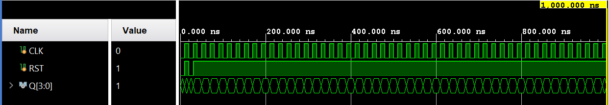
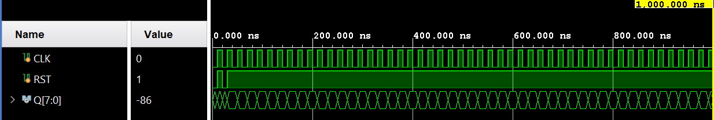

# Lab 3 - Counters and Shifters I Report

106033233 資工大四 周聖諺

---

## Lab 3 - Pre 1: 4-bit Synchronous Binary Up Counter

### Design Specification

[Source Code](./lab3_pre1/)

**4-bit Synchronous Binary Up Counter**

Input: rst, clk

Output [3:0]q

### Design Implementation

To implement the binary up counter, I use a variable q_in to count from 0 to 15. Whenever the output of the counter q changes, the variable q_in should be changed to q + 1. In addition, when the circuit detect the raise of the clock, the output of the counter will change to the variable q_in. On the other hand, if the reset switch to 0 or the counter hit the upper limit(15), q will be reset to 0.

**Verilog Code**

```verilog
`define BCD_COUNTER_BITS 4

module binary_up_counter(
    q,
    clk,
    rst
    );
    
    output [`BCD_COUNTER_BITS-1:0]q;
    input clk;
    input rst;
    
    reg [`BCD_COUNTER_BITS-1:0]q;
    reg [`BCD_COUNTER_BITS-1:0]q_in;
    
    always@(q)
    begin
        q_in <= q + `BCD_COUNTER_BITS'd1;
    end
    
    always@(posedge clk or negedge rst)
    begin
        if(~rst)
        begin
            q <= `BCD_COUNTER_BITS'd0;
        end
        else
        begin
            q <= q_in;
        end
    end
endmodule
```

**Block Diagram**


**RTL Simulation**



## Lab 3 - Pre 2: 8-Cascaded Shift Registers

### Design Specification

[Source Code](./lab3_pre2/)

**D Flip Flop**

Input d, clk, rst

Output q

**8-Cascaded Shift Registers**

Input: rst, clk

Output [7:0]q

### Design Implementation

**D Flip Flop**

I use a variable d to store the input and q as the output of the flip flop. Whenever the clock is raised, the output variable q will be updated with the input variable d. In addition, when the reset is triggered, the output q will be 0.

**8-Cascaded Shift Registers**

I use a variable q with 8 entries to store the value. Whenever the clock is raised, it will shift the value in the previous register to the next one and the last one will be shift to the first register.

**Verilog Code**

```verilog
`define BIT_WIDTH 8

module shifter(
    q,
    clk,
    rst
    );
    
    output [`BIT_WIDTH-1:0]q;
    input clk;
    input rst;
    
    reg [`BIT_WIDTH-1:0]q;
    
    always@(posedge clk or negedge rst)
    begin
        if(~rst)
        begin
            q <= `BIT_WIDTH'b01010101;
        end
        else
        begin
            q[0] <= q[7];
            q[1] <= q[0];
            q[2] <= q[1];
            q[3] <= q[2];
            q[4] <= q[3];
            q[5] <= q[4];
            q[6] <= q[5];
            q[7] <= q[6];
        end
    end
endmodule
```

**Block Diagram**


**RTL Simulation**



## Lab 3 - 1: $1/2^{27}$ Frequency Divider

### Design Specification

[Source Code](./lab3_1/)

Input: rst_n, clk

Output: clk_out

### Design Implementation

To implement the frequency divider, I use a variable with 26 bits to count from 0 to $1^{27} - 1$. and then back to 0 while the variable hits $1^{27} - 1$. 

Actually, $1/2^{27}$ frequency divider can also be implemented by cascading 26 D-type flip flop. Whenever we cascade one flip flop, the frequency can be divided by 2.


**Verilog Code**

```verilog
`define FREQ_DIV_BIT 26

module lab3_1(
    clk_out, // divided clock output
    clk, // global clock input
    rst_n // active low reset
);

    output clk_out; // divided output
    input clk; // global clock input
    input rst_n; // active low reset
    reg clk_out; // clk output (in always block)
    reg [`FREQ_DIV_BIT-2:0] cnt; // remainder of the counter
    reg [`FREQ_DIV_BIT-1:0] cnt_tmp; // input to dff (in always block)
    
    // Combinational logics: increment, neglecting overflow 
    always @(clk_out or cnt)
        cnt_tmp = {clk_out,cnt} + 1'b1;
    
    // Sequential logics: Flip flops
    always @(posedge clk or negedge rst_n)
        if (~rst_n) {clk_out, cnt}<=`FREQ_DIV_BIT'd0;
        else {clk_out,cnt}<=cnt_tmp;

endmodule
```

**I/O Pin Assignment**

| I/O | clk | rst_n | clk_out |
|-----|----|-----|-----|
| LOC | W5 | V17 | U16 |

**Block Diagram**


## Lab 3 - 2: 1Hz Count-for-50M Frequency Divider

### Design Specification

[Source Code](./lab3_2/)

Input: rst, clk

Output: clk_out

### Design Implementation

To generate the 1 Hz clock, I use variables counter_in and counter_out to count from 0 to 50M. The reason why we need  50M counting is each counting is triggered only at the clock raise, so the circuit will count 1 more for twice clock pulses.

**Verilog Code**

```verilog
`define FREQ_DIV_BITS 30
//`define FREQ_DIV_COUNT `FREQ_DIV_BITS'd1000000
`define FREQ_DIV_COUNT `FREQ_DIV_BITS'd50000000

module lab3_2(
    clk_out,
//    counter,
    clk,
    rst
    );
    
    input clk;
    input rst;
    output clk_out;
//    output counter;
    
    reg clk_in;
    reg clk_out;
    reg [`FREQ_DIV_BITS-1:0] counter_in;
    reg [`FREQ_DIV_BITS-1:0] counter_out;
    
    always@(counter_out or clk_out)
        if(counter_out < (`FREQ_DIV_COUNT - 1))
        begin
            counter_in <= counter_out + `FREQ_DIV_BITS'd1;
            clk_in <= clk_out;
        end
        else
        begin
            counter_in <= `FREQ_DIV_BITS'd0;
            clk_in <= ~clk_out;
        end
        
    always@(posedge clk or negedge rst)
        if(~rst)
        begin
            counter_out <= `FREQ_DIV_BITS'd0;
            clk_out <= 1'd0;
        end
        else
        begin
            counter_out <= counter_in;
            clk_out <= clk_in;
        end
endmodule
```

**I/O Pin Assignment**

| I/O | clk | rst | clk_out |
|-----|----|-----|-----|
| LOC | W5 | V17 | U16 |

**Block Diagram**


## Lab 3 - 3: 1Hz 4-bit Synchronous Binary Up Counter

### Design Specification

[Source Code](./lab3_3/)

**Frequency Divider**

Input: rst, clk

Output: clk_out

**4-bit Synchronous Binary Up Counter**

Input: rst, clk

Output [3:0]q;

**1Hz 4-bit Synchronous Binary Up Counter**

Input: rst, clk

Output [3:0]q;

### Design Implementation

**Frequency Divider**

Same as Lab3-2.

**4-bit Synchronous Binary Up Counter**

Same as Lab3-pre1.

**1Hz 4-bit Synchronous Binary Up Counter**

All we need to do is combine the 1 Hz frequency divider and the 4-bit binary up counter which triggered by the 1 Hz frequency divider.

**Verilog Code**

```verilog
`define BCD_COUNTER_BITS 4
`define RST_HIGH 1'b1

module lab3_3(
    q,
    rst,
    clk
    );
    output [`BCD_COUNTER_BITS-1:0]q;
    input rst;
    input clk;
    
//    reg [`BCD_COUNTER_BITS-1:0]q;
    wire DIV_CLK;
    
    frequency_divider U0(.clk(clk), .rst(rst), .clk_out(DIV_CLK));
    binary_up_counter U1(.clk(DIV_CLK), .rst(rst), .q(q));
endmodule
```

**I/O Pin Assignment**

| I/O | clk | rst_n | q[0] | q[1] | q[2] | q[3] |
|-----|----|-----|-----|-----|-----|-----|
| LOC | W5 | V17 | U16 | E19 | U19 | V19 |

**Block Diagram**


## Lab 3 - 4: 1 Hz 8-Cascaded Shift Registers

### Design Specification

[Source Code](./lab3_pre2/)

**Frequency Divider**

Input: rst, clk

Output: clk_out

**8-Cascaded Shift Registers**

Input: rst, clk

Output [7:0]q

**1Hz 8-Cascaded Shift Registers**

Input: rst, clk

Output [7:0]q

### Design Implementation

**Frequency Divider**

Same as Lab3-2.

**8-Cascaded Shift Registers**

Same as Lab3-Pre2.

**1Hz 8-Cascaded Shift Registers**


**Verilog Code**

```verilog
`define BIT_WIDTH 8

module shift_register(
    q,
    clk,
    rst
    );
    
    output [`BIT_WIDTH-1:0]q;
    input clk;
    input rst;
    
    wire [`BIT_WIDTH-1:0]q;
    wire CLK_OUT;
    
    frequency_divider U0(.clk(clk), .rst(rst), .clk_out(CLK_OUT));
    shifter U1(.clk(CLK_OUT), .rst(rst), .q(q));
endmodule
```

**Block Diagram**

