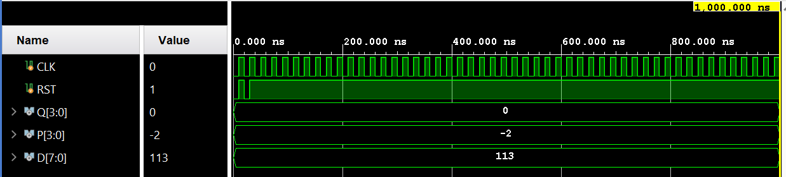

# Lab 4 - Counters and Shifters II Report

106033233 資工大四 周聖諺(Sheng-Yen Chou)

---

## Lab 4 - 1: 1Hz 4-bit Synchronous Binary Down Counter

### Design Specification

[Source Code](./lab4_1/)

**Frequency Divider**

Input: rst, clk

Output: clk_out

**4-bit Synchronous Binary Down Counter**

Input: rst, clk

Output [3:0]q

**1Hz 4-bit Synchronous Binary Down Counter**

Input: rst, clk

Output [3:0]q

### Design Implementation

**Frequency Divider**

To generate the 1 Hz clock, I use variables counter_in and counter_out to count from 0 to 50M. The counter_in will store the value for the next time step and pass the value to the counter_out when the clock raises. The reason why we need  50M counting is each counting is triggered only when the clock raises, so the circuit will count 1 more for every twice clock pulses.

```verilog
`define FREQ_DIV_BITS 30
//`define FREQ_DIV_COUNT `FREQ_DIV_BITS'd1000000
`define FREQ_DIV_COUNT `FREQ_DIV_BITS'd50000000

module frequency_divider(
    clk_out,
//    counter,
    clk,
    rst
    );
    
    input clk;
    input rst;
    output clk_out;
//    output counter;
    
    reg clk_in;
    reg clk_out;
    reg [`FREQ_DIV_BITS-1:0] counter_in;
    reg [`FREQ_DIV_BITS-1:0] counter_out;
    
    always@(counter_out or clk_out)
        if(counter_out < (`FREQ_DIV_COUNT - 1))
        begin
            counter_in <= counter_out + `FREQ_DIV_BITS'd1;
            clk_in <= clk_out;
        end
        else
        begin
            counter_in <= `FREQ_DIV_BITS'd0;
            clk_in <= ~clk_out;
        end
        
    always@(posedge clk or negedge rst)
        if(~rst)
        begin
            counter_out <= `FREQ_DIV_BITS'd0;
            clk_out <= 1'd0;
        end
        else
        begin
            counter_out <= counter_in;
            clk_out <= clk_in;
        end
endmodule
```

**4-bit Synchronous Binary Down Counter**

To implement the binary down counter, I use a variable q_in to count from 0 to 15. Whenever the output of the counter q changes, the variable q_in should be changed to q - 1. In addition, when the circuit detects the raise of the clock, the output of the counter will change to the variable q_in. On the other hand, if the reset switch to 0 or the counter hits 0, q will be reset to the upper limit 15.

**Verilog Code**

```verilog
`define BCD_COUNTER_BITS 4

module binary_down_counter(
    q,
    clk,
    rst
    );
    
    output [`BCD_COUNTER_BITS-1:0]q;
    input clk;
    input rst;
    
    reg [`BCD_COUNTER_BITS-1:0]q;
    reg [`BCD_COUNTER_BITS-1:0]q_in;
    
    always@(q)
    begin
        q_in <= q - `BCD_COUNTER_BITS'd1;
    end
    
    always@(posedge clk or negedge rst)
    begin
        if(~rst)
        begin
            q <= `BCD_COUNTER_BITS'd0;
        end
        else
        begin
            q <= q_in;
        end
    end
endmodule
```

**1Hz 4-bit Synchronous Binary Down Counter**

All we need to do is combine the 1 Hz frequency divider and the 4-bit binary down counter which triggered by the 1 Hz frequency divider.

```verilog
`define BCD_COUNTER_BITS 4
`define RST_HIGH 1'b1

module lab4_1(
    q,
    rst,
    clk
    );
    output [`BCD_COUNTER_BITS-1:0]q;
    input rst;
    input clk;
    
//    reg [`BCD_COUNTER_BITS-1:0]q;
    wire DIV_CLK;
    
    frequency_divider U0(.clk(clk), .rst(rst), .clk_out(DIV_CLK));
    binary_down_counter U1(.clk(DIV_CLK), .rst(rst), .q(q));
endmodule
```

**I/O Pin Assignment**

| I/O | clk | rst | q[0] | q[1] | q[2] | q[3] |
|-----|----|-----|-----|-----|-----|-----|
| LOC | W5 | V17 | U16 | E19 | U19 | V19 |

**Block Diagram**


**RTL Simulation**


---

## Lab 4 - 2: 1Hz 4-bit Synchronous Binary Down Counter To 7-Segment Display

### Design Specification

[Source Code](./lab4_2/)

**Frequency Divider**

Input: rst, clk

Output: clk_out

**4-bit Synchronous Binary Down Counter**

Input: rst, clk

Output [3:0]q

**1Hz 4-bit Synchronous Binary Down Counter**

Input: rst, clk

Output [3:0]q

**Binary to 7-Segment Display**

Input [3:0] i

Output [3:0]P, [7:0]D

**1Hz 4-bit Synchronous Binary Down Counter To 7-Segment Display**

Input rst, clk

Output [3:0]q,  [3:0]P, [7:0]D

### Design Implementation

**Frequency Divider**

Same as lab 4-1.

**4-bit Synchronous Binary Down Counter**

Same as lab 4-1.

**1Hz 4-bit Synchronous Binary Down Counter**

Same as lab 4-1.

**Binary to 7-Segment Display**

Convert 4-bit binary number to 7-segment display with switch-case syntax.

```verilog
`define INPUT_BITS_N 4
`define SEGMENT_7_DISPALY_DIGIT_N 4
`define SEGMENT_7_SEGMENT_N 8

module segment7(
    input [`INPUT_BITS_N:0] i,
    output [`SEGMENT_7_DISPALY_DIGIT_N-1:0]P,
    output [`SEGMENT_7_SEGMENT_N-1:0]D
    );
    
    reg [`SEGMENT_7_SEGMENT_N-1:0]D;
    
    assign P = ~4'b0001;
    always@(i)
        case(i)
            4'd0: D=`SEGMENT_7_SEGMENT_N'b0000001_1;
            4'd1: D=`SEGMENT_7_SEGMENT_N'b1001111_1;
            4'd2: D=`SEGMENT_7_SEGMENT_N'b0010010_1;
            4'd3: D=`SEGMENT_7_SEGMENT_N'b0000110_1;
            4'd4: D=`SEGMENT_7_SEGMENT_N'b1001100_1;
            4'd5: D=`SEGMENT_7_SEGMENT_N'b0100100_1;
            4'd6: D=`SEGMENT_7_SEGMENT_N'b0100000_1;
            4'd7: D=`SEGMENT_7_SEGMENT_N'b0001111_1;
            4'd8: D=`SEGMENT_7_SEGMENT_N'b0000000_1;
            4'd9: D=`SEGMENT_7_SEGMENT_N'b0000100_1;
            4'd10: D=`SEGMENT_7_SEGMENT_N'b0001000_1;
            4'd11: D=`SEGMENT_7_SEGMENT_N'b1100000_1;
            4'd12: D=`SEGMENT_7_SEGMENT_N'b0110001_1;
            4'd13: D=`SEGMENT_7_SEGMENT_N'b1000010_1;
            4'd14: D=`SEGMENT_7_SEGMENT_N'b0110000_1;
            4'd15: D=`SEGMENT_7_SEGMENT_N'b0111000_1;
            default: D=`SEGMENT_7_SEGMENT_N'b0111000_1;
        endcase
        
endmodule
```

**1Hz 4-bit Synchronous Binary Down Counter To 7-Segment Display**

It's a simple module and just use the divided clock from frequency divider to trigger the binary down counter. The counting of the down counter will be shown in 7-segment display.

```verilog
`define BCD_COUNTER_BITS 4
`define RST_HIGH 1'b1
`define SEGMENT_7_DISPALY_DIGIT_N 4
`define SEGMENT_7_SEGMENT_N 8

module lab4_2(
    q,
    P,
    D,
    rst,
    clk
    );
    output [`BCD_COUNTER_BITS-1:0]q;
    output [`SEGMENT_7_DISPALY_DIGIT_N-1:0]P;
    output [`SEGMENT_7_SEGMENT_N-1:0]D;
    input rst;
    input clk;
    
//    reg [`BCD_COUNTER_BITS-1:0]q;
    wire DIV_CLK;
    
    assign P = 4'b1110;
    
    frequency_divider U0(.clk(clk), .rst(rst), .clk_out(DIV_CLK));
    binary_down_counter U1(.clk(DIV_CLK), .rst(rst), .q(q));
    segment7 U2(.i(q), .P(P), .D(D));
endmodule
```

**I/O Pin Assignment**

| I/O | clk | rst | q[0] | q[1] | q[2] | q[3] | P[0] | P[1] | P[2] | P[3] |
|-----|-----|-----|------|------|------|------|------|------|------|------|
| LOC | W5  | V17 | U16  | E19  | U19  | V19  | U2   | U4   | V4   | W4   |

| I/O | D[0] | D[1] | D[2] | D[3] | D[4] | D[5] | D[6] | D[7] |
|-----|----|----|----|----|----|----|----|----|
| LOC | V7 | U7 | V5 | U5 | V8 | U8 | W6 | W7 |

**Block Diagram**


**RTL Simulation**


---

## Lab 4 - 3: 0.5Hz 4-bit Synchronous Binary Down Counter To 7-Segment Display

### Design Specification

[Source Code](./lab4_3/)

**Frequency Divider**

Input: rst, clk

Output: clk_out

**4-bit Synchronous Binary Down Counter**

Input: rst, clk

Output [3:0]q

**0.5Hz 4-bit Synchronous Binary Down Counter**

Input: rst, clk

Output [3:0]q

**Binary to 7-Segment Display**

Input [3:0] i

Output [3:0]P, [7:0]D

**0.5Hz 4-bit Synchronous Binary Down Counter To 7-Segment Display**

Input rst, clk

Output [3:0]q,  [3:0]P, [7:0]D

### Design Implementation

**Frequency Divider**

It's similar to lab 4-2. I only modify the upper limit of the counter to 100M, which means twice divide the frequency.

```verilog
`define FREQ_DIV_BITS 30
//`define FREQ_DIV_COUNT `FREQ_DIV_BITS'd1000000
//`define FREQ_DIV_COUNT `FREQ_DIV_BITS'd50000000
`define FREQ_DIV_COUNT `FREQ_DIV_BITS'd100000000

module frequency_divider(
    clk_out,
    clk,
    rst
    );
    
    input clk;
    input rst;
    output clk_out;
    
    reg clk_in;
    reg clk_out;
    reg [`FREQ_DIV_BITS-1:0] counter_in;
    reg [`FREQ_DIV_BITS-1:0] counter_out;
    
    always@(counter_out or clk_out)
        if(counter_out < (`FREQ_DIV_COUNT - 1))
        begin
            counter_in <= counter_out + `FREQ_DIV_BITS'd1;
            clk_in <= clk_out;
        end
        else
        begin
            counter_in <= `FREQ_DIV_BITS'd0;
            clk_in <= ~clk_out;
        end
        
    always@(posedge clk or negedge rst)
        if(~rst)
        begin
            counter_out <= `FREQ_DIV_BITS'd0;
            clk_out <= 1'd0;
        end
        else
        begin
            counter_out <= counter_in;
            clk_out <= clk_in;
        end
endmodule
```

**4-bit Synchronous Binary Down Counter**

Same as lab 4-2.

**1Hz 4-bit Synchronous Binary Down Counter**

Same as lab 4-2.

**Binary to 7-Segment Display**

Same as lab 4-2.

**0.5Hz 4-bit Synchronous Binary Down Counter To 7-Segment Display**

We simply combine the previous 3 modules and we can 

```verilog
`define BCD_COUNTER_BITS 4
`define RST_HIGH 1'b1
`define SEGMENT_7_DISPALY_DIGIT_N 4
`define SEGMENT_7_SEGMENT_N 8

module lab4_3(
    q,
    P,
    D,
    rst,
    clk
    );
    output [`BCD_COUNTER_BITS-1:0]q;
    output [`SEGMENT_7_DISPALY_DIGIT_N-1:0]P;
    output [`SEGMENT_7_SEGMENT_N-1:0]D;
    input rst;
    input clk;
    
//    reg [`BCD_COUNTER_BITS-1:0]q;
    wire DIV_CLK;
    
    assign P = 4'b1110;
    
    frequency_divider U0(.clk(clk), .rst(rst), .clk_out(DIV_CLK));
    binary_down_1digit_counter U1(.clk(DIV_CLK), .rst(rst), .q(q));
    segment7 U2(.i(q), .P(P), .D(D));
endmodule

```

**I/O Pin Assignment**

| I/O | clk | rst | q[0] | q[1] | q[2] | q[3] | P[0] | P[1] | P[2] | P[3] |
|-----|-----|-----|------|------|------|------|------|------|------|------|
| LOC | W5  | V17 | U16  | E19  | U19  | V19  | U2   | U4   | V4   | W4   |

| I/O | D[0] | D[1] | D[2] | D[3] | D[4] | D[5] | D[6] | D[7] |
|-----|----|----|----|----|----|----|----|----|
| LOC | V7 | U7 | V5 | U5 | V8 | U8 | W6 | W7 |

**Block Diagram**


**RTL Simulation**



---

## Lab 4 - 4: 1Hz 8-bit Synchronous Binary Up Counter To 7-Segment Display

### Design Specification

[Source Code](./lab4_2/)

**Frequency Divider**

Input: rst, clk

Output: clk_out

**8-bit Synchronous Binary Up Counter**

Input: rst, clk

Output [7:0]q

**1Hz 8-bit Synchronous Binary Up Counter**

Input: rst, clk

Output [7:0]q

**Extractor**

Input [7:0] x

Output [3:0] d1, [3:0] d2

**Binary to 7-Segment Display**

Input [3:0] i

Output [3:0]P, [7:0]D

**7-Segment Display**

Output [0:3]d_sel, [7:0]d_out

Input clk, rst, [7:0]d0, [7:0]d1, [7:0]d2, [7:0]d3

**1Hz 8-bit Synchronous Binary Up Counter To 7-Segment Display**

Input rst, clk

Output [3:0]q,  [3:0]P, [7:0]D

### Design Implementation

**Frequency Divider**

Same as lab 4-1.

**8-bit Synchronous Binary Up Counter**

It's similar to the 4-bit binary down counter in lab 4-1. I only extend the bits array of the counter to 8 bits and use plus 1 instead of minus 1.

**1Hz 8-bit Synchronous Binary Up Counter**

It's similar to the 1 Hz 4-bit binary down counter in lab 4-1. I only extend the bits array of the counter to 8 bits and use plus 1 instead of minus 1.

**Extractor**

I use mod of 10 to extract the first decimal digit and use divided by 10 to extract the second decimal digit.

```verilog
module extract(
    input [7:0] x,
    output [3:0] d1,
    output [3:0] d2
    );
    
    wire [7:0]mod;
    wire [7:0]div;
    assign mod = x % 10;
    assign div = x / 10;
    
    assign d1 = mod[3:0];
    assign d2 = div[3:0];
endmodule
```

**Binary to 7-Segment Display**

Same as lab4-2.

**7-Segment Display Controller**

Since we can only control one digit of the 7-segment display each time, I design a module that takes the 4-digit patterns as input and shows the 1 digit on the display when the clock raises. Whenever the clock raises, the module will switch the control d_sel to different digit and shows the corresponding digit. Take an example, when the first clock raise occur, the module will set d_sel = 4'b1110 and d_out = d0. As for second clock pulse, the module will output d_sel = 4'b1101 and d_out = d1 and so on. 

```verilog
`define DIGIT_N 4
`define SEGMENT_N 8
`define NONE_BITS `SEGMENT_N'b1111111_0
`define EMPTY_BITS `SEGMENT_N'b1111111_1

module display_7seg(
    d_sel,
    d_out,
    clk,
    rst,
    d0,
    d1,
    d2,
    d3
    );
    
    output [0:`DIGIT_N-1]d_sel;
    output [`SEGMENT_N-1:0]d_out;
    input clk;
    input rst;
    input [`SEGMENT_N-1:0]d0;
    input [`SEGMENT_N-1:0]d1;
    input [`SEGMENT_N-1:0]d2;
    input [`SEGMENT_N-1:0]d3;
    
    reg [0:`DIGIT_N-1]d_sel;
    reg [`SEGMENT_N-1:0]d_out;
    reg [0:`DIGIT_N-1]d_sel_temp;
    reg [`SEGMENT_N-1:0]d_out_temp;
    wire clk_out;
    
//    initial
//    begin
//        d_sel_temp <= `DIGIT_N'b1110;
//        d_out_temp <= `EMPTY_BITS;
//    end

    segment7_frequency_divider U0(.clk(clk), .rst(rst), .clk_out(clk_out));
    
    always@(d_sel)
    begin
        case((d_sel << 1) | (d_sel >> (`DIGIT_N-1)))
            `DIGIT_N'b1110: d_out_temp <= d0;
            `DIGIT_N'b1101: d_out_temp <= d1;
            `DIGIT_N'b1011: d_out_temp <= d2;
            `DIGIT_N'b0111: d_out_temp <= d3;
            default: d_out_temp <= `NONE_BITS;
        endcase
        d_sel_temp <= (d_sel << 1) | (d_sel >> (`DIGIT_N-1));
    end
    
    always@(posedge clk_out or negedge rst)
    begin
        if(~rst)
        begin
            d_out <= `EMPTY_BITS;
            d_sel <= `DIGIT_N'b1110;
        end
        else
        begin
            d_out <= d_out_temp;
            d_sel <= d_sel_temp;
        end
    end
        
endmodule
```

**1Hz 8-bit Synchronous Binary Up Counter To 7-Segment Display**

I combine the all modules mentioned above. First, I generate a 1 Hz clock to trigger the 8-bit up counter and output the number of counting. Then, extract the both decimal digits of the binary number of counting. Finally, show the decimal digits on the 7-segment display.

```verilog
`define BCD_COUNTER_BITS 8
`define RST_HIGH 1'b1

`define INPUT_BITS_N 4
`define SEGMENT_7_DISPALY_DIGIT_N 4
`define SEGMENT_7_SEGMENT_N 8

`define P 4'b1111
`define NONE_SEG7 `SEGMENT_7_SEGMENT_N'b1111111_1

module lab4_4(
    q,
    D_SEL,
    D_OUT,
    rst,
    clk
    );
    output [`BCD_COUNTER_BITS-1:0]q;
    output [`SEGMENT_7_DISPALY_DIGIT_N-1:0]D_SEL;
    output [`SEGMENT_7_SEGMENT_N-1:0]D_OUT;
    input rst;
    input clk;
    
    //    reg [`BCD_COUNTER_BITS-1:0]q;
    wire DIV_CLK;
    wire [`INPUT_BITS_N-1:0]D1_BINARY;
    wire [`INPUT_BITS_N-1:0]D2_BINARY;
    wire [`SEGMENT_7_SEGMENT_N-1:0]D1_SEGMENT7;
    wire [`SEGMENT_7_SEGMENT_N-1:0]D2_SEGMENT7;
    
    // 2-Digits Binary up counter 
    frequency_divider U0(.clk(clk), .rst(rst), .clk_out(DIV_CLK));
    binary_up_2digit_counter U1(.clk(DIV_CLK), .rst(rst), .q(q));
    
    // Extract digits
    extract U2(.x(q), .d1(D1_BINARY), .d2(D2_BINARY));
    
    // Convert binary to 7-segment 
    segment7 U3(.i(D1_BINARY), .D(D1_SEGMENT7));
    segment7 U4(.i(D2_BINARY), .D(D2_SEGMENT7));
    
    // Show
    display_7seg U5(.clk(clk), .rst(rst), .d0(D1_SEGMENT7), .d1(D2_SEGMENT7), .d2(`NONE_SEG7), .d3(`NONE_SEG7), .d_sel(D_SEL), .d_out(D_OUT));
endmodule
```

**I/O Pin Assignment**

| I/O | clk | rst | q[0] | q[1] | q[2] | q[3] | P[0] | P[1] | P[2] | P[3] |
|-----|-----|-----|------|------|------|------|------|------|------|------|
| LOC | W5  | V17 | U16  | E19  | U19  | V19  | U2   | U4   | V4   | W4   |

| I/O | D[0] | D[1] | D[2] | D[3] | D[4] | D[5] | D[6] | D[7] |
|-----|----|----|----|----|----|----|----|----|
| LOC | V7 | U7 | V5 | U5 | V8 | U8 | W6 | W7 |

**Block Diagram**


**RTL Simulation**


## Discussion 

In lab 3-5, first I use 100M Hz clock to trigger the 7-segment display to switch the controlling digits. However, I found it didn't work at all because the display cannot adapt such high-frequent switching. As a result, I gradually slower down the update frequency to 1000 Hz(which is divided by $50000 \times 2$) and the marquee finally worked.

## Conclusion

The lab4 seems like an extension of the lab3. 

In the lab 3, we've learned how to implement a shift register and a frequency divider to demonstrate the time-depending circuit. In addition, we also review the state machine and relation between them and the sequential circuit.

## Reference

- None