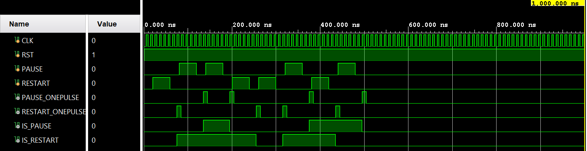
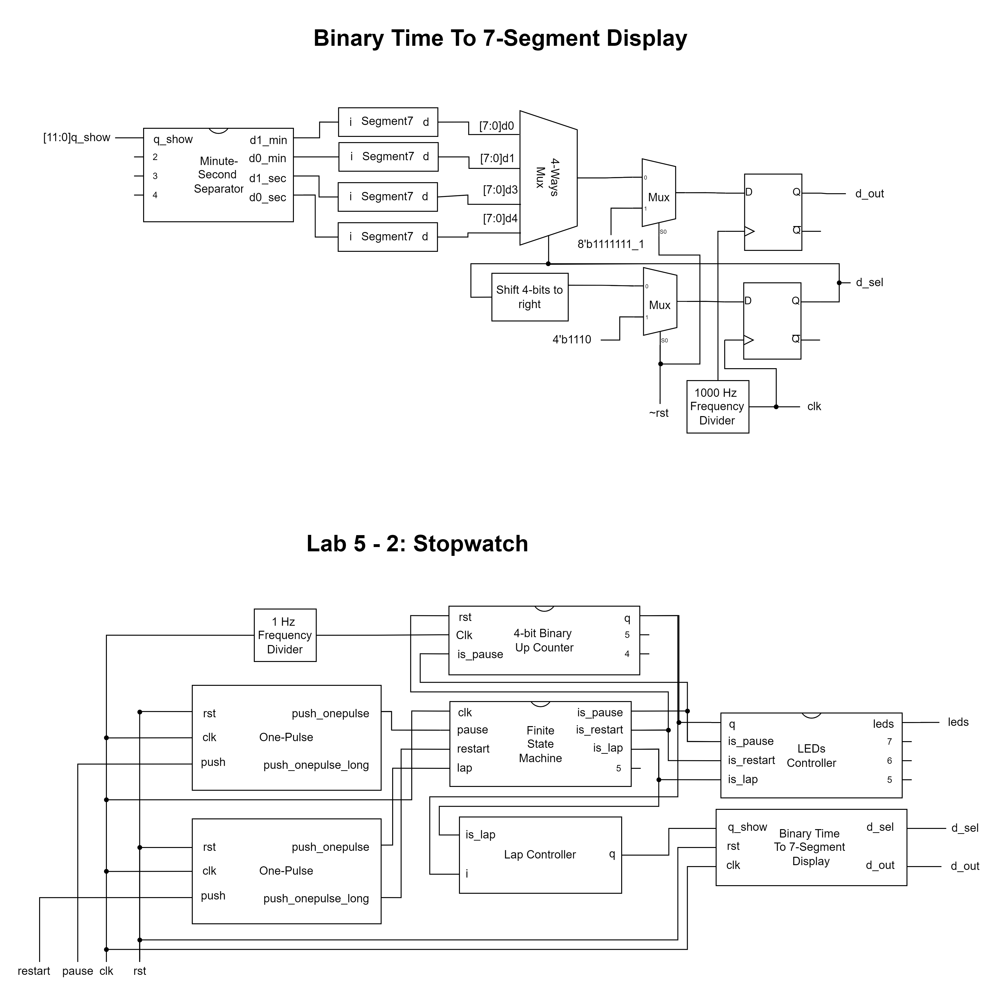
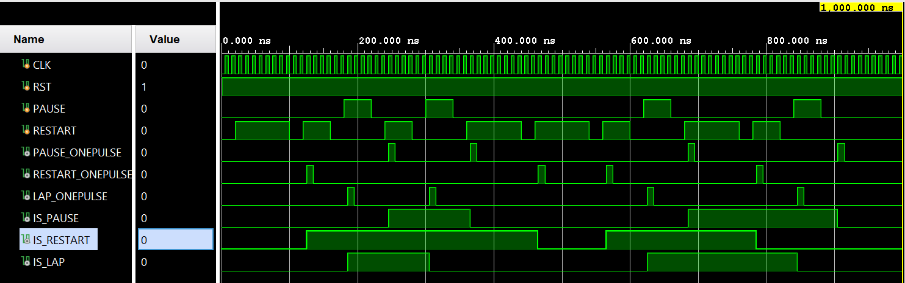
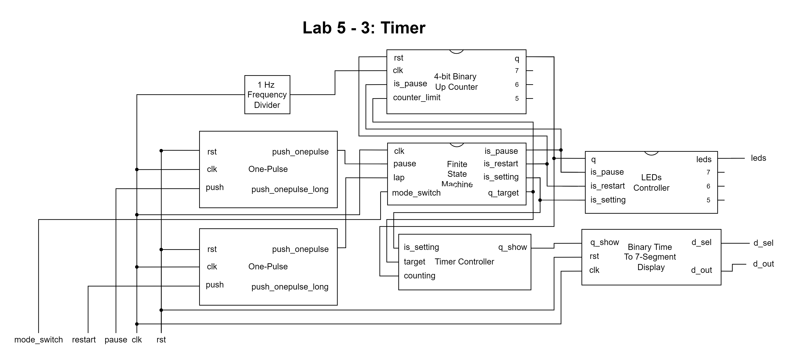
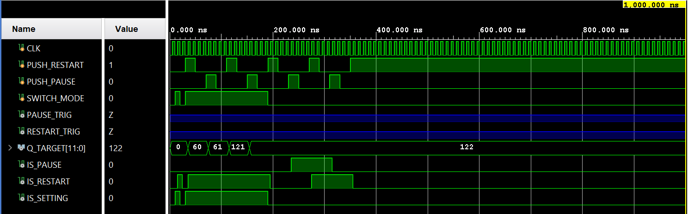

# Lab 5 - Timer and Stopwatch Report

106033233 資工大四 周聖諺(Sheng-Yen Chou)

---

## Lab 5 - Pre Lab: 40-Second Timer

### Design Specification

[Source Code](./prelab/)

**Debounce**

Input: rst, clk, push

Output: push_debounced

**One-Pulse**

Input: rst, clk, push

Output: push_onepulse

**Finite State Machine**

Input pause, clk, restart

Output is_pause, is_restart

**Frequency Divider**

Input: rst, clk

Output: clk_out

**2-Digit Synchronous Binary Down Counter**

Input: rst, clk

Output [7:0]q

**LEDs Controller**

Input: q, is_pause, is_restart

Output: leds

**Extractor**

Input: [7:0] x

Output: [3:0] d1, [3:0] d2

**Binary To 7-Segment Convertor**

Input: [3:0] i

Output: [3:0]P, [7:0]D

**7-Segment7 Frequency Divider**

Input: clk, rst

Output: clk_out

**7-Segment Display**

Output: [0:3]d_sel, [7:0]d_out

Input: clk, rst, [7:0]d0, [7:0]d1, [7:0]d2, [7:0]d3

**40-Second Timer**

Output [15:0]leds, [3:0]D_SEL, [7:0]D_OUT

Input restart, push, rst, clk

### Design Implementation

#### Global Variables

The global variables are used across the whole project.

```verilog
// Segment-7 Displayer
`define SEGMENT_7_INPUT_BITS_N 4
`define SEGMENT_7_DISPALY_DIGIT_N 4
`define SEGMENT_7_SEGMENT_N 8
`define SEGMENT_7_NONE `SEGMENT_7_SEGMENT_N'b1111111_1
`define SEGMENT_7_EMPTY `SEGMENT_7_SEGMENT_N'b1111111_0

// Segment-7 Displayer Frequency Divider
`define SEGMENT_7_FREQ_DIV_BITS 30
// 1000 Hz
`define SEGMENT_7_FREQ_DIV_COUNT `FREQ_DIV_BITS'd50000
//`define SEGMENT_7_FREQ_DIV_COUNT `FREQ_DIV_BITS'd2
// 1 Hz
//`define SEGMENT_7_FREQ_DIV_COUNT `FREQ_DIV_BITS'd5000000
`define RST_OFF 1'b1

// BCD Counter
`define BCD_COUNTER_BITS 8
`define BCD_COUNTER_LIMIT `BCD_COUNTER_BITS'd40
`define BCD_COUNTER_ZERO `BCD_COUNTER_BITS'd0

// Frequency Divider
`define FREQ_DIV_BITS 30
// 1 Hz
`define FREQ_DIV_COUNT `FREQ_DIV_BITS'd50000000

// LED control
`define LEDS_NUM 16
```

#### Debounce

For each click, the module will delay 4 clock cycle and then raise the debounce pulse. I use 4 registers to represent the delay state and send a pulse while 4 registers are all 1s.

```verilog
module debounce (
    rst, 
    clk, 
    push, 
    push_debounced
    );
    
    input rst;
    input clk;
    input push;
    output push_debounced;
    // declare the outputs
    reg push_debounced;
    // declare the shifting registers
    reg[3:0] push_window;
    
    always @(posedge clk or posedge rst) 
    begin
        if (~rst) begin
            push_window <= 4'b0;
            push_debounced <= 1'b0;
        end else begin
            push_window<={push, push_window[3:1]};
            
            if (push_window[3:0] == 4'b1111) begin
                push_debounced <= 1'b1; 
            end else begin
                push_debounced <= 1'b0; 
            end 
        end
    end 
endmodule
```

#### One-Pulse

The one-pulse module raise a pulse while the debounce module raises a pulse. As a result, it will produce high voltage while the previous debounce signal is higher than the current debounce signal.

```verilog
module onepulse (
    rst, 
    clk, 
    push, 
    push_onepulse
    );
    
    input clk, rst;
    input push;
    output push_onepulse;
    // internal registers
    reg push_onepulse_next;
    reg push_debounced_delay;
    reg push_onepulse;
    wire push_debounced;
    
    debounce U0(.clk(clk), .rst(rst), .push(push), .push_debounced(push_debounced));
    
    always @* begin
        push_onepulse_next = push_debounced & ~push_debounced_delay;
    end
    
    always @(posedge clk or posedge rst) 
    begin
        if (~rst) begin
            push_onepulse <= 1'b0; 
            push_debounced_delay <= 1'b0; 
        end else begin
            push_onepulse <= push_onepulse_next;
            push_debounced_delay <=push_debounced;
        end
    end 
endmodule
```

#### Finite State Machine

The finite state machine controls 2 signals: ``is_pause`` and ``is_restart``. The down counter will pause while the signal ``is_pause`` is at high voltage and resume to count while the signal is at low voltage. It is controlled independently, so I only need to inverse the signal whenever the button ``restart`` is pressed.

On the other hand, the down counter will reset to 0 when the signal ``is_restart`` raises. It only depends on ``restart`` button, so we only need to inverse the signal whenever the button is clicked. 

```verilog
`define STATE_START 0

module fsm(
    is_pause,
    is_restart,
    pause,
    clk,
    restart
    );
    
    output is_pause;
    output is_restart;
    input pause;
    input clk;
    input restart;
    
    reg is_restart;
    reg is_pause;
    reg state;
    
    initial
    begin
        state = `STATE_START;
    end
    
    always@(posedge restart)
    begin
        is_restart = is_restart ^ 1;
    end
    
    always@(posedge pause)
    begin
          if(state == `STATE_PAUSE)
          begin
            state = `STATE_START;
            is_pause = 0;
          end
          else if(state == `STATE_START)
          begin
            state = `STATE_PAUSE;
            is_pause = 1;
          end
    end
endmodule
```

#### Frequency Divider

To generate the 1 Hz clock, I use variables counter_in and counter_out to count from 0 to 50M. The counter_in will store the value for the next time step and pass the value to the counter_out when the clock raises. The reason why we need  50M counting is each counting is triggered only when the clock raises, so the circuit will count 1 more for every twice clock pulses.

```verilog
`include "global.v"

//`define FREQ_DIV_BITS 30
//`define FREQ_DIV_COUNT `FREQ_DIV_BITS'd1000000
//`define FREQ_DIV_COUNT `FREQ_DIV_BITS'd50000000

module frequency_divider(
    clk_out,
    clk,
    rst
    );
    
    input clk;
    input rst;
    output clk_out;
    
    reg clk_in;
    reg clk_out;
    reg [`FREQ_DIV_BITS-1:0] counter_in;
    reg [`FREQ_DIV_BITS-1:0] counter_out;
    
    always@(counter_out or clk_out)
        if(counter_out < (`FREQ_DIV_COUNT - 1))
        begin
            counter_in <= counter_out + `FREQ_DIV_BITS'd1;
            clk_in <= clk_out;
        end
        else
        begin
            counter_in <= `FREQ_DIV_BITS'd0;
            clk_in <= ~clk_out;
        end
        
    always@(posedge clk or negedge rst)
        if(~rst)
        begin
            counter_out <= `FREQ_DIV_BITS'd0;
            clk_out <= 1'd0;
        end
        else
        begin
            counter_out <= counter_in;
            clk_out <= clk_in;
        end
endmodule
```

#### 2-Digit Synchronous Binary Down Counter

To implement the binary down counter, I use a variable q_in to count from 0 to 15. Whenever the output of the counter q changes, the variable q_in should be changed to q - 1. In addition, when the circuit detects the raise of the clock, the output of the counter will change to the variable q_in. On the other hand, if the reset switch to 0 or the counter hits 0, q will be reset to the upper limit 15.

**Verilog Code**

```verilog
`include "global.v"

module binary_down_2digit_counter(
    q,
    clk,
    rst,
    is_pause
    );
    
    output [`BCD_COUNTER_BITS-1:0]q;
    input clk;
    input rst;
    input is_pause;
    
    reg [`BCD_COUNTER_BITS-1:0]q;
    reg [`BCD_COUNTER_BITS-1:0]q_in;
    
    initial
    begin
        q <= `BCD_COUNTER_LIMIT;
    end
    
    always@(q)
    begin
//        if(q == (`BCD_COUNTER_LIMIT - `BCD_COUNTER_BITS'd1))
        if(q <= `BCD_COUNTER_BITS'd1)
        begin
            q_in <= `BCD_COUNTER_ZERO;
        end
        else
        begin
            if(~is_pause)
            begin
                q_in <= q - `BCD_COUNTER_BITS'd1;
            end
            else
            begin
                q_in <= q;
            end
        end
    end
    
    always@(posedge clk or negedge rst)
    begin
        if(~rst)
        begin
            q <= `BCD_COUNTER_LIMIT;
        end
        else
        begin
            q <= q_in;
        end
    end
endmodule
```

#### LEDs Controller

The LEDs will all light up whenever the the module counts to 0. In addition, ``LED[0]`` lights up when the counter is counting and goes out when the counter is paused. 

```verilog
`include "global.v"

module led_control(
    q,
    is_pause,
    is_restart,
    leds
    );
    
    input [`BCD_COUNTER_BITS-1:0]q;
    input is_pause;
    input is_restart;
    output [`LEDS_NUM-1:0]leds;
    
    reg [`LEDS_NUM-1:0]leds;
    
    always@(q or is_pause or is_restart)
    begin
        if(q == `BCD_COUNTER_ZERO)
        begin
            leds = {`LEDS_NUM{1'b1}};
        end
        else if((!is_pause) && (is_restart))
        begin
            leds = `LEDS_NUM'b1;
        end
        else
        begin
            leds = `LEDS_NUM'b0;
        end
    end
endmodule
```

#### Extractor

I use mod of 10 to extract the first decimal digit and use divided by 10 to extract the second decimal digit.

```verilog
`include "global.v"

module extract(
    input [`BCD_COUNTER_BITS-1:0] x,
    output [`SEGMENT_7_INPUT_BITS_N-1:0] d1,
    output [`SEGMENT_7_INPUT_BITS_N-1:0] d2
    );
    
    wire [`BCD_COUNTER_BITS-1:0]mod;
    wire [`BCD_COUNTER_BITS-1:0]div;
    assign mod = x % 10;
    assign div = x / 10;
    
    assign d1 = mod[`SEGMENT_7_INPUT_BITS_N-1:0];
    assign d2 = div[`SEGMENT_7_INPUT_BITS_N-1:0];
endmodule
```

#### Binary To 7-Segment Convertor

Convert 4-bit binary number to 7-segment display with switch-case syntax.

```verilog
`include "global.v"

module segment7(
    i,
    P,
    D
    );
    
    input [`SEGMENT_7_INPUT_BITS_N:0] i;
    output [`SEGMENT_7_DISPALY_DIGIT_N-1:0]P;
    output [`SEGMENT_7_SEGMENT_N-1:0]D;
    
    reg [`SEGMENT_7_SEGMENT_N-1:0]D;
    
    assign P = ~4'b0001;
    always@(i)
        case(i)
            `SEGMENT_7_INPUT_BITS_N'd0: D=`SEGMENT_7_SEGMENT_N'b0000001_1;
            `SEGMENT_7_INPUT_BITS_N'd1: D=`SEGMENT_7_SEGMENT_N'b1001111_1;
            `SEGMENT_7_INPUT_BITS_N'd2: D=`SEGMENT_7_SEGMENT_N'b0010010_1;
            `SEGMENT_7_INPUT_BITS_N'd3: D=`SEGMENT_7_SEGMENT_N'b0000110_1;
            `SEGMENT_7_INPUT_BITS_N'd4: D=`SEGMENT_7_SEGMENT_N'b1001100_1;
            `SEGMENT_7_INPUT_BITS_N'd5: D=`SEGMENT_7_SEGMENT_N'b0100100_1;
            `SEGMENT_7_INPUT_BITS_N'd6: D=`SEGMENT_7_SEGMENT_N'b0100000_1;
            `SEGMENT_7_INPUT_BITS_N'd7: D=`SEGMENT_7_SEGMENT_N'b0001111_1;
            `SEGMENT_7_INPUT_BITS_N'd8: D=`SEGMENT_7_SEGMENT_N'b0000000_1;
            `SEGMENT_7_INPUT_BITS_N'd9: D=`SEGMENT_7_SEGMENT_N'b0000100_1;
            `SEGMENT_7_INPUT_BITS_N'd10: D=`SEGMENT_7_SEGMENT_N'b0001000_1;
            `SEGMENT_7_INPUT_BITS_N'd11: D=`SEGMENT_7_SEGMENT_N'b1100000_1;
            `SEGMENT_7_INPUT_BITS_N'd12: D=`SEGMENT_7_SEGMENT_N'b0110001_1;
            `SEGMENT_7_INPUT_BITS_N'd13: D=`SEGMENT_7_SEGMENT_N'b1000010_1;
            `SEGMENT_7_INPUT_BITS_N'd14: D=`SEGMENT_7_SEGMENT_N'b0110000_1;
            `SEGMENT_7_INPUT_BITS_N'd15: D=`SEGMENT_7_SEGMENT_N'b0111000_1;
            default: D=`SEGMENT_7_SEGMENT_N'b0111000_1;
        endcase
        
endmodule
```

#### 7-Segment Display

Since we can only control one digit of the 7-segment display each time, I design a module that takes the 4-digit patterns as input and shows the 1 digit on the display when the clock raises. Whenever the clock raises, the module will switch the control d_sel to different digit and shows the corresponding digit. Take an example, when the first clock raise occur, the module will set d_sel = 4'b1110 and d_out = d0. As for second clock pulse, the module will output d_sel = 4'b1101 and d_out = d1 and so on. 

```verilog
`include "global.v"

//`define DIGIT_N 4
//`define SEGMENT_N 8


module display_7seg(
    d_sel,
    d_out,
    clk,
    rst,
    d0,
    d1,
    d2,
    d3
    );
    
    output [0:`SEGMENT_7_DISPALY_DIGIT_N-1]d_sel;
    output [`SEGMENT_7_SEGMENT_N-1:0]d_out;
    input clk;
    input rst;
    input [`SEGMENT_7_SEGMENT_N-1:0]d0;
    input [`SEGMENT_7_SEGMENT_N-1:0]d1;
    input [`SEGMENT_7_SEGMENT_N-1:0]d2;
    input [`SEGMENT_7_SEGMENT_N-1:0]d3;
    
    reg [0:`SEGMENT_7_DISPALY_DIGIT_N-1]d_sel;
    reg [`SEGMENT_7_SEGMENT_N-1:0]d_out;
    reg [0:`SEGMENT_7_DISPALY_DIGIT_N-1]d_sel_temp;
    reg [`SEGMENT_7_SEGMENT_N-1:0]d_out_temp;
    wire clk_out;
    
//    initial
//    begin
//        d_sel <= `SEGMENT_7_DISPALY_DIGIT_N'b1110;
//        d_out <= `SEGMENT_7_EMPTY;
//    end

    segment7_frequency_divider U0(.clk(clk), .rst(`RST_OFF), .clk_out(clk_out));
    
    always@(d_sel)
    begin
        case((d_sel << 1) | (d_sel >> (`SEGMENT_7_DISPALY_DIGIT_N-1)))
            `SEGMENT_7_DISPALY_DIGIT_N'b1110: d_out_temp <= d0;
            `SEGMENT_7_DISPALY_DIGIT_N'b1101: d_out_temp <= d1;
            `SEGMENT_7_DISPALY_DIGIT_N'b1011: d_out_temp <= d2;
            `SEGMENT_7_DISPALY_DIGIT_N'b0111: d_out_temp <= d3;
            default: d_out_temp <= `SEGMENT_7_NONE;
        endcase
        d_sel_temp <= (d_sel << 1) | (d_sel >> (`SEGMENT_7_DISPALY_DIGIT_N-1));
    end
    
    always@(posedge clk_out or negedge rst)
    begin
        if(~rst)
        begin
            d_out <= `SEGMENT_7_EMPTY;
            d_sel <= `SEGMENT_7_DISPALY_DIGIT_N'b1110;
//            d_sel <= d_sel_temp;
        end
        else
        begin
            d_out <= d_out_temp;
            d_sel <= d_sel_temp;
        end
    end
        
endmodule
```

#### 40-Second Timer

```verilog
`include "global.v"

//`define BCD_COUNTER_BITS 8
//`define RST_HIGH 1'b1

//`define INPUT_BITS_N 4
//`define SEGMENT_7_DISPALY_DIGIT_N 4
//`define SEGMENT_7_SEGMENT_N 8

//`define P 4'b1111
//`define NONE_SEG7 `SEGMENT_7_SEGMENT_N'b1111111_1

module prelab(
    leds,
    D_SEL,
    D_OUT,
    restart,
    push,
    rst,
    clk
    );
    output [`LEDS_NUM-1:0]leds;
    output [`SEGMENT_7_DISPALY_DIGIT_N-1:0]D_SEL;
    output [`SEGMENT_7_SEGMENT_N-1:0]D_OUT;
    input restart;
    input push;
    input rst;
    input clk;
    
    //    reg [`BCD_COUNTER_BITS-1:0]q;
    wire DIV_CLK;
    wire [`SEGMENT_7_INPUT_BITS_N-1:0]D1_BINARY;
    wire [`SEGMENT_7_INPUT_BITS_N-1:0]D2_BINARY;
    wire [`SEGMENT_7_SEGMENT_N-1:0]D1_SEGMENT7;
    wire [`SEGMENT_7_SEGMENT_N-1:0]D2_SEGMENT7;
    wire PAUSE_ONEPULSE;
    wire RESTART_ONEPULSE;
    wire IS_PAUSE;
    wire IS_RESTART;
    
    wire [`BCD_COUNTER_BITS-1:0]Q;

//    assign IS_RESTART = 1;
//    assign IS_PAUSE = 0;
    onepulse PauseBtn(.rst(rst), .clk(clk), .push(push), .push_onepulse(PAUSE_ONEPULSE));
    onepulse RestartBtn(.rst(rst), .clk(clk), .push(restart), .push_onepulse(RESTART_ONEPULSE));
    fsm FSM(.clk(clk), .pause(PAUSE_ONEPULSE), .restart(RESTART_ONEPULSE), .is_pause(IS_PAUSE), .is_restart(IS_RESTART));
    
    // 2-Digits Binary up counter 
    frequency_divider U0(.clk(clk), .rst(IS_RESTART), .clk_out(DIV_CLK));
    binary_down_2digit_counter U1(.clk(DIV_CLK), .rst(IS_RESTART), .is_pause(IS_PAUSE), .q(Q));
    
    // LEDs controller
    led_control LED_CONTROL(.q(Q), .is_pause(IS_PAUSE), .is_restart(IS_RESTART), .leds(leds));
    
    // Extract digits
    extract U2(.x(Q), .d1(D1_BINARY), .d2(D2_BINARY));
    
    // Convert binary to 7-segment 
    segment7 U3(.i(D1_BINARY), .D(D1_SEGMENT7));
    segment7 U4(.i(D2_BINARY), .D(D2_SEGMENT7));
    
    // Show
    display_7seg(.clk(clk), .rst(rst), .d0(D1_SEGMENT7), .d1(D2_SEGMENT7), .d2(`SEGMENT_7_NONE), .d3(`SEGMENT_7_NONE), .d_sel(D_SEL), .d_out(D_OUT));
//    display_hex_7seg (.clk(clk), .rst(rst), .d0(D1_BINARY), .d1(D2_BINARY));
endmodule
```

### I/O Pin Assignment

| I/O | clk | rst | push | restart | D_SEL[0] | D_SEL[1] | D_SEL[2] | D_SEL[3] |
|-----|-----|-----|------|---------|----------|----------|----------|----------|
| LOC | W5  | V17 | T17  | W19     | U2       | U4       | V4       | W4       |

| I/O | D_OUT[0] | D_OUT[1] | D_OUT[2] | D_OUT[3] | D_OUT[4] | D_OUT[5] | D_OUT[6] | D_OUT[7] |
|-----|----|----|----|----|----|----|----|----|
| LOC | V7 | U7 | V5 | U5 | V8 | U8 | W6 | W7 |

| I/O | leds[0] | leds[1] | leds[2] | leds[3] | leds[4] | leds[5] | leds[6] | leds[7] | leds[8] | leds[9] | leds[10] | leds[11] | leds[12] | leds[13] | leds[14] | leds[15] |
|-----|---------|---------|---------|---------|---------|---------|---------|---------|---------|---------|----------|----------|----------|----------|----------|----------|
| LOC | U16     | E19     | U19     | V19     | W18     | U15     | U14     | V14     | V13     | V3      | W3       | U3       | P3       | N3       | P1       | L1       |

### Block Diagram


### RTL Simulation



## Lab 5-1:  40-Second Down Counter

Because I've finished all requirements in the prelab, please refers to the section [Lab5-Prelab](##Lab-5---Pre-Lab:-40-Second-Timer).

## Lab 5 - 2: Stopwatch

### Design Specification

[Source Code](./exp_2/)

**Debounce**

Input: rst, clk, push

Output: push_debounced

**One-Pulse**

Input: rst, clk, push

Output: push_onepulse

**Finite State Machine**

Input pause, clk, restart, lap

Output is_pause, is_restart, is_lap

**Lap Controller**

Output [11:0]q

Input [11:0]i, is_lap

**Frequency Divider**

Input: rst, clk

Output: clk_out

**2-Digit Synchronous Binary Up Counter**

Input: rst, clk

Output [11:0]q

**LEDs Controller**

Input: q, is_pause, is_restart, is_lap

Output: [15:0]leds

**Minute-Second Separator**

Input [11:0]i

Output [7:0]d0_min, [7:0]d1_min, [7:0]d0_sec, [7:0]d1_sec

**Binary To 7-Segment Convertor**

Input: [3:0] i

Output: [3:0]P, [7:0]D

**7-Segment7 Frequency Divider**

Input: clk, rst

Output: clk_out

**7-Segment Display**

Output: [0:3]d_sel, [7:0]d_out

Input: clk, rst, [7:0]d0, [7:0]d1, [7:0]d2, [7:0]d3

**7-Segment Time Display**

Output [3:0]d_sel, [7:0]d_out;

Input [11:0]q_lap, clk, rst

**Stopwatch**

Output [15:0]leds, [3:0]D_SEL, [7:0]D_OUT

Input restart, push, rst,  clk

### Design Implementation

#### Global Variables

```verilog
// Segment-7 Displayer
`define SEGMENT_7_INPUT_BITS_N 4
`define SEGMENT_7_DISPALY_DIGIT_N 4
`define SEGMENT_7_SEGMENT_N 8
`define SEGMENT_7_NONE `SEGMENT_7_SEGMENT_N'b1111111_1
`define SEGMENT_7_EMPTY `SEGMENT_7_SEGMENT_N'b1111111_0

// @Segment-7 Displayer Frequency Divider
`define SEGMENT_7_FREQ_DIV_BITS 30
// 1000 Hz
`define SEGMENT_7_FREQ_DIV_COUNT `FREQ_DIV_BITS'd50000
//`define SEGMENT_7_FREQ_DIV_COUNT `FREQ_DIV_BITS'd2
// 1 Hz
//`define SEGMENT_7_FREQ_DIV_COUNT `FREQ_DIV_BITS'd5000000
`define RST_OFF 1'b1

// @BCD Counter
`define BCD_COUNTER_BITS 12
`define BCD_COUNTER_LIMIT `BCD_COUNTER_BITS'd3600
`define BCD_COUNTER_ZERO `BCD_COUNTER_BITS'd0

// @Frequency Divider
`define FREQ_DIV_BITS 30
// 1 Hz
`define FREQ_DIV_COUNT `FREQ_DIV_BITS'd50000000
//`define FREQ_DIV_COUNT `FREQ_DIV_BITS'd2

// @LED control
`define LEDS_NUM 16

// @Minute-Second Seperater
`define UNIT_BITS 6

// One Pulse
`define COUNTER_BITS_N 30
`define PRESS_CYCLE_N `COUNTER_BITS_N'd200000000
//`define PRESS_CYCLE_N `COUNTER_BITS_N'd2
```

#### Debounce

Same as [lab 5-Prelab](####Debounce).

#### One-Pulse

It's similar to the ``one-pulse`` module in  [lab 5-Prelab](####One-Pulse). I use a counter to count the clock cycles during the button is pressed. If the counting exceed a threshold, it will trigger a long press pulse ``push_onepulse_long``. Otherwise, it will trigger a click pulse ``push_onepulse``. 

```verilog
`include "global.v"

//`define LONG_PRESS_N 3
//`define COUNTER_BITS_N 30

module onepulse (
    rst, 
    clk, 
    clk_long,
    push, 
    push_onepulse,
    push_onepulse_long,
    push_debounced,
    push_sig,
    push_sig_long
    );
    
    input clk, clk_long, rst;
    input push;
    output push_onepulse;
    output push_onepulse_long;
    output push_debounced;
    output push_sig;
    output push_sig_long;
    // internal registers
    reg push_onepulse_next;
    reg push_debounced_delay;
    reg push_onepulse;
    
    reg push_onepulse_next_long;
    reg push_debounced_delay_long;
    reg push_onepulse_long;
    
    reg [`COUNTER_BITS_N-1:0]counter_temp;
    reg [`COUNTER_BITS_N-1:0]counter;
    reg push_sig;
    reg push_sig_long;
    
    debounce U0(.clk(clk), .rst(rst), .push(push), .push_debounced(push_debounced));
//    debounce U1(.clk(clk_long), .rst(rst), .push(push), .push_debounced(push_debounced_long));
    
    initial begin
        push_onepulse = 1'b0;
        push_onepulse_long = 1'b0;
    end
    
    always@(*) begin
        push_onepulse = push_sig;
        push_onepulse_long = push_sig_long;
    end

    // Switching long or short
    always@(counter) begin
        counter_temp <= counter + `COUNTER_BITS_N'b1;
    end
    
    always @(posedge clk or negedge rst) begin
        if (~rst) begin
            counter <= `COUNTER_BITS_N'b0;
            push_sig_long <= 1'b0;
            push_sig <= 1'b0;
        end else if(~push_debounced) begin
             if(counter > `PRESS_CYCLE_N) begin
                push_sig <= 1'b0;
                push_sig_long <= 1'b1;
             end else if(counter > 0) begin
                push_sig <= 1'b1;
                push_sig_long <= 1'b0;
             end else begin
                push_sig <= 1'b0;
                push_sig_long <= 1'b0;
             end
             counter <= `COUNTER_BITS_N'b0;
        end else if(push_debounced) begin
            counter <= counter_temp;
            push_sig <= 1'b0;
            push_sig_long <= 1'b0;
        end
    end
endmodule
```

#### Finite State Machine

It's similar to the finite state machine in the [Lab 5-Prelab](####Finite-State-Machine). I just add a new control signal ``is_lap``. Whenever the button ``lap`` is clicked, the signal ``is_lap`` will be inverted.

```verilog
`define STATE_LAP 2
`define STATE_PAUSE 1
`define STATE_START 0

module fsm(
    is_pause,
    is_restart,
    is_lap,
    clk,
    pause,
    restart,
    lap
    );
    
    output is_pause;
    output is_restart;
    output is_lap;
    input clk;
    input pause;
    input restart;
    input lap;
    
    reg is_lap;
    reg is_restart;
    reg is_pause;
    reg state;
    
    initial begin
        state = `STATE_START;
    end
    
    always@(posedge restart) begin
        is_restart <= is_restart ^ 1;
    end
    
    always@(posedge lap) begin
        is_lap <= ~is_lap;
    end
    
    always@(posedge pause) begin
      if(state == `STATE_PAUSE) begin
        state = `STATE_START;
        is_pause = 0;
      end
      else if(state == `STATE_START) begin
        state = `STATE_PAUSE;
        is_pause = 1;
      end
    end
endmodule
```

#### Lap Controller

In stopwatch, we need to freeze the display in the lap. The lap controller will stop updating the latest counting while ``is_lap`` is ``true``.

```verilog
`include "global.v"

module lap_controller(
    q,
    i,
    is_lap
    );
    
    output [`BCD_COUNTER_BITS-1:0]q;
    input [`BCD_COUNTER_BITS-1:0]i;
    input is_lap;
    
    reg [`BCD_COUNTER_BITS-1:0]q;
    
    initial begin
        q <= i;
    end
    
    always@(is_lap or i) begin
        if(!is_lap) begin
            q <= i; 
        end
    end
endmodule
```

#### Frequency Divider

Same as [lab 5-Prelab](####Frequency-Divider)

#### 2-Digit Synchronous Binary Up Counter

It's similar to the down counter in the [Lab 5-Prelab](####2-Digit-Synchronous-Binary-Down-Counter). The only different thing is this counter counts up rather than down.

```verilog
`include "global.v"

module binary_up_4digit_counter(
    q,
    clk,
    rst,
    is_pause
    );
    
    output [`BCD_COUNTER_BITS-1:0]q;
    input clk;
    input rst;
    input is_pause;
    
    reg [`BCD_COUNTER_BITS-1:0]q;
    reg [`BCD_COUNTER_BITS-1:0]q_in;
    
    initial
    begin
//        q <= `BCD_COUNTER_LIMIT;
        q <= `BCD_COUNTER_ZERO;
    end
    
    always@(q or is_pause)
    begin
//        if(q == (`BCD_COUNTER_LIMIT - `BCD_COUNTER_BITS'd1))
        if(q >= `BCD_COUNTER_LIMIT)
        begin
//            q_in <= `BCD_COUNTER_ZERO;
            q_in <= `BCD_COUNTER_LIMIT;
        end
        else
        begin
            if(~is_pause)
            begin
                q_in <= q + `BCD_COUNTER_BITS'd1;
            end
            else
            begin
                q_in <= q;
            end
        end
    end
    
    always@(posedge clk or negedge rst)
    begin
        if(~rst)
        begin
//            q <= `BCD_COUNTER_LIMIT;
            q <= `BCD_COUNTER_ZERO;
        end
        else
        begin
            q <= q_in;
        end
    end
endmodule
```

#### LEDs Controller

It's similar to the LEDs controller in the [Lab 5-Prelab](####LEDs-Controller). The LEDs will all light up while the counter hit the limit. On the other hand, while the counter is counting, ``leds[0]`` will be turned on. While the stopwatch enters a lap, ``leds[1]`` will be turned on.

```verilog
`include "global.v"

module led_control(
    q,
    is_pause,
    is_restart,
    is_lap,
    leds
    );
    
    input [`BCD_COUNTER_BITS-1:0]q;
    input is_pause;
    input is_restart;
    input is_lap;
    output [`LEDS_NUM-1:0]leds;
    
    reg [`LEDS_NUM-1:0]leds;
    
    always@(q or is_pause or is_restart or is_lap) begin
        if(q == `BCD_COUNTER_LIMIT)begin
            leds = {`LEDS_NUM{1'b1}};
        end else begin
            leds[`LEDS_NUM-1:2] = {(`LEDS_NUM-2){1'b0}};
            if((!is_pause) && (is_restart)) begin
                leds[0] = 1'b1;
            end else begin
                leds[0] = 1'b0;
            end
            
            if(is_lap) begin
                leds[1] = 1'b1;
            end else begin
                leds[1] = 1'b0;
            end
        end
    end
endmodule
```

#### Minute-Second Separator

This module converts the time in seconds to the form of minutes and seconds. I extract the minute unit with dividing to 60 and the seconds unit with taking the modulo to 60. Finally, we can separate the digits with similar ways.

```verilog
`include "global.v"

module min_sec_seperate(
    i,
    d0_min,
    d1_min,
    d0_sec,
    d1_sec
    );
    
    input [`BCD_COUNTER_BITS-1:0]i;
    output [`SEGMENT_7_INPUT_BITS_N-1:0]d0_min;
    output [`SEGMENT_7_INPUT_BITS_N-1:0]d1_min;
    output [`SEGMENT_7_INPUT_BITS_N-1:0]d0_sec;
    output [`SEGMENT_7_INPUT_BITS_N-1:0]d1_sec;
    
    wire [`BCD_COUNTER_BITS-1:0]MINS;
    wire [`BCD_COUNTER_BITS-1:0]SECS;
    wire [`BCD_COUNTER_BITS-1:0]D0_MIN;
    wire [`BCD_COUNTER_BITS-1:0]D1_MIN;
    wire [`BCD_COUNTER_BITS-1:0]D0_SEC;
    wire [`BCD_COUNTER_BITS-1:0]D1_SEC;
    
    assign MINS = i / 60;
    assign SECS = i % 60;
    
    assign D0_MIN = MINS % 10;
    assign D1_MIN = MINS / 10;
    assign D0_SEC = SECS % 10;
    assign D1_SEC = SECS / 10;
    
    assign d0_min = D0_MIN[`SEGMENT_7_INPUT_BITS_N-1:0];
    assign d1_min = D1_MIN[`SEGMENT_7_INPUT_BITS_N-1:0];
    assign d0_sec = D0_SEC[`SEGMENT_7_INPUT_BITS_N-1:0];
    assign d1_sec = D1_SEC[`SEGMENT_7_INPUT_BITS_N-1:0];
endmodule
```

#### Binary To 7-Segment Convertor

Same as [lab 5-Prelab](####Binary-To-7-Segment-Convertor)

#### 7-Segment Display

Same as [lab 5-Prelab](####7-Segment-Display)

#### 7-Segment Time Display

This module shows the time on the 7-segment display. It takes seconds as input and output the control signals of the 7-segment display. We can implement this specialty with the modules ``Minute-Second Separator``, ``Binary To 7-Segment Convertor``, and ``7-Segment Display``. First, I parse the time in second to the form of minutes and seconds. Then, convert them into the patterns shown on the 7-segment display.

```verilog
`include "global.v"

module display_time_7_segment(
    d_sel,
    d_out,
    q_lap,
    clk,
    rst
    );
    
    output [`SEGMENT_7_DISPALY_DIGIT_N-1:0]d_sel;
    output [`SEGMENT_7_SEGMENT_N-1:0]d_out;
    input [`BCD_COUNTER_BITS-1:0]q_lap;
    input clk;
    input rst;
    
    wire [`SEGMENT_7_INPUT_BITS_N-1:0]D0_MIN_BINARY;
    wire [`SEGMENT_7_INPUT_BITS_N-1:0]D1_MIN_BINARY;
    wire [`SEGMENT_7_INPUT_BITS_N-1:0]D0_SEC_BINARY;
    wire [`SEGMENT_7_INPUT_BITS_N-1:0]D1_SEC_BINARY;
    wire [`SEGMENT_7_SEGMENT_N-1:0]D0_MIN_SEGMENT7;
    wire [`SEGMENT_7_SEGMENT_N-1:0]D1_MIN_SEGMENT7;
    wire [`SEGMENT_7_SEGMENT_N-1:0]D0_SEC_SEGMENT7;
    wire [`SEGMENT_7_SEGMENT_N-1:0]D1_SEC_SEGMENT7;
    
    // Extract digits
    min_sec_seperate SEP(.i(q_lap), .d0_min(D0_MIN_BINARY), .d1_min(D1_MIN_BINARY), .d0_sec(D0_SEC_BINARY), .d1_sec(D1_SEC_BINARY));
    
    // Convert binary to 7-segment 
    segment7 D0_MIN_CONV(.i(D0_MIN_BINARY), .D(D0_MIN_SEGMENT7));
    segment7 D1_MIN_CONV(.i(D1_MIN_BINARY), .D(D1_MIN_SEGMENT7));
    segment7 D0_SEC_CONV(.i(D0_SEC_BINARY), .D(D0_SEC_SEGMENT7));
    segment7 D1_SEC_CONV(.i(D1_SEC_BINARY), .D(D1_SEC_SEGMENT7));
    
    // Show
    display_7seg(.clk(clk), .rst(rst), .d0(D0_SEC_SEGMENT7), .d1(D1_SEC_SEGMENT7), .d2(D0_MIN_SEGMENT7), .d3(D1_MIN_SEGMENT7), .d_sel(d_sel), .d_out(d_out));
endmodule
```

#### Stopwatch

To implement a stopwatch, I only need to combine all modules into one. The ``Frequency Divider``  generate 1 Hz clock to trigger the ``2-Digit Synchronous Binary Up Counter``. The ``One-Pulse`` module send signal whenever the button is clicked or long pressed to control the ``Finite State Machine``. The ``Lap Controller`` controls the number shown on the display by the module ``7-Segment Time Display``.

```verilog
`include "global.v"

module exp_2(
    leds,
    D_SEL,
    D_OUT,
    restart,
    push,
    rst,
    clk
    );
    output [`LEDS_NUM-1:0]leds;
    output [`SEGMENT_7_DISPALY_DIGIT_N-1:0]D_SEL;
    output [`SEGMENT_7_SEGMENT_N-1:0]D_OUT;
    input restart;
    input push;
    input rst;
    input clk;
    
    //    reg [`BCD_COUNTER_BITS-1:0]q;
    wire DIV_CLK;
    wire [`SEGMENT_7_INPUT_BITS_N-1:0]D0_MIN_BINARY;
    wire [`SEGMENT_7_INPUT_BITS_N-1:0]D1_MIN_BINARY;
    wire [`SEGMENT_7_INPUT_BITS_N-1:0]D0_SEC_BINARY;
    wire [`SEGMENT_7_INPUT_BITS_N-1:0]D1_SEC_BINARY;
    wire [`SEGMENT_7_SEGMENT_N-1:0]D0_MIN_SEGMENT7;
    wire [`SEGMENT_7_SEGMENT_N-1:0]D1_MIN_SEGMENT7;
    wire [`SEGMENT_7_SEGMENT_N-1:0]D0_SEC_SEGMENT7;
    wire [`SEGMENT_7_SEGMENT_N-1:0]D1_SEC_SEGMENT7;
    
    wire PAUSE_ONEPULSE;
    wire RESTART_ONEPULSE;
    wire LAP_ONEPULSE;
    wire IS_PAUSE;
    wire IS_RESTART;
    wire IS_LAP;
    
    wire [`BCD_COUNTER_BITS-1:0]Q;
    wire [`BCD_COUNTER_BITS-1:0]Q_LAP;

//    assign IS_RESTART = 1;
//    assign IS_PAUSE = 0;

    // 1 Hz Clock
    frequency_divider U0(.clk(clk), .rst(rst), .clk_out(DIV_CLK));
    
    onepulse PauseBtn(.rst(rst), .clk(clk), .clk_long(DIV_CLK), .push(push), .push_onepulse(PAUSE_ONEPULSE));
    onepulse RestartBtn(.rst(rst), .clk(clk), .clk_long(DIV_CLK), .push(restart), .push_onepulse(LAP_ONEPULSE), .push_onepulse_long(RESTART_ONEPULSE));
    fsm FSM(.clk(clk), .pause(PAUSE_ONEPULSE), .restart(RESTART_ONEPULSE), .lap(LAP_ONEPULSE), .is_pause(IS_PAUSE), .is_restart(IS_RESTART), .is_lap(IS_LAP));
    
    // 2-Digits Binary up counter 
    binary_up_4digit_counter U1(.clk(DIV_CLK), .rst(IS_RESTART), .is_pause(IS_PAUSE), .q(Q));
    lap_controller LAP_CONTROL(.q(Q_LAP), .i(Q), .is_lap(IS_LAP));
    
    // LEDs controller
    led_control LED_CONTROL(.q(Q), .is_pause(IS_PAUSE), .is_restart(IS_RESTART), .is_lap(IS_LAP), .leds(leds));
    display_time_7_segment TIME_DISPLAY(.q_lap(Q_LAP), .clk(clk), .rst(rst), .d_sel(D_SEL), .d_out(D_OUT));
endmodule
```

### I/O Pin Assignment

| I/O | clk | rst | push | restart | D_SEL[0] | D_SEL[1] | D_SEL[2] | D_SEL[3] |
|-----|-----|-----|------|---------|----------|----------|----------|----------|
| LOC | W5  | V17 | T17  | W19     | U2       | U4       | V4       | W4       |

| I/O | D_OUT[0] | D_OUT[1] | D_OUT[2] | D_OUT[3] | D_OUT[4] | D_OUT[5] | D_OUT[6] | D_OUT[7] |
|-----|----|----|----|----|----|----|----|----|
| LOC | V7 | U7 | V5 | U5 | V8 | U8 | W6 | W7 |

| I/O | leds[0] | leds[1] | leds[2] | leds[3] | leds[4] | leds[5] | leds[6] | leds[7] | leds[8] | leds[9] | leds[10] | leds[11] | leds[12] | leds[13] | leds[14] | leds[15] |
|-----|---------|---------|---------|---------|---------|---------|---------|---------|---------|---------|----------|----------|----------|----------|----------|----------|
| LOC | U16     | E19     | U19     | V19     | W18     | U15     | U14     | V14     | V13     | V3      | W3       | U3       | P3       | N3       | P1       | L1       |

### Block Diagram



### RTL Simulation



## Lab 5 - 3: Timer

### Design Specification

[Source Code](./exp_2/)

**Debounce**

Input: rst, clk, push

Output: push_debounced

**One-Pulse**

Input: rst, clk, push

Output: push_onepulse

**Finite State Machine**

Output is_pause, is_restart, is_setting,  [11:0]q_target

Input clk, pause, restart, mode_switch

**Frequency Divider**

Input: rst, clk

Output: clk_out

**2-Digit Synchronous Binary Down Counter**

Input: rst, clk

Output [11:0]q

**LEDs Controller**

Input: q, is_pause, is_restart, is_lap

Output: [15:0]leds

**Minute-Second Separator**

Input [11:0]i

Output [7:0]d0_min, [7:0]d1_min, [7:0]d0_sec, [7:0]d1_sec

**Binary To 7-Segment Convertor**

Input: [3:0] i

Output: [3:0]P, [7:0]D

**7-Segment7 Frequency Divider**

Input: clk, rst

Output: clk_out

**7-Segment Display**

Output: [0:3]d_sel, [7:0]d_out

Input: clk, rst, [7:0]d0, [7:0]d1, [7:0]d2, [7:0]d3

**7-Segment Time Display**

Output [3:0]d_sel, [7:0]d_out;

Input [11:0]q_lap, clk, rst

**Timer**

Output [15:0]leds, [3:0]D_SEL, [7:0]D_OUT

Input restart, push, rst, clk

### Design Implementation

#### Global Variables

```verilog
// Segment-7 Displayer
`define SEGMENT_7_INPUT_BITS_N 4
`define SEGMENT_7_DISPALY_DIGIT_N 4
`define SEGMENT_7_SEGMENT_N 8
`define SEGMENT_7_NONE `SEGMENT_7_SEGMENT_N'b1111111_1
`define SEGMENT_7_EMPTY `SEGMENT_7_SEGMENT_N'b1111111_0

// @Segment-7 Displayer Frequency Divider
`define SEGMENT_7_FREQ_DIV_BITS 30
// 1000 Hz
`define SEGMENT_7_FREQ_DIV_COUNT `FREQ_DIV_BITS'd50000
//`define SEGMENT_7_FREQ_DIV_COUNT `FREQ_DIV_BITS'd2
// 1 Hz
//`define SEGMENT_7_FREQ_DIV_COUNT `FREQ_DIV_BITS'd5000000
`define RST_OFF 1'b1

// @BCD Counter
`define BCD_COUNTER_BITS 12
`define BCD_COUNTER_LIMIT `BCD_COUNTER_BITS'd60
`define BCD_COUNTER_ZERO `BCD_COUNTER_BITS'd0

// @Frequency Divider
`define FREQ_DIV_BITS 30
// 1 Hz
`define FREQ_DIV_COUNT `FREQ_DIV_BITS'd50000000
//`define FREQ_DIV_COUNT `FREQ_DIV_BITS'd2

// @LED control
`define LEDS_NUM 16

// @Minute-Second Seperater
`define UNIT_BITS 6

// One Pulse
`define COUNTER_BITS_N 30
`define PRESS_CYCLE_N `COUNTER_BITS_N'd200000000
//`define PRESS_CYCLE_N `COUNTER_BITS_N'd2
```

#### Debounce

Same as [lab 5-Prelab](####Debounce).

#### One-Pulse

Same as [lab 5-2](####One-Pulse).

#### Finite State Machine

The finite state machine controls 2 signals: ``is_pause`` and ``is_restart``. The down counter will pause while the signal ``is_pause`` is at high voltage and resume to count while the signal is at low voltage. It is controlled independently, so I only need to inverse the signal whenever the button ``restart`` is pressed.

On the other hand, the down counter will reset to 0 when the signal ``is_restart`` raises. It only depends on ``restart`` button, so we only need to inverse the signal whenever the button is clicked. 

#### Frequency Divider

Same as [lab 5-2](####Frequency-Divider).

#### 2-Digit Synchronous Binary Down Counter

Same as [lab 5-2](####2-Digit-Synchronous-Binary-Down-Counter)

#### LEDs Controller

It's similar to the ``LEDs controller`` in [Lab5-2](####LEDs-Controller). 

```verilog
`include "global.v"

module led_controller(
    q,
    is_pause,
    is_restart,
    is_setting,
    leds
    );
    
    input [`BCD_COUNTER_BITS-1:0]q;
    input is_pause;
    input is_restart;
    input is_setting;
    output [`LEDS_NUM-1:0]leds;
    
    reg [`LEDS_NUM-1:0]leds;
    
    always@(q or is_pause or is_restart or is_setting) begin
        if(is_setting) begin
            leds[`LEDS_NUM-1:2] = {(`LEDS_NUM-2){1'b0}};
            leds[1] = 1'b1;
            leds[0] = 1'b0;
        end else begin
            if(q == `BCD_COUNTER_ZERO)begin
                leds = {`LEDS_NUM{1'b1}};
            end else begin
                leds[`LEDS_NUM-1:1] = {(`LEDS_NUM-1){1'b0}};
                
                if((!is_pause) && (is_restart)) begin
                    leds[0] = 1'b1;
                end else begin
                    leds[0] = 1'b0;
                end
            end
        end
    end
endmodule
```

#### Minute-Second Separator

Same as [lab 5-2](####Minute-Second-Separator)

#### Binary To 7-Segment Convertor

Same as [lab 5-Prelab](####Binary-To-7-Segment-Convertor)

#### 7-Segment Display

Same as [lab 5-Prelab](####7-Segment-Display)

#### 7-Segment Time Display

Same as [lab 5-2](####7-Segment-Time-Display)

#### Timer


### I/O Pin Assignment

| I/O | clk | rst | push | restart | D_SEL[0] | D_SEL[1] | D_SEL[2] | D_SEL[3] |
|-----|-----|-----|------|---------|----------|----------|----------|----------|
| LOC | W5  | V17 | T17  | W19     | U2       | U4       | V4       | W4       |

| I/O | D_OUT[0] | D_OUT[1] | D_OUT[2] | D_OUT[3] | D_OUT[4] | D_OUT[5] | D_OUT[6] | D_OUT[7] |
|-----|----|----|----|----|----|----|----|----|
| LOC | V7 | U7 | V5 | U5 | V8 | U8 | W6 | W7 |

| I/O | leds[0] | leds[1] | leds[2] | leds[3] | leds[4] | leds[5] | leds[6] | leds[7] | leds[8] | leds[9] | leds[10] | leds[11] | leds[12] | leds[13] | leds[14] | leds[15] |
|-----|---------|---------|---------|---------|---------|---------|---------|---------|---------|---------|----------|----------|----------|----------|----------|----------|
| LOC | U16     | E19     | U19     | V19     | W18     | U15     | U14     | V14     | V13     | V3      | W3       | U3       | P3       | N3       | P1       | L1       |

### Block Diagram



### RTL Simulation

