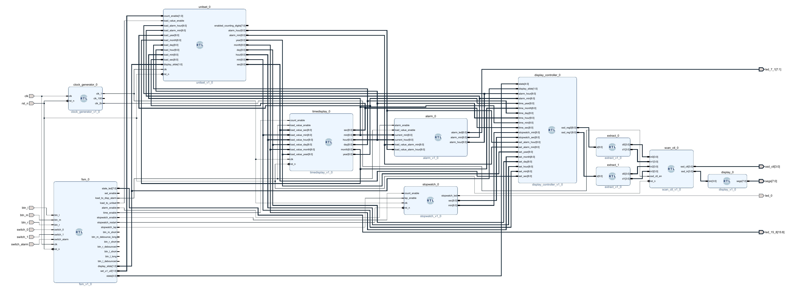

# Lab 6 - Electronic Clock Report

106033233 資工大四 周聖諺(Sheng-Yen Chou)

---

## Block Diagram

## Finite State Machine

### Design Specification

[fsm.v Source Code](exp_1_1/exp_1_1.srcs/sources_1/new/fsm.v)

Output: [15:0] state_led, [1:0] display_slide, load_to_disp_alarm, load_to_unitset, time_enable, alarm_enable, stopwatch_enable, stopwatch_restart, stopwatch_lap, [1:0] set_u1_u0,
[4:0] state

Input: btn_l, btn_m, btn_r, switch_0, switch_1, switch_alarm, clk, rst_n

### Design Implementation

**State Control**

Use 3 DIP switches to control the states and the activation of the alarm  and some variables only depend on the state, including ``state``, ``load_to_disp_alarm``, ``load_to_unitset``, ``time_enable``, and ``alarm_enable``. The variable ``load_to_disp_alarm`` decides whether to load the output of the module ``unitset`` and ``load_to_unitset`` determine whether to load current digits of the alarm and the time components to module ``unitset``. ``load_to_disp_alarm`` is on in the state ``TIME`` and ``SET``. 

**Time Display and Alarm**

The variables ``time_enable`` and ``alarm_enable`` control whether to enable counting of the modules. Absolutely, ``time_enable`` is enabled in state ``TIME`` and ``alarm_enable`` is enabled in state ``ALARM``.

**Stopwatch**

The variables ``stopwatch_enable``, ``stopwatch_restart``, and ``stopwatch_lap`` control the behavior of the stopwatch module. The implementation is totally the same as the Lab 5-2. The finite state machine controls 2 signals: ``stopwatch_enable`` and ``stopwatch_restart``. The down counter will pause while the signal ``stopwatch_enable`` is at low voltage and resume to count while the signal is at low voltage. It is controlled independently, so I only need to inverse the signal whenever the right button ``btn_r`` is pressed.

On the other hand, the down counter will reset to 0 when the signal ``stopwatch_restart`` raises. It only depends on ``btn_l`` button, so we only need to inverse the signal whenever the button is clicked. 

**Others**

The variable ``state_led`` controls the LED display of the board and it can simply implemented by switch and if-else condition control. 

``display_slide`` controls the digits that would be displayed in the 7-segment display. 

## Time Display Module

### Design Specification

[timedisplay.v Source Code](exp_1_1/exp_1_1.srcs/sources_1/new/timedisplay.v)

Output: year, month, day, hour, min, sec

Input: count_enable, load_value_enable, load_value_year, load_value_month, load_value_day, load_value_hour, load_value_min, load_value_sec, clk, rst_n

### Design Implementation

The module is implemented with a series of ``counterx`` module. We can simply cascade the ``counterx`` from the second to the year. Use the carry bit to trigger the next counter. 

For leap year, I design a module called ``datetime_limit`` to count the length of a month. The module will set the length of February in the leap year as 29, otherwise, as 28.

## Unit Setting Module

### Design Specification

[unitset.v Source Code](exp_1_1/exp_1_1.srcs/sources_1/new/unitset.v)

Output: [8:0] alarm_hour, [8:0] alarm_min, [8:0] year, [8:0] month, [8:0] day, [8:0] hour, [8:0] min, [8:0] sec

Input: count_enable, load_value_enable, [8:0] load_alarm_hour, [8:0] load_alarm_min, [8:0] load_year, [8:0] load_month, [8:0] load_day, [8:0] load_hour, [8:0] load_min, [8:0] load_sec, display_slide, clk, rst_n

### Design Implementation

The ``display_slide`` will control the variable ``enabled_counting_digits`` to decide which unit to set up. While ``display_slide`` is 3, 2, 1, 0, the unitset will set the (alarm hour, alarm minute), (year, month), (day, hour) and, (minute, second) individually. The module also support leap years. 

The module is implemented by a series of cascaded counters ``counterx``. The counting of a digit would be enabled while the digit is selected by the ``enabled_counting_digits``.

## Alarm Module

### Design Specification

[alarm.v Source Code](exp_1_1/exp_1_1.srcs/sources_1/new/alarm.v)

Output: [6:0] alarm_led, [8:0] alarm_min, [8:0] alarm_hour

Input: alarm_enable, load_value_enable, [8:0] current_min,[8:0] current_hour, [8:0] load_value_alarm_min, [8:0] load_value_alarm_hour

### Design Implementation

If ``load_value_enable`` is enabled, the module will load the argument ``load_value_alarm_hour`` to the register ``alarm_hour`` and load the argument ``load_value_alarm_min`` to the register ``alarm_min``. In addition, while ``alarm_enable`` is enabled, the alarm will be active. If the current hour and minute is the same as the hours and the minute, ``alarm_led`` will be lighted up.

## Stopwatch Module

### Design Specification

[stopwatch.v Source Code](exp_1_1/exp_1_1.srcs/sources_1/new/stopwatch.v)

Output: stopwatch_led, [8:0] sec, [8:0] min, 

Input: count_enable, lap_enable, clk, rst_n

### Design Implementation

The ``stopwatch`` module is implemented by 2 ``counterx`` modules. The counter will be activated while the argument ``count_enable`` is true. It will be reset while the argument ``rst_n`` is raised. In addition, while the argument ``lap_enable`` is true, the variable ``sec`` and ``min`` will be freezed and stopped to synchronize with the argument ``counting_sec`` and ``counting_min``.

## Switch Controller Module

### Design Specification

[switch_controller.v Source Code](exp_1_1/exp_1_1.srcs/sources_1/new/switch_controller.v)

Output: [8:0] sel_d1, [8:0] sel_d0

Input: [8:0] alarm_hour, [8:0] alarm_min, [8:0] year, [8:0] month, [8:0] day, [8:0] hour, [8:0] min, [8:0] sec, [1:0] display_slide

### Design Implementation

The module will select the corresponding unit as output according to the ``display_slide`` argument. When ``display_slide`` is equal to 0, 1, 2, 3, the module will output (``sel_d1``, ``sel_d0``) = (``alarm_hour``, ``alarm_min``), (``year``, ``month``), (``day``, ``hour``), (``min``, ``sec``) respectively.

## Display Controller Module

### Design Specification

[display_controller.v Source Code](exp_1_1/exp_1_1.srcs/sources_1/new/display_controller.v)

Output: [8:0] ssd_reg0, [8:0] ssd_reg1

Input: [4:0]state, [1:0]display_slide, [8:0] alarm_hour, [8:0] alarm_min, [8:0] time_year, [8:0] time_month, [8:0] time_day, [8:0] time_hour, [8:0] time_min, [8:0] time_sec, [8:0] stopwatch_min, [8:0] stopwatch_sec, [8:0] set_alarm_hour, [8:0] set_alarm_min, [8:0] set_year, [8:0] set_month, [8:0] set_day, [8:0] set_hour, [8:0] set_min, [8:0] set_sec

### Design Implementation

The module will select corresponding inputs as the output according to the argument ``state`` and ``display_slide``. First, the module will call ``switch_controller`` module to select the corresponding numbers according to the argument ``display_slide``. Then, The module will choose the numbers that will be shown in the 7-segment display ``ssd_reg0`` and ``ssd_reg1`` from the selected numbers. While the ``state[4:3]`` is equal to ``2'b00``(``Time``), ``2'b11``(``SET``), and ``2'b01``(``STW``), the module will choose the selected number of ``timedisplay``, ``unitset``, and ``stopwatch`` respectively.

## Clock Generator Module

### Design Specification

[clock_generator.v Source Code](exp_1_1/exp_1_1.srcs/sources_1/new/clock_generator.v)

Output: reg clk_1, reg clk_100, reg clk_2k,

Input: clk, rst_n

### Design Implementation

The clock generator provides 1 Hz clock and 100 Hz clock. The module is implemented by a counter. Whenever the counter hit the limit, the module would invert the output signal. 

## Extract Module

### Design Specification

[extract.v Source Code](exp_1_1/exp_1_1.srcs/sources_1/new/extract.v)

Output: [3:0] d0, [3:0] d1

Input: [8:0] x

### Design Implementation

The ``extract`` module will separate the tens digit ``d1`` and unit digits ``d0`` from the input number ``x``. 

## Scan Controller Module

### Design Specification

[scan_ctl.v Source Code](exp_1_1/exp_1_1.srcs/sources_1/new/scan_ctl.v)

Output: [3:0] ssd_in, [3:0] ssd_ctl

Input: [3:0] in0, [3:0] in1, [3:0] in2, [3:0] in3, ssd_ctl_en, rst_n

### Design Implementation

Since we can only control one digit of the 7‑segment display each time, I design a module that takes the 4‑digit patterns as input and shows the 1 digit on the display when the clock raises. Whenever the clock raises, the module will switch the control ``ssd_ctl`` to different digit and shows the corresponding digit. Take an example, when the first clock raise occur, the module will set ``ssd_ctl = 4’b1110`` and ``ssd_in = in0``. As for second clock pulse, the module will output ``ssd_ctl = 4’b1101`` and ``ssd_in = in1`` and so on.

## Display Module

### Design Specification

[display.v Source Code](exp_1_1/exp_1_1.srcs/sources_1/new/display.v)

Output: [7:0] segs

Input: [3:0] bin

### Design Implementation

The module will convert the 4-bits binary number to 7-segment display patters from 0~16.

## Debounce

### Design Specification

[debounce.v Source Code](exp_1_1/exp_1_1.srcs/sources_1/new/debounce.v)

Output: push_debounced

Input: rst, clk, push

### Design Implementation

For each click, the module will delay 4 clock cycle and then raise the debounce pulse. I use 4 registers to represent the delay state and send a pulse while 4 registers are all 1s

## Onepule Module

### Design Specification

[onepulse.v Source Code](exp_1_1/exp_1_1.srcs/sources_1/new/onepulse.v)

Output: push_onepulse, push_onepulse_long, push_debounced, push_debounced_long

Input: clk, rst, push

### Design Implementation

The one‑pulse module raise a pulse while the debounce module raises a pulse. As a result, it will produce high voltage while the previous debounce signal is higher than the current debounce signal.

## Counterx Module

### Design Specification

[counterx.v Source Code](exp_1_1/exp_1_1.srcs/sources_1/new/counterx.v)

Output: [8:0] q, time_carry, count_enable, load_value_enable, [8:0] load_value, [8:0] count_limit_u, [8:0] count_limit_l, [8:0] count_init

Input: clk, rst_n

### Design Implementation

The ``counterx`` module is a binary-up counter that counts from ``count_limit_l`` to ``count_limit_u``. The argument ``count_init`` set the initial value of the counter.

## Datetime Limit Module

### Design Specification

[datetime_limit.v Source Code](exp_1_1/exp_1_1.srcs/sources_1/new/datetime_limit.v)

Output: [8:0] year_limit, [8:0] month_limit, [8:0] day_limit, [8:0] hour_limit, [8:0] min_limit, [8:0] sec_limit, [8:0] year_init, [8:0] month_init, [8:0] day_init, [8:0] hour_init, [8:0] min_init, [8:0] sec_init

Input: [8:0] year, [8:0] month

### Design Implementation

The module provide the upper limit of each date/time unit and support leap year. During the leap year, the length of February is 29, otherwise is 28. 

### Design Implementatio

## I/O Pin Assignment

| I/O | switch_0 | switch_0 | switch_alarm | btn_m |
|-----|----------|----------|--------------|-------|
| LOC |    V17   |    V16   |      R2      |  T18  |

| I/O | clk | rst | btn_r | btn_l | ssd_ctl[0] | ssd_ctl[1] | ssd_ctl[2] | ssd_ctl[3] |
|-----|-----|-----|-------|-------|----------|----------|----------|----------|
| LOC | W5  | W16 | T17   | W19   | U2       | U4       | V4       | W4       |

| I/O | segs[0] | segs[1] | segs[2] | segs[3] | segs[4] | segs[5] | segs[6] | segs[7] |
|-----|----|----|----|----|----|----|----|----|
| LOC | V7 | U7 | V5 | U5 | V8 | U8 | W6 | W7 |

| I/O | led[0] | led[1] | led[2] | led[3] | led[4] | led[5] | led[6] | led[7] | 
|-----|---------|---------|---------|---------|---------|---------|---------|---------|
| LOC | U16     | E19     | U19     | V19     | W18     | U15     | U14     | V14     |

| I/O | led[8] | led[9] | led[10] | led[11] | led[12] | led[13] | leds[14] | led[15] |
|-----|---------|---------|----------|----------|----------|----------|----------|----------|
| LOC | V13     | V3      | W3       | U3       | P3       | N3       | P1       | L1       |

## Conclusion

In lab6, I firstly implement a large project, which is more than 1000 lines of codes. I spent lots of time on the ``unitset`` module and how to design a data flow between the ``timedisplay``, ``alarm``, and ``unitset``. I've learned a lot while doing this homework.