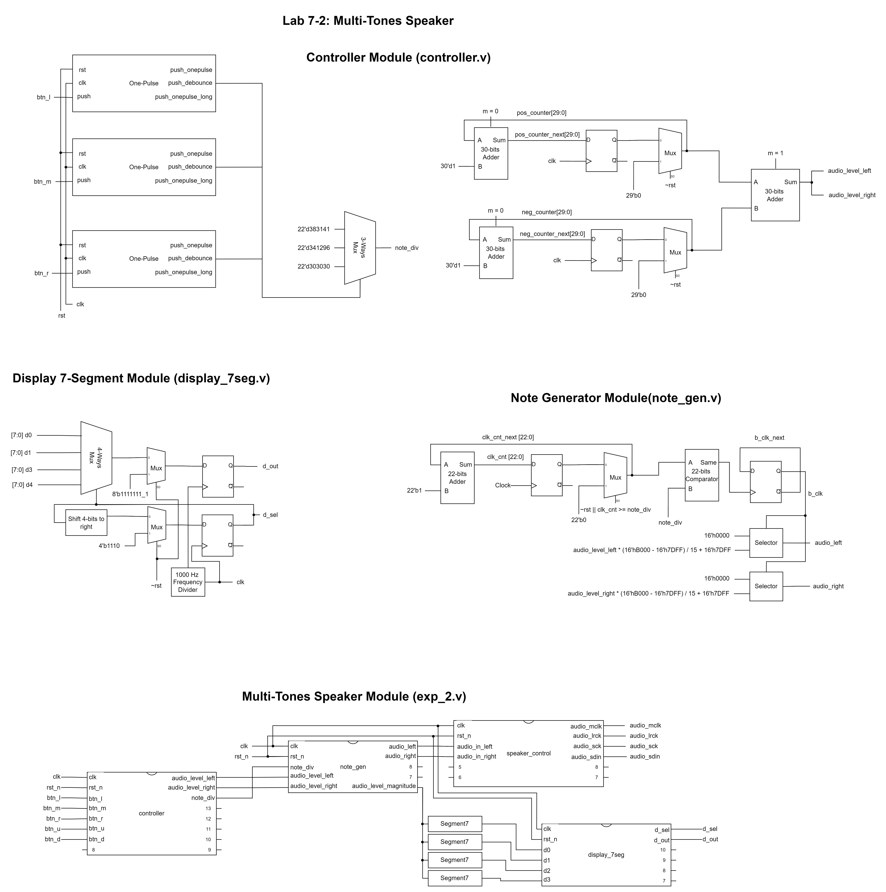

# Lab 7 - Speaker

106033233 資工大四 周聖諺(Sheng-Yen Chou)

---

## Lab 7-1: Speaker

### Design Specification

[Source Code](./exp_1/)

**global**

Global variables

**Frequency Divider**

Output: [9:0] clk_out

Input: clk, rst_n

**Note Generation**

Input clk, rst_n, [21:0] note_div

Output [15:0] audio_left, [15:0] audio_right

**Speaker Control**

input clk, rst_n, [15:0] audio_in_left, [15:0] audio_in_right

Output audio_mclk, audio_lrck, audio_sck, reg audio_sdin, [9:0] clk_out, [15:0] buff_idx

**Speaker**

Input clk, rst_n

Output audio_mclk, audio_lrck, audio_sck, audio_sdin

### Design Implementation

#### Global Variables

The global variables are used across the whole project.

#### Frequency Divider

The frequency divider module output a vector which represents the clock divided by $2^1$, $2^2$, $2^3$... , $2^{10}$. It can be simply implemented by adding 1 to a variable ``[9:0] clk_out`` at each clock pulse.

#### Note Generation

This module generates the serial audio signal divided by ``note_div``. The module divides the clock by the argument ``note_div`` and multiply with the amplitude 16'hB000 when the clock raises. Otherwise, multiply with the amplitude 16'h5FFF.

The module is implemented by a counter. Whenever the counter hits the ``note_div``, the variable ``b_clk`` will set to 1 and trigger a pulse.

#### Speaker Control

The ``speaker_controll`` module generate the clocks for the speaker, including ``mclk``, ``lrck``, and ``sck``. The clock ``mclk`` is 25M Hz, which need to divide the main clock (100M Hz) by 4. The clock ``lrck`` is 25M/128 Hz, which need to divide the main clock (100M Hz) by $2^9$. The clock ``sck`` is 25M/4 Hz, which need to divide the main clock (100M Hz) by $2^4$.

In the hand, the module also serialize the 16-bits parallel data. The module transmit 1 bit per ``sck`` clock and this can be implemented by a rotating index of the 16-bits register.

The module also controls the switch between the left and the right channel. When the ``lrck`` raises, the module will produce the sound of the left channel to the ``audio_sdin``. Otherwise, it will output the right channel.

#### Speaker

It is the top module of this lab. The ``Note Generation`` module will generate the left and right channel sound based on the given ``note_div``. The module ``speaker control`` will take the left and right channel of sound (``audio_in_left`` and ``audio_in_right``) as input and serialize them. In the mean time, the audio volume of left channel ``audio_level_magnitude`` will be shown on the 7-segment display. 

### I/O Pin Assignment

| I/O | audio_sdin | audio_sck | audio_lrck | audio_mclk |
|-----|------------|-----------|------------|------------|
| LOC | B16        | B15       | A16        | A14        |

| I/O | clk | rst | btn_l | btn_m | btn_r | btn_u | btn_d | d_sel[0] | d_sel[1] | d_sel[2] | d_sel[3] |
|-----|-----|-----|-------|-------|-------|-------|-------|----------|----------|----------|----------|
| LOC | W5  | V17 | W19   | U18   | T17   | T18   | U17   | U2       | U4       | V4       | W4       |

| I/O | d_out[0] | d_out[1] | d_out[2] | d_out[3] | d_out[4] | d_out[5] | d_out[6] | d_out[7] |
|-----|----|----|----|----|----|----|----|----|
| LOC | V7 | U7 | V5 | U5 | V8 | U8 | W6 | W7 |

### Block Diagram

### RTL Simulation

## Lab 7-2: Multi-Tones Speaker

### Design Specification

[Source Code](./exp_2/)

**Debounce**

Input: rst, clk, push

Output: push_debounced

**One-Pulse**

Input: clk, rst, push

Output: push_onepulse, push_onepulse_long, push_debounced, push_debounced_long, push_sig,  push_sig_long

**Frequency Divider**

Output: [9:0] clk_out

Input: clk, rst_n

**Controller**

Input: clk, rst_n, btn_l, btn_m, btn_r, btn_u, btn_d

Output: [3:0] audio_level_left, [3:0] audio_level_right, [21:0] note_div

**Note Generation**

Input: clk, rst_n, [21:0] note_div, input [3:0] audio_level_left, [3:0] audio_level_right

Output: [15:0] audio_left, [15:0] audio_right, [15:0]audio_level_magnitude

**Speaker Control**

Input: clk, rst_n, [15:0] audio_in_left, [15:0] audio_in_right

Output: audio_mclk, audio_lrck, audio_sck, audio_sdin, [9:0] clk_out, [15:0] buff_idx

**Binary To 7-Segment Convertor**

Input: [3:0] i

Output: [3:0] P, [7:0] D

**7-Segment7 Frequency Divider**

Input: clk, rst

Output: clk_out

**7-Segment Display**

Output: [0:3] d_sel, [7:0] d_out

Input: clk, rst, [7:0] d0, [7:0] d1, [7:0] d2, [7:0] d3

**Speaker**

Input: clk, rst_n, btn_l, btn_m, btn_r, btn_u, btn_d

Output: audio_mclk, audio_lrck,  audio_sck,  audio_sdin, [3:0] d_sel, [7:0] d_out 

### Design Implementation

#### Global Variables

The global variables are used across the whole project.

#### Debounce

For each click, the module will delay 4 clock cycle and then raise the debounce pulse. I use 4 registers to represent the delay state and send a pulse while 4 registers are all 1s.

#### One-Pulse

I use a counter to count the clock cycles during the button is pressed. If the counting exceed a threshold, it will trigger a long press pulse ``push_onepulse_long``. Otherwise, it will trigger a click pulse ``push_onepulse``. 

#### Frequency Divider

Same as [lab 7-1](####Frequency-Divider)

#### Controller

The ``controller`` module produces the corresponding ``note_div`` for the ``note_gen`` module according to the pressed buttons. I concatenate the ``debounce`` signal for every button and assign different numbers to ``note_div`` to generate sound with different tones. 

In the other hand, whenever the left/right button is pressed, the module will add/minus 1 to the volume counter. 

#### Note Generation

It's similar to the ``note_gen`` module in the [lab 6-1](####Note-Generation) but the ``note_gen`` in the lab 6-1 will produce the same magnitude in left and right channel. In lab 6-2, ``note_gen`` can produces different magnitude in the left and right channel. The arguments ``audio_level_left`` and ``audio_level_right`` set the audio volume of the left and right channel. 

The audio is divided into 16 levels between 16'hB000 and 16'h7DFF. The module will control the amplitude with the formula ``audio_level * (`AUDIO_IN_BITS_N'hB000 - `AUDIO_IN_BITS_N'h7DFF) / 15 + `AUDIO_IN_BITS_N'h7DFF``. 

#### Speaker Control

Same as [lab 6-1](####Speaker-Control).

#### Binary To 7-Segment Convertor

Convert 4-bit binary number to 7-segment display with switch-case syntax.

#### 7-Segment Frequency Divider

To generate the 1000 Hz clock, I use variables ``counter_in`` and ``counter_out`` to count from 0 to 50000. The counter_in will store the value for the next time step and pass the value to the ``counter_out`` when the clock raises. The reason why we need  50000 counting is each counting is triggered only when the clock raises, so the circuit will count 1 more for every twice clock pulses.

#### 7-Segment Display

Since we can only control one digit of the 7-segment display each time, I design a module that takes the 4-digit patterns as input and shows the 1 digit on the display when the clock raises. Whenever the clock raises, the module will switch the control d_sel to different digit and shows the corresponding digit. Take an example, when the first clock raise occur, the module will set d_sel = 4'b1110 and d_out = d0. As for second clock pulse, the module will output d_sel = 4'b1101 and d_out = d1 and so on. 

#### Speaker

The module ``speaker`` combines all modules listed above. The ``controller`` module detects the press of the buttons and give the ``note_div``,  ``audio_level_left`` and ``audio_level_right`` parameter. The ``note_gen`` module generate the left and right channel sound according the ``note_div`, ``audio_level_left`` and ``audio_level_right``. The ``speaker_control`` serializes the ``audio_in_left`` and ``audio_in_right`` signal as the output of the left and right channel. 

Finally, ``segment7`` and ``display_7seg`` module convert the binary number to 7-segment display pattern and shown them on the 7-segment display.

### I/O Pin Assignment

| I/O | audio_sdin | audio_sck | audio_lrck | audio_mclk |
|-----|------------|-----------|------------|------------|
| LOC | B16        | B15       | A16        | A14        |

| I/O | clk | rst | btn_l | btn_m | btn_r | btn_u | btn_d | d_sel[0] | d_sel[1] | d_sel[2] | d_sel[3] |
|-----|-----|-----|-------|-------|-------|-------|-------|----------|----------|----------|----------|
| LOC | W5  | V17 | W19   | U18   | T17   | T18   | U17   | U2       | U4       | V4       | W4       |

| I/O | d_out[0] | d_out[1] | d_out[2] | d_out[3] | d_out[4] | d_out[5] | d_out[6] | d_out[7] |
|-----|----|----|----|----|----|----|----|----|
| LOC | V7 | U7 | V5 | U5 | V8 | U8 | W6 | W7 |

### Block Diagram

### RTL Simulation

## Lab 7-3: Double-Channels Speaker

### Design Specification

[Source Code](./exp_3/)

**Debounce**

Input: rst, clk, push

Output: push_debounced

**One-Pulse**

Input: clk, rst, push

Output: push_onepulse, push_onepulse_long, push_debounced, push_debounced_long, push_sig,  push_sig_long

**Frequency Divider**

Output: [9:0] clk_out

Input: clk, rst_n

**Controller**

Input: clk, rst_n, btn_l, btn_m, btn_r, btn_u, btn_d

Output: [3:0] audio_level_left, [3:0] audio_level_right, [21:0] note_div_left, [21:0] note_div_right

**Note Generation**

Input: clk, rst_n, input [3:0] audio_level_left, [3:0] audio_level_right, [21:0] note_div_left, [21:0] note_div_right

Output: [15:0] audio_left, [15:0] audio_right, [15:0] audio_level_magnitude

**Speaker Control**

Input: clk, rst_n, [15:0] audio_in_left, [15:0] audio_in_right

Output: audio_mclk, audio_lrck, audio_sck, audio_sdin, [9:0] clk_out, [15:0] buff_idx

**Binary To 7-Segment Convertor**

Input: [3:0] i

Output: [3:0] P, [7:0] D

**7-Segment7 Frequency Divider**

Input: clk, rst

Output: clk_out

**7-Segment Display**

Output: [0:3] d_sel, [7:0] d_out

Input: clk, rst, [7:0] d0, [7:0] d1, [7:0] d2, [7:0] d3

**Speaker**

Input: clk, rst_n, btn_l, btn_m, btn_r, btn_u, btn_d

Output: audio_mclk, audio_lrck,  audio_sck,  audio_sdin, [3:0] d_sel, [7:0] d_out 

### Design Implementation

#### Debounce

Same as [lab 7-2](####Debounce).

#### One-Pulse

Same as [lab 7-2](####One-Pulse).

#### Frequency Divider

Same as [lab 7-1](####Frequency-Divider)

#### Controller

Similar to [lab 7-2](####Controller). The ``controller`` module produces the corresponding ``note_div`` for the ``note_gen`` module according to the pressed buttons. I concatenate the ``debounce`` signal for every button and assign different numbers to ``note_div`` to generate sound with different tones. The only difference is that lab 7-2 generates 3 different kinds of tone, while  lab 7-3 generate 5 different kinds of tones.

#### Note Generation

Similar to [lab 7-1](####Note-Generation). The ``note_gen`` module generates the audio signal according to the given ``note_div``. The different thing is that it can generate different tones ``audio_left`` and ``audio_right`` for left and right channels individually according to ``note_div_left`` and ``note_div_right``, while the lab 7-1 only requires signal tone for channels. The module can also produce audio with variant volume. 

The module is implemented by a counter. Whenever the counter hits the ``note_div_left`` or ``note_div_right``, the variable ``b_clk_left`` or ``b_clk_right`` will set to 1 and trigger a pulse respectively.

#### Speaker Control

Same as [lab 7-1](####Speaker-Control)

#### Binary To 7-Segment Convertor

Same as [lab 7-1](####Binary-To-7-Segment-Convertor)

#### 7-Segment Frequency Divider

Same as [lab 7-1](####7-Segment-Frequency-Divider)

#### 7-Segment Display

Same as [lab 7-1](####7-Segment-Display)

#### Speaker

Similar to [lab 7-1](####Speaker). It is the top module of this lab. The ``Note Generation`` module will generate the left and right channel sound based on the given ``note_div_left`` and ``note_div_right``. The module ``speaker control`` will take the left and right channel of sound (``audio_in_left`` and ``audio_in_right``) as input and serialize them.  In the mean time, the audio volume of left channel ``audio_level_magnitude`` will be shown on the 7-segment display. 

### I/O Pin Assignment

| I/O | audio_sdin | audio_sck | audio_lrck | audio_mclk | switch |
|-----|------------|-----------|------------|------------|--------|
| LOC | B16        | B15       | A16        | A14        | V16    |

| I/O | clk | rst | btn_l | btn_m | btn_r | btn_u | btn_d | d_sel[0] | d_sel[1] | d_sel[2] | d_sel[3] |
|-----|-----|-----|-------|-------|-------|-------|-------|----------|----------|----------|----------|
| LOC | W5  | V17 | W19   | U18   | T17   | T18   | U17   | U2       | U4       | V4       | W4       |

| I/O | d_out[0] | d_out[1] | d_out[2] | d_out[3] | d_out[4] | d_out[5] | d_out[6] | d_out[7] |
|-----|----|----|----|----|----|----|----|----|
| LOC | V7 | U7 | V5 | U5 | V8 | U8 | W6 | W7 |

### Block Diagram

### RTL Simulation

## Discussion 

In lab 5-2, it took me lots of time to design the state machine because the always block cannot be activated by 2 edge-triggered variables. Finally, I store the variables in the 2 independent variables and add them together as the clock raises. In addition, when I implement the one-pulse module, it took me much time to detect long press and click in the mean time. In the end, I use a counter to count the clock cycle during the pressed button.

## Conclusion

The lab 7 is easier than lab 6 and it's my first time to deal with I/O. Producing audio with FPGA is a interesting thing. We also learn how to serialize the audio data and control the audio signal.

## Reference

- None